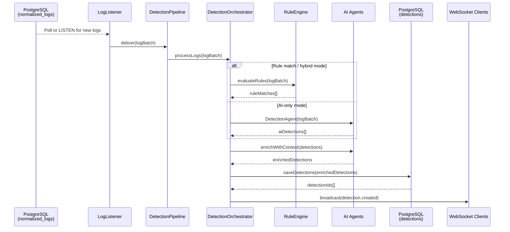
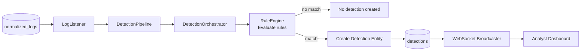
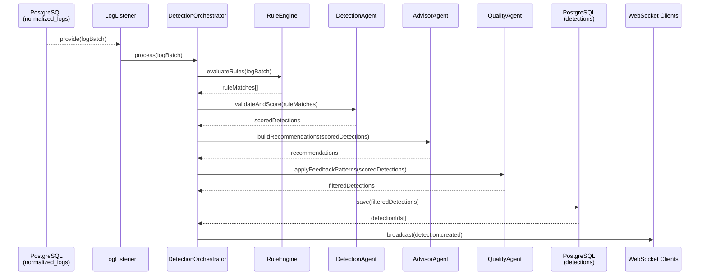
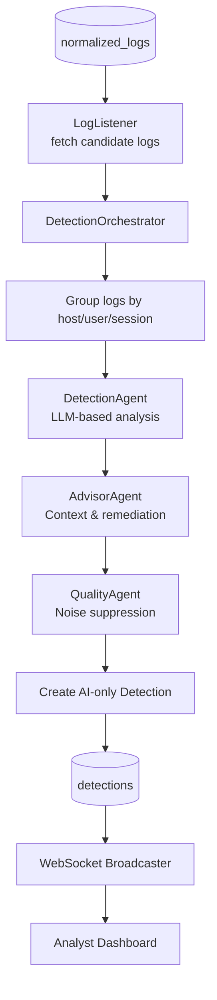
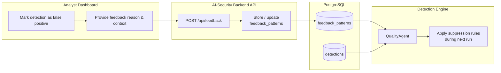
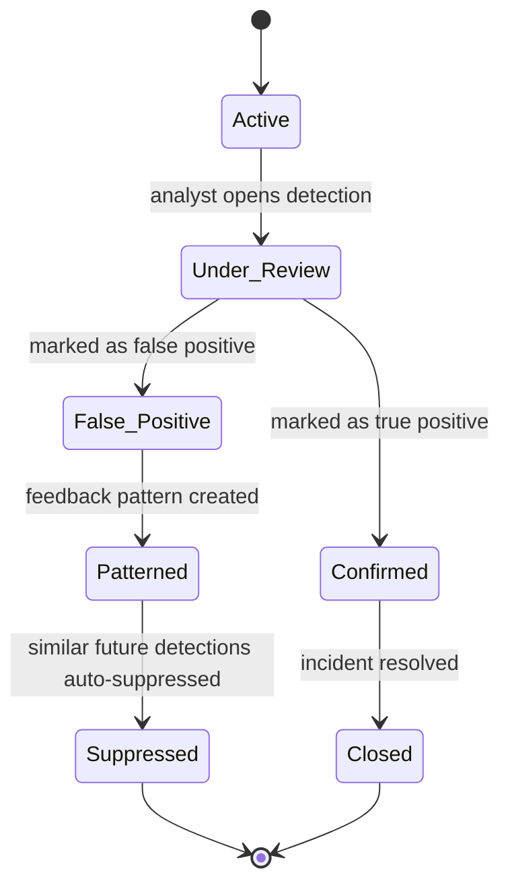
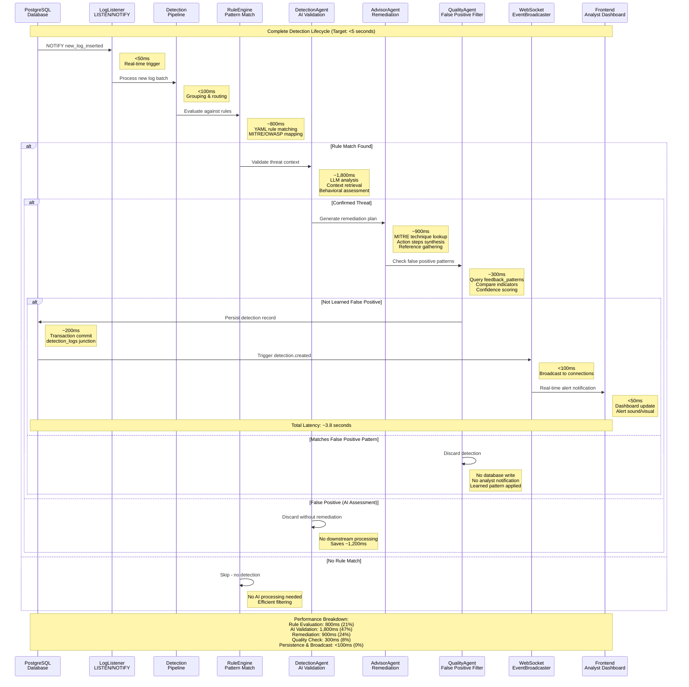

# Appendix E - Detection Flow Diagrams

This appendix documents the detection flows implemented in the AI-Security backend. Each Mermaid diagram illustrates how normalised logs move from ingestion to detection, highlighting rule-only, hybrid, and AI-only modes plus the feedback loop and status lifecycle.

---

## E.1 End-to-End Detection Lifecycle

Shows the journey from new logs in PostgreSQL to detections broadcast to analyst dashboards.

**Figure E.1 - End-to-End Detection Lifecycle**

---

## E.2 Rule-Only Detection Flow

Covers the pure rule-processing path when AI enrichment is disabled.

**Figure E.2 - Rule-Only Detection Flow**

---

## E.3 Hybrid Detection Flow (Rules + AI Agents)

Illustrates how rule hits are validated, contextualised, and filtered by AI agents before persistence.

**Figure E.3 - Hybrid Detection Flow**

---

## E.4 AI-Only Detection Flow

Describes the pathway when detections are driven solely by AI agents.

**Figure E.4 - AI-Only Detection Flow**

---

## E.5 Feedback Loop and Continuous Learning

Shows how analyst feedback becomes suppression patterns applied by the QualityAgent.

**Figure E.5 - Feedback Loop and Pattern Application**

---

## E.6 Detection Status Lifecycle

Summarises the main state transitions for detections.

**Figure E.6 - Detection Status State Machine**

**Figure E.7: Detection Lifecycle Sequence with Latency Analysis**

