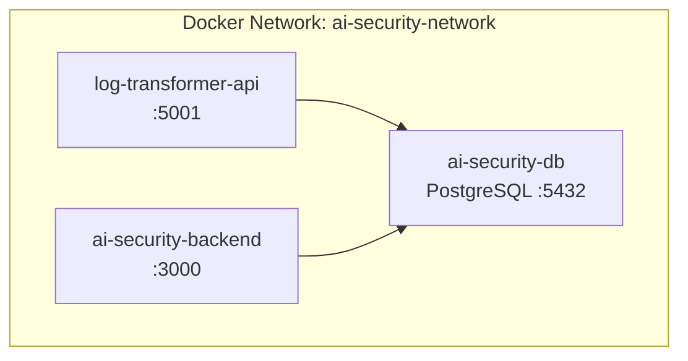

# Appendix F - Docker Deployment Instructions (Log-Transformer)

This appendix explains how to deploy the Log-Transformer ingestion service with Docker Compose, including prerequisites, environment settings, service definitions, lifecycle commands, and verification steps.

---

## F.1 Prerequisites

Ensure the following before starting the container:

- Docker 20.10+ and Docker Compose 2.0+
- AI-Security PostgreSQL instance reachable (shared network)
- Port `5001` available for the Log-Transformer HTTP API

---

## F.2 Docker Compose Topology

Log-Transformer runs as a container on the same network as the shared PostgreSQL database and AI-Security backend.

**Figure F.1 - Log-Transformer Docker Topology**



---

## F.3 Environment Configuration

A `.env` file holds connection details and runtime settings.

**Figure F.2 - Example `.env`**

```ini
# Log-Transformer API
LT_HTTP_PORT=5001

# Database connection (shared with AI-Security)
LT_DB_HOST=ai-security-db
LT_DB_PORT=5432
LT_DB_NAME=ai_security
LT_DB_USER=ai_security_user
LT_DB_PASSWORD=change_me

# Optional logging and worker settings
LT_WORKER_CONCURRENCY=4
LT_LOG_LEVEL=Information
```

---

## F.4 Docker Compose Service Definition

Defines how the container connects to the network, exposes ports, and injects environment variables.

**Figure F.3 - `docker-compose.yml` Service**

```yaml
services:
  log-transformer-api:
    image: your-registry/log-transformer:latest
    container_name: log-transformer-api
    ports:
      - "${LT_HTTP_PORT:-5001}:5001"
    environment:
      - ConnectionStrings__Database=Host=${LT_DB_HOST};Port=${LT_DB_PORT};Database=${LT_DB_NAME};Username=${LT_DB_USER};Password=${LT_DB_PASSWORD}
      - LT_WORKER_CONCURRENCY=${LT_WORKER_CONCURRENCY:-4}
      - LT_LOG_LEVEL=${LT_LOG_LEVEL:-Information}
    volumes:
      - ./uploads:/app/uploads
    depends_on:
      - ai-security-db
    networks:
      - ai-security-network
```

---

## F.5 Starting and Stopping the Service

Run these commands from the directory containing `docker-compose.yml`.

**Figure F.4 - Lifecycle Commands**

```bash
# Start Log-Transformer in the background
docker-compose up -d log-transformer-api

# View container logs
docker-compose logs -f log-transformer-api

# Stop the service (container remains)
docker-compose stop log-transformer-api

# Stop and remove container
docker-compose down log-transformer-api

# Rebuild and restart after code changes
docker-compose up -d --build log-transformer-api
```

---

## F.6 Verifying Deployment

Validate the container is healthy and accepting ingestion requests.

**Figure F.5 - Verification Requests**

```bash
# Health check
curl http://localhost:5001/health

# (If Swagger/OpenAPI is enabled)
# http://localhost:5001/swagger

# Confirm ingestion endpoint
curl -X POST http://localhost:5001/ingest/json \
     -H "Content-Type: application/json" \
     -d '[{ "timestamp": "2025-01-14T10:00:00Z", "message": "test log" }]'
```

Successful responses confirm the service can write normalised logs to the shared PostgreSQL instance used by the AI-Security backend.
