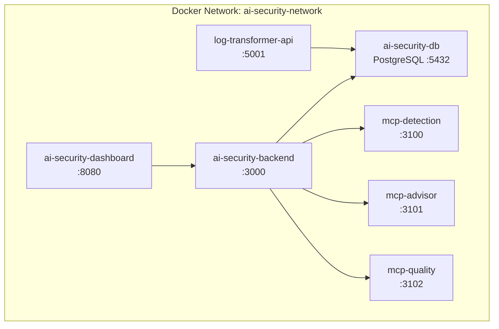

# Appendix G - Docker Deployment Instructions (AI-Security Backend)

This appendix explains how to deploy the AI-Security platform (PostgreSQL, backend API, optional dashboard, and MCP agents) with Docker Compose.

---

## G.1 Prerequisites

Ensure:

- Docker 20.10+ and Docker Compose 2.0+
- ≥8 GB RAM recommended
- Ports available: `3000` (API), `5432` (PostgreSQL), `8080` (dashboard), `3100-3102` (MCP servers)

---

## G.2 Docker Compose Topology

The stack contains the database, backend, dashboard, MCP services, plus optional Log-Transformer connectivity.

**Figure G.1 - AI-Security Docker Topology**



---

## G.3 Environment Configuration

A shared `.env` file stores database credentials, API ports, and AI provider settings.

**Figure G.2 - Example `.env`**

```ini
# PostgreSQL
DB_HOST=ai-security-db
DB_PORT=5432
DB_NAME=ai_security
DB_USER=ai_security_user
DB_PASSWORD=change_me

# Backend API
API_HTTP_PORT=3000
NODE_ENV=production

# Dashboard
DASHBOARD_HTTP_PORT=8080

# MCP Servers
MCP_DETECTION_PORT=3100
MCP_ADVISOR_PORT=3101
MCP_QUALITY_PORT=3102

# AI Provider configuration (example)
OPENAI_API_KEY=sk-...
AI_PROVIDER=openai
```

---

## G.4 Docker Compose Service Definitions

Defines the core services: PostgreSQL, backend, dashboard (optional). MCP servers may run inside the backend container or as separate services depending on the build.

**Figure G.3 - `docker-compose.yml` Excerpt**

```yaml
services:
  ai-security-db:
    image: postgres:16
    container_name: ai-security-db
    environment:
      - POSTGRES_DB=${DB_NAME}
      - POSTGRES_USER=${DB_USER}
      - POSTGRES_PASSWORD=${DB_PASSWORD}
    volumes:
      - ai_security_db_data:/var/lib/postgresql/data
      - ./database/init:/docker-entrypoint-initdb.d
    ports:
      - "${DB_PORT:-5432}:5432"
    networks:
      - ai-security-network

  ai-security-backend:
    image: your-registry/ai-security-backend:latest
    container_name: ai-security-backend
    depends_on:
      - ai-security-db
    environment:
      - DB_HOST=${DB_HOST}
      - DB_PORT=${DB_PORT}
      - DB_NAME=${DB_NAME}
      - DB_USER=${DB_USER}
      - DB_PASSWORD=${DB_PASSWORD}
      - API_HTTP_PORT=${API_HTTP_PORT}
      - AI_PROVIDER=${AI_PROVIDER}
      - OPENAI_API_KEY=${OPENAI_API_KEY}
    ports:
      - "${API_HTTP_PORT:-3000}:3000"
    volumes:
      - codex_auth:/app/codex_auth
      - agent_data:/app/agent_data
      - backend_logs:/app/logs
    networks:
      - ai-security-network

  ai-security-dashboard:
    image: your-registry/ai-security-dashboard:latest
    container_name: ai-security-dashboard
    depends_on:
      - ai-security-backend
    environment:
      - BACKEND_URL=http://ai-security-backend:3000
      - PORT=${DASHBOARD_HTTP_PORT}
    ports:
      - "${DASHBOARD_HTTP_PORT:-8080}:8080"
    networks:
      - ai-security-network
```

---

## G.5 Lifecycle Commands

Execute from the directory containing `docker-compose.yml`.

**Figure G.4 - Core Commands**

```bash
# Start full stack
docker-compose up -d

# View logs for all services
docker-compose logs -f

# View backend logs
docker-compose logs -f ai-security-backend

# Stop all services
docker-compose stop

# Stop and remove containers
docker-compose down

# Rebuild and restart after code changes
docker-compose up -d --build
```

---

## G.6 Verification

Confirm API, dashboard, and WebSocket endpoints respond.

**Figure G.5 - Verification Steps**

```bash
# Backend health
curl http://localhost:3000/health

# List detections
curl http://localhost:3000/api/detections

# Dashboard (browser)
# http://localhost:8080

# WebSocket stream (wscat)
wscat -c ws://localhost:3000/ws/detections
```

Successful checks indicate the AI-Security stack is ready to consume logs from Log-Transformer or other sources.
