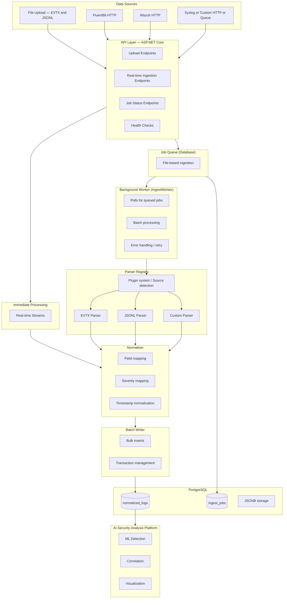
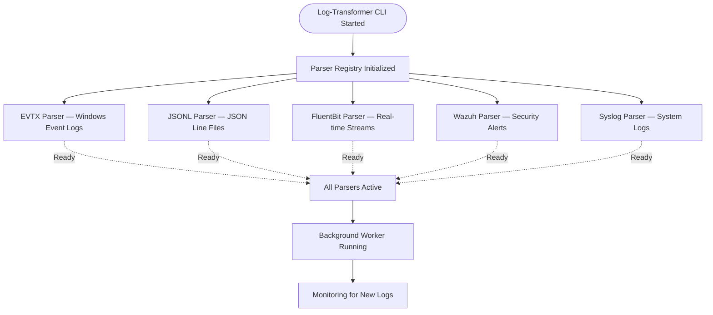

# Appendix F-2.4 — Log-Transformer Architecture

## Overview

Log-Transformer is a modular, plugin-based log ingestion and normalization platform designed for scalability, extensibility, and reliability. The architecture follows industry-standard patterns for data processing pipelines with emphasis on maintainability and performance.

## F-2.4.1 System Architecture

**Figure F-2.4.1 — Log-Transformer System Architecture**



## F-2.4.2 CLI with Active Parsers

**Figure F-2.4.2 — Log-Transformer CLI and Active Parsers**



### Notes
At startup, the CLI initializes multiple parsers for common log formats and streaming inputs. When all parsers are active, the background worker monitors for new logs and processes them via the configured pipeline.

## Core Components

### 1. API Layer

**Technology**: ASP.NET Core 8.0 Minimal APIs

**Responsibilities**:
- Accept file uploads (multipart/form-data)
- Expose real-time ingestion endpoints
- Provide job status information
- Serve API documentation (Swagger)
- Health check endpoints

**Key Features**:
- Asynchronous request handling
- Request validation
- Error handling middleware
- CORS support (configurable)
- OpenAPI/Swagger documentation

**Endpoints Structure**:
`/ingest/evtx` — File upload (accepts all types)
`/ingest/fluentbit` — FluentBit real-time ingestion
`/ingest/wazuh` — Wazuh alert ingestion
`/ingest/syslog` — Syslog message ingestion
`/ingest/jobs/{id}` — Job status query
`/health` — Health check
`/swagger` — API documentation

### 2. Job Queue System

**Storage**: PostgreSQL `ingest_jobs` table

**Purpose**: Decouple file upload from processing to ensure:
- Non-blocking API responses
- Fault tolerance
- Progress tracking
- Retry capability

**Job Lifecycle**: `queued → running → done/error`

**Schema**:
```sql
CREATE TABLE ingest_jobs (
  id VARCHAR(26) PRIMARY KEY,
  source VARCHAR(50) NOT NULL,
  filename VARCHAR(255) NOT NULL,
  path VARCHAR(1024) NOT NULL,
  status VARCHAR(50) NOT NULL,
  inserted INTEGER DEFAULT 0,
  skipped INTEGER DEFAULT 0,
  error TEXT,
  created_at TIMESTAMP NOT NULL,
  started_at TIMESTAMP,
  finished_at TIMESTAMP
);
```

### 3. Background Worker (IngestWorker)

**Type**: .NET `BackgroundService` (Hosted Service)

**Operation Mode**:
- Continuously polls for queued jobs
- Configurable poll interval (default: 5 seconds)
- Single-threaded sequential processing (can be scaled horizontally)

**Processing Flow**:
1. Query oldest queued job
2. Set status to "running"
3. Resolve appropriate parser
4. Stream and parse log file
5. Normalize and insert records (batch)
6. Update status to "done" or "error"
7. Repeat

**Error Handling**:
- Graceful degradation on parser errors
- Transaction rollback on database errors
- Detailed error logging
- Job marked as "error" with message

### 4. Parser System

**Design Pattern**: Plugin architecture with interface-based polymorphism

**Core Interface**:
```csharp
public interface ILogIngestParser
{
  string SourceSystem { get; }
  IAsyncEnumerable<NormalizedLog> ParseAsync(
    IngestContext context, 
    CancellationToken cancellationToken
  );
}
```

**Built-in Parsers**:
- EVTX Parser: Windows Event Log files
  - Platform-specific readers (Windows/Linux)
  - Cross-platform fallback using libraries
- JSONL Parser: JSON Lines format
  - Streaming line-by-line parsing
  - Flexible schema mapping

**Parser Registry**:
- Resolves parsers by file extension or source hint
- Supports custom parser plugins
- Extensible via dependency injection

**Adding New Parsers**:
```csharp
public class SyslogParser : ILogIngestParser
{
  public string SourceSystem => "syslog";
    
  public async IAsyncEnumerable<NormalizedLog> ParseAsync(
    IngestContext context, 
    CancellationToken ct)
  {
    // Parse RFC3164 or RFC5424 format
    // Yield normalized logs
  }
}
```

### 5. Normalization Layer

**Purpose**: Transform diverse log formats into a unified schema

**Normalizer Operations**:
- Field mapping
- Severity mapping
- Timestamp normalization (UTC)
- Data enrichment (source, processed_at, etc.)
- JSON serialization (raw and normalized data as JSONB)

**Severity Mapping Example**:
```csharp
// Windows Event Log levels
0 (LogAlways)    → info
1 (Critical)     → critical
2 (Error)        → high
3 (Warning)      → medium
4 (Information)  → info
5 (Verbose)      → info

// Syslog severities
0 (Emergency)    → critical
1 (Alert)        → critical
2 (Critical)     → critical
3 (Error)        → high
4 (Warning)      → medium
5 (Notice)       → low
6 (Info)         → info
7 (Debug)        → info
```

**Normalized Schema**:
```json
{
  "source_ip": "192.168.1.100",
  "destination_ip": "10.0.0.50",
  "user": "admin",
  "host": "web-server-01",
  "process": "sshd",
  "file_path": "/var/log/auth.log",
  "action": "login_attempt",
  "result": "success",
  "channel": "security",
  "event_id": 4624,
  "additional_fields": {
  "custom_field_1": "value1",
  "custom_field_2": "value2"
  }
}
```

### 6. Batch Writer

**Purpose**: Optimize database writes for high throughput

**Features**:
- Configurable batch size (default: 1000 records)
- Transaction management
- Bulk insert operations
- Automatic timestamp handling
- Error recovery

**Performance Benefits**:
- Reduces database round trips
- Improves throughput by 10–50x vs. individual inserts
- Lower CPU and I/O overhead
- Better connection pool utilization

**Configuration**:
```json
{
  "Import": {
  "BatchSize": 1000,
  "PollIntervalSeconds": 5
  }
}
```

### 7. Data Layer (Entity Framework Core)

**ORM**: Entity Framework Core 8.0 with Npgsql

**Design Decisions**:
- No migrations (uses existing ai-security schema)
- Explicit column and type mappings
- Enum support (PostgreSQL enum types)
- JSONB support (native JSON storage and querying)

**Database Context**:
```csharp
public class AppDbContext : DbContext
{
  public DbSet<IngestJob> IngestJobs { get; set; }
  public DbSet<NormalizedLog> NormalizedLogs { get; set; }
    
  protected override void OnModelCreating(ModelBuilder builder)
  {
    builder.HasPostgresEnum<SeverityEnum>();
    builder.HasPostgresEnum<LogStatusEnum>();
    // Configure mappings
  }
}
```

### 8. Storage Layer

**File Storage**:
- Uploaded files stored in date-partitioned directories
- Format: `uploads/YYYYMMDD/{ULID}.{extension}`
- Supports local filesystem or network volumes
- Docker volume mounting for persistence

**Database Storage**:
- PostgreSQL 16 with JSONB support
- Shared database with ai-security platform
- Optimized indexes for common queries
- Partitioning-ready schema

## Design Patterns

### 1. Strategy Pattern (Parsers)

Different parsing strategies selected at runtime based on file type or source hint.

### 2. Factory Pattern (Parser Registry)

Factory creates appropriate parser instances based on input criteria.

### 3. Observer Pattern (Background Worker)

Worker continuously observes job queue for new work.

### 4. Repository Pattern (Data Access)

Entity Framework provides abstraction over data access.

### 5. Pipeline Pattern (Processing Flow)

Data flows through stages: Upload → Queue → Parse → Normalize → Write

## Scalability Architecture

### Horizontal Scaling

**API Layer**:
- Stateless design enables running multiple instances
- Load balancer distributes traffic
- No session state or in-memory caching

**Worker Layer**:
- Multiple worker instances can process jobs concurrently
- Database row-level locking prevents duplicate processing
- Each worker operates independently

**Deployment Example**:
```yaml
services:
  log-transformer-api:
  replicas: 3
  deploy:
    mode: replicated
  
  log-transformer-worker:
  replicas: 5
  deploy:
    mode: replicated
```

### Vertical Scaling

- Increase batch size for higher memory/throughput trade-off
- Adjust poll interval for responsiveness
- Tune database connection pool size
- Allocate more CPU cores for parallel processing

### Database Scaling

- Read replicas for query workloads
- Partitioning by timestamp or source
- Archival strategy for old data
- Index optimization

## Fault Tolerance

### Component Failures

**API Failure**:
- Load balancer redirects to healthy instances
- In-flight uploads may fail (client retry required)

**Worker Failure**:
- Jobs remain in "running" state
- Manual intervention or automatic recovery needed
- Other workers continue processing

**Database Failure**:
- Application retries with exponential backoff
- Circuit breaker pattern (future enhancement)
- Graceful degradation

### Data Integrity

- Transactional job updates
- Atomic file writes
- Idempotent processing (future: deduplication)
- Audit logging

## Performance Characteristics

### Throughput

- File Upload: 10–50 MB/s per instance (network limited)
- Parsing: 10,000–50,000 events/second (format dependent)
- Database Writes: 5,000–10,000 inserts/second (batch optimized)

### Latency

- Upload API: < 100 ms (file store time)
- Job Queue: < 1 second (poll interval)
- Processing: Varies by file size and complexity
- Real-time Endpoints: < 50 ms (direct write)

### Resource Usage

- Memory: 512 MB – 2 GB per instance
- CPU: 0.5 – 2 cores per instance
- Storage: Varies by log retention policy
- Database Connections: 5–20 per instance

## Security Architecture

### Input Validation

- File type validation
- File size limits
- Content validation (parser-specific)
- Path traversal prevention

### Data Protection

- Encrypted connections (TLS)
- Secure credential storage
- SQL injection prevention (parameterized queries)
- Input sanitization

### Audit & Compliance

- All uploads logged with metadata
- Processing status tracked
- Error logging for forensics
- Configurable data retention

## Integration Patterns

### Synchronous Integration (File Upload)

```
Client → API → Job Queue → Response (job_id)
     ↓
  File Storage
```

### Asynchronous Integration (Background Processing)

```
Worker → Job Queue → Parser → Normalizer → Database
```

### Real-time Integration (Streaming)

```
External System → API Endpoint → Normalizer → Database
```

### Database Integration (Shared Schema)

```
Log-Transformer → PostgreSQL ← AI-Security
           ↓
        normalized_logs
```

## Technology Stack

| Component | Technology | Version |
|-----------|------------|---------|
| Runtime | .NET | 8.0 |
| Web Framework | ASP.NET Core | 8.0 |
| ORM | Entity Framework Core | 8.0 |
| Database | PostgreSQL | 16+ |
| Database Driver | Npgsql | 8.0+ |
| Containerization | Docker | 20+ |
| Orchestration | Docker Compose | 2.0+ |

## Future Architecture Enhancements

### Planned Improvements

1. Message Queue Integration
   - RabbitMQ/Kafka for reliable message delivery
   - Better decoupling of components
   - Replay and retry capabilities

2. Microservices Split
   - Separate API and Worker services
   - Independent scaling
   - Technology diversity (polyglot persistence)

3. Event Sourcing
   - Capture all state changes
   - Audit trail
   - Replay capabilities

4. CQRS Pattern
   - Separate read and write models
   - Optimized query performance
   - Eventual consistency

5. Distributed Tracing
   - OpenTelemetry integration
   - End-to-end request tracking
   - Performance monitoring

6. Circuit Breaker Pattern
   - Prevent cascade failures
   - Graceful degradation
   - Automatic recovery

7. Service Mesh
  - Traffic management
  - Security policies
  - Observability
