# Architecture

## Overview

Log-Transformer is a modular, plugin-based log ingestion and normalization platform designed for scalability, extensibility, and reliability. The architecture follows industry-standard patterns for data processing pipelines with emphasis on maintainability and performance.

## System Architecture Diagram

```
┌─────────────────────────────────────────────────────────────────┐
│                         Data Sources                             │
├──────────────┬──────────────┬──────────────┬────────────────────┤
│  File Upload │   FluentBit  │    Wazuh     │   Syslog/Custom   │
│   (.evtx,    │   (HTTP)     │   (HTTP)     │    (HTTP/Queue)   │
│   .jsonl)    │              │              │                    │
└──────┬───────┴──────┬───────┴──────┬───────┴──────┬─────────────┘
       │              │              │              │
       └──────────────┴──────────────┴──────────────┘
                      │
                      ▼
       ┌──────────────────────────────────┐
       │      API Layer (ASP.NET Core)    │
       │  - Upload Endpoints              │
       │  - Real-time Ingestion Endpoints │
       │  - Job Status Endpoints          │
       │  - Health Checks                 │
       └────────────┬─────────────────────┘
                    │
       ┌────────────┴─────────────────┐
       │                              │
       ▼                              ▼
┌────────────────┐          ┌───────────────────┐
│  Job Queue     │          │  Immediate        │
│  (Database)    │          │  Processing       │
│  - File-based  │          │  - Real-time      │
│    ingestion   │          │    streams        │
└───────┬────────┘          └─────────┬─────────┘
        │                             │
        ▼                             │
┌────────────────────────────┐        │
│  Background Worker         │        │
│  (IngestWorker)            │        │
│  - Polls for queued jobs   │        │
│  - Batch processing        │        │
│  - Error handling/retry    │        │
└──────────┬─────────────────┘        │
           │                          │
           └──────────┬───────────────┘
                      │
                      ▼
           ┌──────────────────────┐
           │  Parser Registry     │
           │  - Plugin system     │
           │  - Source detection  │
           └──────────┬───────────┘
                      │
        ┌─────────────┼─────────────┐
        │             │             │
        ▼             ▼             ▼
  ┌──────────┐  ┌──────────┐  ┌──────────┐
  │  EVTX    │  │  JSONL   │  │  Custom  │
  │  Parser  │  │  Parser  │  │  Parser  │
  └────┬─────┘  └────┬─────┘  └────┬─────┘
       │             │             │
       └─────────────┴─────────────┘
                     │
                     ▼
          ┌──────────────────────┐
          │   Normalizer         │
          │   - Field mapping    │
          │   - Severity mapping │
          │   - Timestamp norm   │
          └──────────┬───────────┘
                     │
                     ▼
          ┌──────────────────────┐
          │   Batch Writer       │
          │   - Bulk inserts     │
          │   - Transaction mgmt │
          └──────────┬───────────┘
                     │
                     ▼
          ┌──────────────────────┐
          │   PostgreSQL         │
          │   - normalized_logs  │
          │   - ingest_jobs      │
          │   - JSONB storage    │
          └──────────┬───────────┘
                     │
                     ▼
          ┌──────────────────────┐
          │   AI-Security        │
          │   Analysis Platform  │
          │   - ML Detection     │
          │   - Correlation      │
          │   - Visualization    │
          └──────────────────────┘
```

## Log Transformer CLI with Active Parsers

```mermaid
graph TB
    Start([Log Transformer CLI Started]) --> Registry[Parser Registry Initialized]
    
    Registry --> Parser1[📄 EVTX Parser<br/>Windows Event Logs]
    Registry --> Parser2[📋 JSONL Parser<br/>JSON Line Files]
    Registry --> Parser3[🔧 FluentBit Parser<br/>Real-time Streams]
    Registry --> Parser4[🛡️ Wazuh Parser<br/>Security Alerts]
    Registry --> Parser5[📡 Syslog Parser<br/>System Logs]
    
    Parser1 -.->|Ready| Status[✅ All Parsers Active]
    Parser2 -.->|Ready| Status
    Parser3 -.->|Ready| Status
    Parser4 -.->|Ready| Status
    Parser5 -.->|Ready| Status
    
    Status --> Worker[Background Worker Running]
    Worker --> Monitor[Monitoring for New Logs]
    
    style Start fill:#e1f5ff
    style Registry fill:#fff3cd
    style Parser1 fill:#d4edda
    style Parser2 fill:#d4edda
    style Parser3 fill:#d4edda
    style Parser4 fill:#d4edda
    style Parser5 fill:#d4edda
    style Status fill:#d1ecf1
    style Worker fill:#f8d7da
    style Monitor fill:#e2e3e5
```



**What This Diagram Shows:**

When the Log Transformer starts up, it initializes five different "translators" (parsers) that each understand a different type of log format:

- **EVTX Parser**: Reads Windows Event Log files
- **JSONL Parser**: Reads JSON formatted log files
- **FluentBit Parser**: Accepts real-time log streams from FluentBit
- **Wazuh Parser**: Accepts security alerts from Wazuh
- **Syslog Parser**: Reads standard system log messages

Once all parsers are ready, the background worker starts monitoring for new logs to process. This ensures the system can handle any type of log file or stream that arrives.

## Core Components

### 1. API Layer

**Technology**: ASP.NET Core 8.0 Minimal APIs

**Responsibilities**:
- Accept file uploads (multipart/form-data)
- Expose real-time ingestion endpoints
- Provide job status information
- Serve API documentation (Swagger)
- Health check endpoints

**Key Features**:
- Asynchronous request handling
- Request validation
- Error handling middleware
- CORS support (configurable)
- OpenAPI/Swagger documentation

**Endpoints Structure**:
```
/ingest/evtx          - File upload (legacy name, accepts all types)
/ingest/fluentbit     - FluentBit real-time ingestion
/ingest/wazuh         - Wazuh alert ingestion
/ingest/syslog        - Syslog message ingestion
/ingest/jobs/{id}     - Job status query
/health               - Health check
/swagger              - API documentation
```

### 2. Job Queue System

**Storage**: PostgreSQL `ingest_jobs` table

**Purpose**: Decouple file upload from processing to ensure:
- Non-blocking API responses
- Fault tolerance
- Progress tracking
- Retry capability

**Job Lifecycle**:
```
queued → running → done/error
```

**Schema**:
```sql
CREATE TABLE ingest_jobs (
    id VARCHAR(26) PRIMARY KEY,
    source VARCHAR(50) NOT NULL,
    filename VARCHAR(255) NOT NULL,
    path VARCHAR(1024) NOT NULL,
    status VARCHAR(50) NOT NULL,
    inserted INTEGER DEFAULT 0,
    skipped INTEGER DEFAULT 0,
    error TEXT,
    created_at TIMESTAMP NOT NULL,
    started_at TIMESTAMP,
    finished_at TIMESTAMP
);
```

### 3. Background Worker (IngestWorker)

**Type**: .NET `BackgroundService` (Hosted Service)

**Operation Mode**:
- Continuously polls for queued jobs
- Configurable poll interval (default: 5 seconds)
- Single-threaded sequential processing (can be scaled horizontally)

**Processing Flow**:
1. Query for oldest queued job
2. Update status to "running"
3. Resolve appropriate parser
4. Stream and parse log file
5. Batch normalize and insert records
6. Update job status to "done" or "error"
7. Repeat

**Error Handling**:
- Graceful degradation on parser errors
- Transaction rollback on database errors
- Detailed error logging
- Job marked as "error" with message

### 4. Parser System

**Design Pattern**: Plugin architecture with interface-based polymorphism

**Core Interface**:
```csharp
public interface ILogIngestParser
{
    string SourceSystem { get; }
    IAsyncEnumerable<NormalizedLog> ParseAsync(
        IngestContext context, 
        CancellationToken cancellationToken
    );
}
```

**Built-in Parsers**:
- **EVTX Parser**: Windows Event Log files
  - Platform-specific readers (Windows/Linux)
  - Cross-platform fallback using libraries
- **JSONL Parser**: JSON Lines format
  - Streaming line-by-line parsing
  - Flexible schema mapping

**Parser Registry**:
- Resolves parsers by file extension or source hint
- Supports custom parser plugins
- Extensible via dependency injection

**Adding New Parsers**:
```csharp
public class SyslogParser : ILogIngestParser
{
    public string SourceSystem => "syslog";
    
    public async IAsyncEnumerable<NormalizedLog> ParseAsync(
        IngestContext context, 
        CancellationToken ct)
    {
        // Parse RFC3164 or RFC5424 format
        // Yield normalized logs
    }
}
```

### 5. Normalization Layer

**Purpose**: Transform diverse log formats into a unified schema

**Normalizer Operations**:
- **Field Mapping**: Extract and map source-specific fields
- **Severity Mapping**: Convert various severity levels to standard enum
- **Timestamp Normalization**: Convert all timestamps to UTC
- **Data Enrichment**: Add metadata (source, processed_at, etc.)
- **JSON Serialization**: Store raw and normalized data as JSONB

**Severity Mapping Example**:
```csharp
// Windows Event Log levels
0 (LogAlways)    → info
1 (Critical)     → critical
2 (Error)        → high
3 (Warning)      → medium
4 (Information)  → info
5 (Verbose)      → info

// Syslog severities
0 (Emergency)    → critical
1 (Alert)        → critical
2 (Critical)     → critical
3 (Error)        → high
4 (Warning)      → medium
5 (Notice)       → low
6 (Info)         → info
7 (Debug)        → info
```

**Normalized Schema**:
```json
{
  "source_ip": "192.168.1.100",
  "destination_ip": "10.0.0.50",
  "user": "admin",
  "host": "web-server-01",
  "process": "sshd",
  "file_path": "/var/log/auth.log",
  "action": "login_attempt",
  "result": "success",
  "channel": "security",
  "event_id": 4624,
  "additional_fields": {
    "custom_field_1": "value1",
    "custom_field_2": "value2"
  }
}
```

### 6. Batch Writer

**Purpose**: Optimize database writes for high throughput

**Features**:
- Configurable batch size (default: 1000 records)
- Transaction management
- Bulk insert operations
- Automatic timestamp handling
- Error recovery

**Performance Benefits**:
- Reduces database round trips
- Improves throughput by 10-50x vs. individual inserts
- Lower CPU and I/O overhead
- Better connection pool utilization

**Configuration**:
```json
{
  "Import": {
    "BatchSize": 1000,
    "PollIntervalSeconds": 5
  }
}
```

### 7. Data Layer (Entity Framework Core)

**ORM**: Entity Framework Core 8.0 with Npgsql

**Design Decisions**:
- **No Migrations**: Uses existing ai-security schema
- **Explicit Mapping**: Manual column and type mappings
- **Enum Support**: PostgreSQL enum type integration
- **JSONB Support**: Native JSON storage and querying

**Database Context**:
```csharp
public class AppDbContext : DbContext
{
    public DbSet<IngestJob> IngestJobs { get; set; }
    public DbSet<NormalizedLog> NormalizedLogs { get; set; }
    
    protected override void OnModelCreating(ModelBuilder builder)
    {
        // Register PostgreSQL enums
        builder.HasPostgresEnum<SeverityEnum>();
        builder.HasPostgresEnum<LogStatusEnum>();
        
        // Configure mappings
        // ...
    }
}
```

### 8. Storage Layer

**File Storage**:
- Uploaded files stored in date-partitioned directories
- Format: `uploads/YYYYMMDD/{ULID}.{extension}`
- Supports local filesystem or network volumes
- Docker volume mounting for persistence

**Database Storage**:
- PostgreSQL 16 with JSONB support
- Shared database with ai-security platform
- Optimized indexes for common queries
- Partitioning-ready schema

## Design Patterns

### 1. Strategy Pattern (Parsers)

Different parsing strategies selected at runtime based on file type or source hint.

### 2. Factory Pattern (Parser Registry)

Factory creates appropriate parser instances based on input criteria.

### 3. Observer Pattern (Background Worker)

Worker continuously observes job queue for new work.

### 4. Repository Pattern (Data Access)

Entity Framework provides abstraction over data access.

### 5. Pipeline Pattern (Processing Flow)

Data flows through stages: Upload → Queue → Parse → Normalize → Write

## Scalability Architecture

### Horizontal Scaling

**API Layer**:
- Stateless design enables running multiple instances
- Load balancer distributes traffic
- No session state or in-memory caching

**Worker Layer**:
- Multiple worker instances can process jobs concurrently
- Database row-level locking prevents duplicate processing
- Each worker operates independently

**Deployment Example**:
```yaml
services:
  log-transformer-api:
    replicas: 3
    deploy:
      mode: replicated
  
  log-transformer-worker:
    replicas: 5
    deploy:
      mode: replicated
```

### Vertical Scaling

- Increase batch size for higher memory/throughput trade-off
- Adjust poll interval for responsiveness
- Tune database connection pool size
- Allocate more CPU cores for parallel processing

### Database Scaling

- Read replicas for query workloads
- Partitioning by timestamp or source
- Archival strategy for old data
- Index optimization

## Fault Tolerance

### Component Failures

**API Failure**:
- Load balancer redirects to healthy instances
- In-flight uploads may fail (client retry required)

**Worker Failure**:
- Jobs remain in "running" state
- Manual intervention or automatic recovery needed
- Other workers continue processing

**Database Failure**:
- Application retries with exponential backoff
- Circuit breaker pattern (future enhancement)
- Graceful degradation

### Data Integrity

- Transactional job updates
- Atomic file writes
- Idempotent processing (future: deduplication)
- Audit logging

## Performance Characteristics

### Throughput

- **File Upload**: 10-50 MB/s per instance (network limited)
- **Parsing**: 10,000-50,000 events/second (format dependent)
- **Database Writes**: 5,000-10,000 inserts/second (batch optimized)

### Latency

- **Upload API**: < 100ms (file store time)
- **Job Queue**: < 1 second (poll interval)
- **Processing**: Varies by file size and complexity
- **Real-time Endpoints**: < 50ms (direct write)

### Resource Usage

- **Memory**: 512 MB - 2 GB per instance
- **CPU**: 0.5 - 2 cores per instance
- **Storage**: Varies by log retention policy
- **Database Connections**: 5-20 per instance

## Security Architecture

### Input Validation

- File type validation
- File size limits
- Content validation (parser-specific)
- Path traversal prevention

### Data Protection

- Encrypted connections (TLS)
- Secure credential storage
- SQL injection prevention (parameterized queries)
- Input sanitization

### Audit & Compliance

- All uploads logged with metadata
- Processing status tracked
- Error logging for forensics
- Configurable data retention

## Integration Patterns

### Synchronous Integration (File Upload)

```
Client → API → Job Queue → Response (job_id)
       ↓
    File Storage
```

### Asynchronous Integration (Background Processing)

```
Worker → Job Queue → Parser → Normalizer → Database
```

### Real-time Integration (Streaming)

```
External System → API Endpoint → Normalizer → Database
```

### Database Integration (Shared Schema)

```
Log-Transformer → PostgreSQL ← AI-Security
                     ↓
              normalized_logs
```

## Technology Stack

| Component | Technology | Version |
|-----------|------------|---------|
| Runtime | .NET | 8.0 |
| Web Framework | ASP.NET Core | 8.0 |
| ORM | Entity Framework Core | 8.0 |
| Database | PostgreSQL | 16+ |
| Database Driver | Npgsql | 8.0+ |
| Containerization | Docker | 20+ |
| Orchestration | Docker Compose | 2.0+ |

## Future Architecture Enhancements

### Planned Improvements

1. **Message Queue Integration**
   - RabbitMQ/Kafka for reliable message delivery
   - Better decoupling of components
   - Replay and retry capabilities

2. **Microservices Split**
   - Separate API and Worker services
   - Independent scaling
   - Technology diversity (polyglot persistence)

3. **Event Sourcing**
   - Capture all state changes
   - Audit trail
   - Replay capabilities

4. **CQRS Pattern**
   - Separate read and write models
   - Optimized query performance
   - Eventual consistency

5. **Distributed Tracing**
   - OpenTelemetry integration
   - End-to-end request tracking
   - Performance monitoring

6. **Circuit Breaker Pattern**
   - Prevent cascade failures
   - Graceful degradation
   - Automatic recovery

7. **Service Mesh**
   - Traffic management
   - Security policies
   - Observability
