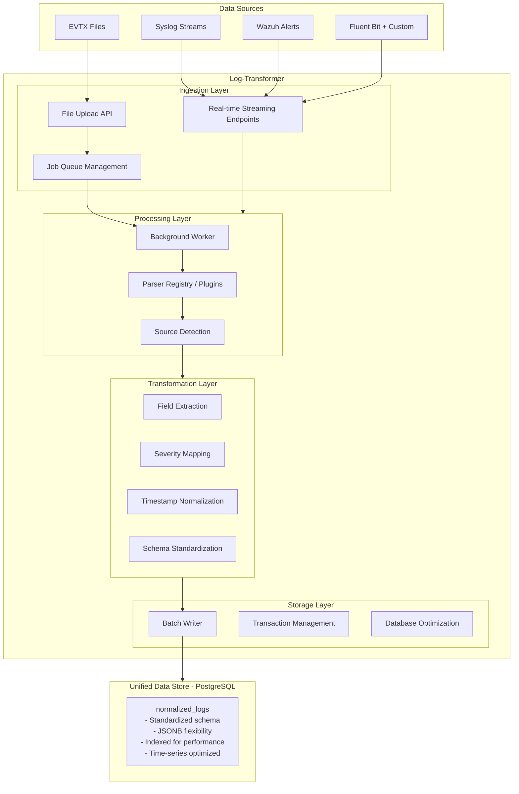

# Appendix F-2.9 — End-to-End Flow

# End-to-End System Flow

## Overview

This document describes how data flows through the entire ecosystem, from initial log collection to final security analysis. The system demonstrates a complete data pipeline that ingests logs from various sources, normalizes them into a unified format, stores them efficiently, and makes them available for advanced security analysis.

## System Architecture Overview



---

## Flow Scenarios

### Scenario 1: File-Based Log Ingestion

This is the most common scenario for batch processing of historical logs.

#### Step-by-Step Flow

**1. Security Engineer Uploads Log File**
```bash
# Engineer has collected logs from a system
curl -X POST http://log-transformer:5001/ingest/evtx \
  -F "file=@/path/to/security-events.evtx"
```

**Response**:
```json
{
  "job_id": "01HXXX1234567890ABCDEFGH",
  "status_url": "/ingest/jobs/01HXXX1234567890ABCDEFGH"
}
```

**What Happens**:
- API validates file type and size
- File saved to `uploads/20251107/01HXXX1234567890ABCDEFGH.evtx`
- Job record created in `ingest_jobs` table with status `queued`
- Immediate response returned to user (non-blocking)

---

**2. Background Worker Picks Up Job**

The worker continuously polls for new jobs:

```csharp
// Worker queries database
var job = await dbContext.IngestJobs
    .Where(j => j.Status == "queued")
    .OrderBy(j => j.CreatedAt)
    .FirstOrDefaultAsync();

// Claims the job
job.Status = "running";
job.StartedAt = DateTime.UtcNow;
await dbContext.SaveChangesAsync();
```

---

**3. Parser Resolution**

The system determines which parser to use:

```csharp
// Registry resolves parser by file extension
var parser = registry.Resolve("/uploads/20251107/01HXX.evtx", "evtx");
// Returns: EvtxIngestParser
```

**Parser Selection Logic**:
- Check source hint from job (`"evtx"`)
- Fall back to file extension (`.evtx`)
- Return appropriate parser or null

---

**4. Streaming Parse & Transform**

The parser reads and transforms logs in a streaming fashion:

```csharp
await foreach (var rawLog in parser.ParseAsync(context, ct))
{
    // rawLog contains:
    // - Original EVTX event data
    // - Timestamp, EventID, Level, etc.
    
    // Normalize the log
    var normalizedLog = new NormalizedLog
    {
        Id = Guid.NewGuid().ToString(),
        Timestamp = rawLog.TimeCreated,
        Source = "evtx",
        EventType = rawLog.Channel,
        Severity = MapSeverity(rawLog.Level),  // 2 → "high"
        RawData = JsonSerializer.Serialize(rawLog),
        NormalizedData = JsonSerializer.Serialize(ExtractFields(rawLog)),
        Status = LogStatusEnum.Pending,
        CreatedAt = DateTime.UtcNow
    };
    
    buffer.Add(normalizedLog);
    
    // Batch write when buffer is full
    if (buffer.Count >= batchSize)
    {
        await batchWriter.WriteAsync(buffer, ct);
        buffer.Clear();
    }
}
```

**Example Transformation**:

*Input (EVTX Event)*:
```xml
<Event>
  <System>
    <EventID>4625</EventID>
    <Level>2</Level>
    <TimeCreated>2025-11-07T14:30:25.123Z</TimeCreated>
    <Computer>SERVER01</Computer>
    <Channel>Security</Channel>
  </System>
  <EventData>
    <TargetUserName>admin</TargetUserName>
    <IpAddress>192.168.1.100</IpAddress>
    <LogonType>3</LogonType>
    <Status>0xC000006D</Status>
  </EventData>
</Event>
```

*Output (Normalized Log)*:
```json
{
  "id": "550e8400-e29b-41d4-a716-446655440000",
  "timestamp": "2025-11-07T14:30:25.123Z",
  "source": "evtx",
  "event_type": "Security",
  "severity": "high",
  "raw_data": {
    "EventID": 4625,
    "Level": 2,
    "Computer": "SERVER01",
    "TargetUserName": "admin",
    "IpAddress": "192.168.1.100",
    "LogonType": 3,
    "Status": "0xC000006D"
  },
  "normalized_data": {
    "event_id": 4625,
    "host": "SERVER01",
    "user": "admin",
    "source_ip": "192.168.1.100",
    "action": "login_attempt",
    "result": "failure",
    "additional_fields": {
      "logon_type": "network",
      "status_code": "0xC000006D"
    }
  },
  "message": "Failed login attempt for user admin from 192.168.1.100",
  "status": "pending",
  "created_at": "2025-11-07T14:30:30.000Z"
}
```

---

**5. Batch Database Write**

Logs are written in optimized batches:

```sql
-- Batch insert (1000 records at once)
INSERT INTO normalized_logs (
    id, timestamp, source, event_type, severity, 
    raw_data, normalized_data, message, status, created_at
)
VALUES
    ('uuid1', '2025-11-07 14:30:25', 'evtx', 'Security', 'high', '...', '...', '...', 'pending', NOW()),
    ('uuid2', '2025-11-07 14:30:26', 'evtx', 'Security', 'medium', '...', '...', '...', 'pending', NOW()),
    -- ... 998 more rows
    ('uuid1000', '2025-11-07 14:35:42', 'evtx', 'Security', 'info', '...', '...', '...', 'pending', NOW());
```

**Performance**: ~5,000-10,000 inserts/second

---

**6. Job Completion**

After all logs are processed:

```csharp
job.Status = "done";
job.Inserted = totalInserted;  // e.g., 15,432
job.Skipped = totalSkipped;    // e.g., 23
job.FinishedAt = DateTime.UtcNow;
await dbContext.SaveChangesAsync();
```

**Engineer Checks Status**:
```bash
curl http://log-transformer:5001/ingest/jobs/01HXXX1234567890ABCDEFGH
```

**Response**:
```json
{
  "id": "01HXXX1234567890ABCDEFGH",
  "source": "evtx",
  "filename": "security-events.evtx",
  "status": "done",
  "inserted": 15432,
  "skipped": 23,
  "created_at": "2025-11-07T14:25:00Z",
  "started_at": "2025-11-07T14:25:05Z",
  "finished_at": "2025-11-07T14:28:32Z"
}
```

---

**7. AI-Security Analysis Begins**

Once data is in the database, ai-security automatically processes it:

**a) Detection Engine Queries New Logs**:
```sql
SELECT * FROM normalized_logs
WHERE status = 'pending'
  AND created_at > NOW() - INTERVAL '5 minutes'
ORDER BY timestamp;
```

**b) ML Models Analyze Patterns**:
- Failed login detection
- Lateral movement analysis
- Privilege escalation detection
- Anomaly scoring

**c) Correlation Engine**:
```sql
-- Find related events for the failed login
SELECT * FROM normalized_logs
WHERE normalized_data->>'source_ip' = '192.168.1.100'
  AND timestamp BETWEEN '2025-11-07 14:00:00' AND '2025-11-07 15:00:00'
ORDER BY timestamp;
```

**d) Alert Generation**:
If suspicious pattern detected:
```json
{
  "alert_id": "ALERT-001",
  "severity": "high",
  "title": "Multiple Failed Login Attempts Detected",
  "description": "User 'admin' had 15 failed login attempts from IP 192.168.1.100 within 5 minutes",
  "affected_entities": {
    "user": "admin",
    "source_ip": "192.168.1.100",
    "host": "SERVER01"
  },
  "timeline": [...],
  "recommended_actions": [
    "Block source IP",
    "Reset user password",
    "Review account activity"
  ]
}
```

**e) Security Analyst Investigates**:
- Views alert in ai-security dashboard
- Drills down into related events
- Uses investigation tools
- Takes response actions

---

### Scenario 2: Real-Time Stream Ingestion

For continuous monitoring, logs are streamed in real-time.

#### Step-by-Step Flow

**1. External System Sends Logs Continuously**

Example: FluentBit configured on application servers

**FluentBit Configuration**:
```conf
[INPUT]
    Name        tail
    Path        /var/log/app/*.log
    Parser      json
    Tag         app.logs

[OUTPUT]
    Name        http
    Match       *
    Host        log-transformer
    Port        5001
    URI         /ingest/fluentbit
    Format      json
    json_date_key timestamp
    json_date_format iso8601
```

**FluentBit Sends**:
```http
POST /ingest/fluentbit HTTP/1.1
Host: log-transformer:5001
Content-Type: application/json

[
  {
    "timestamp": "2025-11-07T14:30:25.123Z",
    "level": "error",
    "tag": "app.auth",
    "log": "Authentication failed for user: admin",
    "host": "web-server-01",
    "container": "auth-service",
    "metadata": {
      "user": "admin",
      "ip": "192.168.1.100",
      "reason": "invalid_password"
    }
  },
  {
    "timestamp": "2025-11-07T14:30:26.456Z",
    "level": "warn",
    "tag": "app.api",
    "log": "Rate limit exceeded",
    "host": "api-server-02",
    "container": "api-service",
    "metadata": {
      "endpoint": "/api/users",
      "ip": "10.0.0.50"
    }
  }
]
```

---

**2. API Endpoint Receives Stream**

```csharp
app.MapPost("/ingest/fluentbit", async (
    FluentBitPayload payload,
    BatchWriter batchWriter,
    CancellationToken ct) =>
{
    var logs = new List<NormalizedLog>();
    
    foreach (var entry in payload)
    {
        logs.Add(new NormalizedLog
        {
            Id = Guid.NewGuid().ToString(),
            Timestamp = entry.Timestamp,
            Source = "fluentbit",
            EventType = entry.Tag,
            Severity = MapSeverity(entry.Level),
            RawData = JsonSerializer.Serialize(entry),
            NormalizedData = JsonSerializer.Serialize(new NormalizedData
            {
                host = entry.Host,
                process = entry.Container,
                user = entry.Metadata?.GetValueOrDefault("user"),
                source_ip = entry.Metadata?.GetValueOrDefault("ip"),
                action = ExtractAction(entry.Log),
                additional_fields = entry.Metadata
            }),
            Message = entry.Log,
            Status = LogStatusEnum.Pending,
            CreatedAt = DateTime.UtcNow
        });
    }
    
    // Immediate write (no job queue for real-time)
    var inserted = await batchWriter.WriteAsync(logs, ct);
    
    return Results.Ok(new { inserted = inserted });
});
```

**Processing Time**: < 50ms per batch

---

**3. Immediate Database Write**

No job queue - data goes directly to database:

```sql
INSERT INTO normalized_logs (...) VALUES (...);
-- Transaction committed immediately
```

---

**4. Real-Time Analysis**

AI-Security detects threats within seconds:

**Continuous Query** (runs every few seconds):
```sql
SELECT * FROM normalized_logs
WHERE created_at > NOW() - INTERVAL '10 seconds'
  AND status = 'pending';
```

**Real-Time Alert**:
- Failed auth detected at 14:30:25
- Alert generated at 14:30:27
- Analyst notified at 14:30:28
- **Total latency: 3 seconds**

---

### Scenario 3: Multi-Source Correlation

The power of unified normalization becomes apparent when correlating across sources.

#### Example: Detecting Advanced Persistent Threat (APT)

**Timeline of Events from Multiple Sources**:

```
14:00:00 | FluentBit (Application) | User 'admin' logged in from 192.168.1.100
14:05:00 | EVTX (Windows)          | Account enumeration on SERVER01
14:10:00 | Syslog (Firewall)       | Unusual outbound connection to 203.0.113.50
14:15:00 | Wazuh (File Integrity)  | Suspicious file created: /tmp/.hidden
14:20:00 | EVTX (Windows)          | Privilege escalation detected
14:25:00 | Syslog (Network)        | Large data transfer to external IP
```

**AI-Security Correlation Query**:
```sql
-- Find all events related to IP 192.168.1.100 in last hour
WITH related_events AS (
    SELECT *
    FROM normalized_logs
    WHERE (
        normalized_data->>'source_ip' = '192.168.1.100'
        OR normalized_data->>'destination_ip' = '192.168.1.100'
        OR normalized_data->>'user' = 'admin'
    )
    AND timestamp BETWEEN '2025-11-07 14:00:00' AND '2025-11-07 15:00:00'
)
SELECT 
    timestamp,
    source,
    event_type,
    severity,
    normalized_data->>'action' as action,
    message
FROM related_events
ORDER BY timestamp;
```

**Result**: Complete attack timeline across all systems

**AI Analysis**:
- Pattern matches known APT behavior
- Severity escalation over time
- Multiple TTPs (Tactics, Techniques, Procedures)
- High confidence score: 95%

**Automated Response**:
1. Isolate affected systems
2. Block malicious IP
3. Disable compromised account
4. Create incident ticket
5. Alert SOC team

---

## Data Lifecycle

### Phase 1: Ingestion (0-5 minutes)

```
Log Generated → Collected → Uploaded/Streamed → Queued
```

**Key Metrics**:
- Ingestion latency: < 1 minute (file) or < 5 seconds (stream)
- Success rate: > 99.9%
- Queue depth: monitored

---

### Phase 2: Processing (5-30 minutes)

```
Queued → Parsed → Normalized → Written → Indexed
```

**Key Metrics**:
- Processing rate: 10K-50K events/second
- Error rate: < 0.1%
- Data quality: 100% schema compliance

---

### Phase 3: Analysis (Real-time)

```
Database → Detection Engine → Correlation → Alerts
```

**Key Metrics**:
- Analysis latency: < 10 seconds
- False positive rate: < 5%
- Detection coverage: > 95% of MITRE ATT&CK

---

### Phase 4: Investigation (Minutes to hours)

```
Alert → Analyst Review → Investigation → Response
```

**Key Metrics**:
- MTTD (Mean Time To Detect): < 5 minutes
- MTTR (Mean Time To Respond): < 30 minutes
- Investigation efficiency: 80% reduction in manual work

---

### Phase 5: Retention (Days to years)

```
Hot Storage (7 days) → Warm Storage (30 days) → Cold Storage (1+ years)
```

**Key Metrics**:
- Hot: SSD, indexed, instant queries
- Warm: Standard disk, compressed
- Cold: S3/Archive, slow retrieval

---

## Integration Points

### 1. Log-Transformer ← Data Sources

**Protocol**: HTTP, File Upload, Message Queue
**Format**: Native formats (EVTX, Syslog, JSON, etc.)
**Authentication**: API keys, mTLS (configurable)

---

### 2. Log-Transformer → Database

**Protocol**: PostgreSQL native protocol
**Format**: Normalized schema with JSONB
**Optimization**: Batch writes, connection pooling

---

### 3. Database ← AI-Security

**Protocol**: PostgreSQL native protocol
**Format**: SQL queries on normalized schema
**Optimization**: Indexed queries, read replicas

---

### 4. AI-Security → External Systems

**Protocol**: Webhooks, SIEM integration, SOAR platforms
**Format**: Alerts, incidents, events
**Integration**: REST APIs, message queues

---

## Performance Characteristics

### End-to-End Latency

| Scenario | Latency | Throughput |
|----------|---------|------------|
| **File Upload** | 2-5 minutes | 10-50K events/minute |
| **Real-time Stream** | 3-10 seconds | Continuous |
| **Multi-source Query** | < 1 second | N/A |
| **Alert Generation** | 5-30 seconds | N/A |

### Resource Utilization

| Component | CPU | Memory | Storage |
|-----------|-----|--------|---------|
| **Log-Transformer API** | 0.5-2 cores | 512MB-2GB | Minimal |
| **Log-Transformer Worker** | 1-4 cores | 1GB-4GB | Temporary |
| **PostgreSQL** | 2-8 cores | 4GB-32GB | 10GB-10TB+ |
| **AI-Security** | 2-8 cores | 4GB-16GB | Minimal |

---

## Monitoring the Flow

### Key Observability Points

**1. Ingestion Monitoring**:
```sql
-- Check ingestion rate
SELECT 
    source,
    COUNT(*) as events,
    MAX(created_at) as latest_event
FROM normalized_logs
WHERE created_at > NOW() - INTERVAL '1 hour'
GROUP BY source;
```

**2. Processing Monitoring**:
```sql
-- Check job queue health
SELECT 
    status,
    COUNT(*) as count,
    AVG(EXTRACT(EPOCH FROM (finished_at - started_at))) as avg_duration_seconds
FROM ingest_jobs
WHERE created_at > NOW() - INTERVAL '24 hours'
GROUP BY status;
```

**3. Analysis Monitoring**:
```sql
-- Check pending analysis
SELECT COUNT(*) as pending_logs
FROM normalized_logs
WHERE status = 'pending';
```

**4. End-to-End Health**:
```bash
# Synthetic transaction
curl -X POST http://log-transformer:5001/ingest/test \
  -F "file=@test.jsonl"

# Wait and verify in database
psql -c "SELECT COUNT(*) FROM normalized_logs WHERE source='test' AND created_at > NOW() - INTERVAL '5 minutes'"
```

---

## Failure Scenarios and Recovery

### Scenario: Database Outage

**Impact**: Ingestion blocked, analysis stopped
**Detection**: Health check fails, error logs
**Recovery**:
1. Jobs remain queued (not lost)
2. Database restored from backup
3. Workers resume processing automatically
4. No data loss

### Scenario: Worker Crash

**Impact**: Jobs stuck in "running" state
**Detection**: Job timeout monitoring
**Recovery**:
1. Identify stale jobs: `started_at > 1 hour ago AND status='running'`
2. Reset to queued: `UPDATE ingest_jobs SET status='queued' WHERE ...`
3. Worker restarts and reprocesses

### Scenario: Parser Error

**Impact**: Single job fails
**Detection**: Job status = "error"
**Recovery**:
1. Error logged with details
2. File preserved for debugging
3. Other jobs continue processing
4. Fix parser, resubmit job

---

## Conclusion

The end-to-end flow demonstrates:

1. **Unified Ingestion**: Any log source can be integrated
2. **Consistent Processing**: All logs normalized to same schema
3. **Efficient Storage**: Optimized for both storage and query performance
4. **Real-time Analysis**: From log to alert in seconds
5. **Complete Visibility**: Full audit trail from source to action

This architecture enables security teams to:
- Monitor everything from a single platform
- Correlate events across all systems
- Detect threats faster
- Respond more effectively
- Scale as needed

The system is production-ready and designed for growth, supporting organizations from small teams to large enterprises with complex security requirements.
