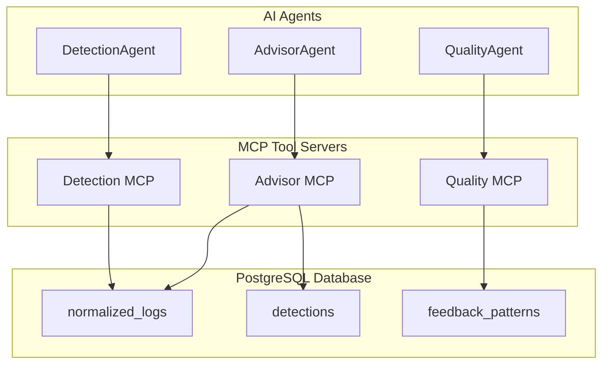
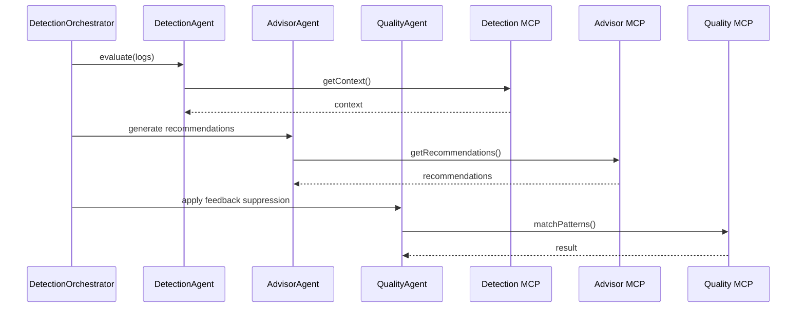

# Appendix H - MCP Tool Specifications

This appendix documents the Model Context Protocol (MCP) tools integrated into the AI-Security backend. Detection, Advisor, and Quality MCP servers expose structured commands so AI agents can retrieve context, generate recommendations, and manage suppression patterns.

---

## H.1 Overview of MCP Integration

Three MCP servers run alongside the backend:

- **Detection MCP** – log summaries, grouped events, lookup utilities.
- **Advisor MCP** – remediation recommendations and MITRE mappings.
- **Quality MCP** – feedback pattern retrieval and updates.

**Figure H.1 - MCP Tool Integration Architecture**



---

## H.2 Detection MCP Tool

Provides the DetectionAgent with recent logs, grouped contexts, and summaries.

### H.2.1 Supported Commands

| Command             | Description                                        |
| ------------------- | -------------------------------------------------- |
| `getRecentLogs(limit)` | Returns the most recent N logs                  |
| `groupLogsBy(field)`  | Groups logs by host, username, or IP            |
| `getLogContext(logId)`| Retrieves related logs for the specified record |
| `summariseEvents(range)` | Summaries for a given time window            |

### H.2.2 Example Command: `getRecentLogs`

**Figure H.2 - Detection MCP Request**

```json
{
  "command": "getRecentLogs",
  "arguments": {
    "limit": 20
  }
}
```

**Response**

```json
{
  "logs": [
    {
      "id": "3f91a230-0fb9-4a57-8558-d0e8cd9f03e9",
      "source": "syslog",
      "event_type": "auth_failure",
      "timestamp": "2025-01-14T09:15:33Z"
    }
  ]
}
```

---

## H.3 Advisor MCP Tool

Assists the AdvisorAgent with remediation steps, MITRE mappings, and context explanations.

### H.3.1 Supported Commands

| Command                     | Description                                      |
| --------------------------- | ------------------------------------------------ |
| `generateRemediation(detection)` | Produces remediation steps                |
| `mapToMitre(detection)`     | Maps behaviour to MITRE techniques               |
| `explainContext(detection)` | Generates a human-readable explanation           |

### H.3.2 Example Command: `generateRemediation`

**Figure H.3 - Advisor MCP Request**

```json
{
  "command": "generateRemediation",
  "arguments": {
    "detectionId": "55e38e5a-6979-49b8-a9c8-9dd066357d05"
  }
}
```

**Response**

```json
{
  "remediation": [
    "Reset the affected credentials.",
    "Block the source IP address temporarily.",
    "Review audit logs for lateral movement indicators."
  ],
  "mitre": "T1110"
}
```

---

## H.4 Quality MCP Tool

Manages feedback patterns for false-positive suppression.

### H.4.1 Supported Commands

| Command               | Description                                 |
| --------------------- | ------------------------------------------- |
| `getPatterns()`       | Returns all feedback patterns               |
| `matchPattern(log)`   | Checks if a log matches an existing pattern |
| `addPattern(pattern)` | Stores a new pattern                        |
| `updatePattern(patternId)` | Updates an existing pattern            |

### H.4.2 Example Command: `addPattern`

**Figure H.4 - Quality MCP Request**

```json
{
  "command": "addPattern",
  "arguments": {
    "pattern_id": "fp-admin-maintenance",
    "reason": "Maintenance login window",
    "attributes": {
      "account_name": "svc_automation",
      "ip_range": "10.0.5.0/24",
      "time_window": "02:00-03:00"
    }
  }
}
```

**Response**

```json
{
  "status": "saved",
  "pattern_id": "fp-admin-maintenance"
}
```

---

## H.5 MCP Tool Schema Summary

| Field     | Description                                  |
| --------- | -------------------------------------------- |
| `command` | Operation invoked on the MCP tool            |
| `arguments` | Input parameters                           |
| `response` | Structured JSON output                      |
| `error`   | Optional error payload                       |

---

## H.6 Interaction Summary Diagram

Shows how MCP tools interact with AI agents during hybrid detection.

**Figure H.5 - MCP-Agent Interaction Summary**


