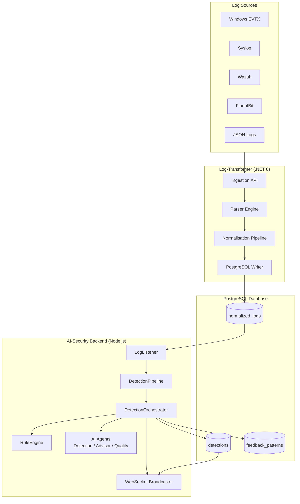
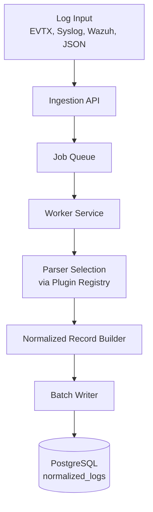
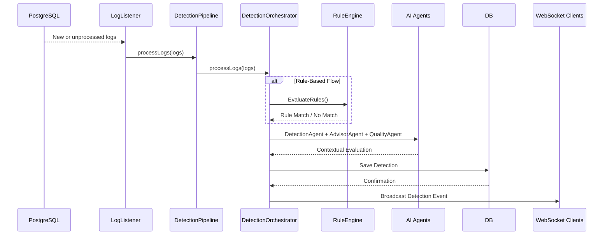
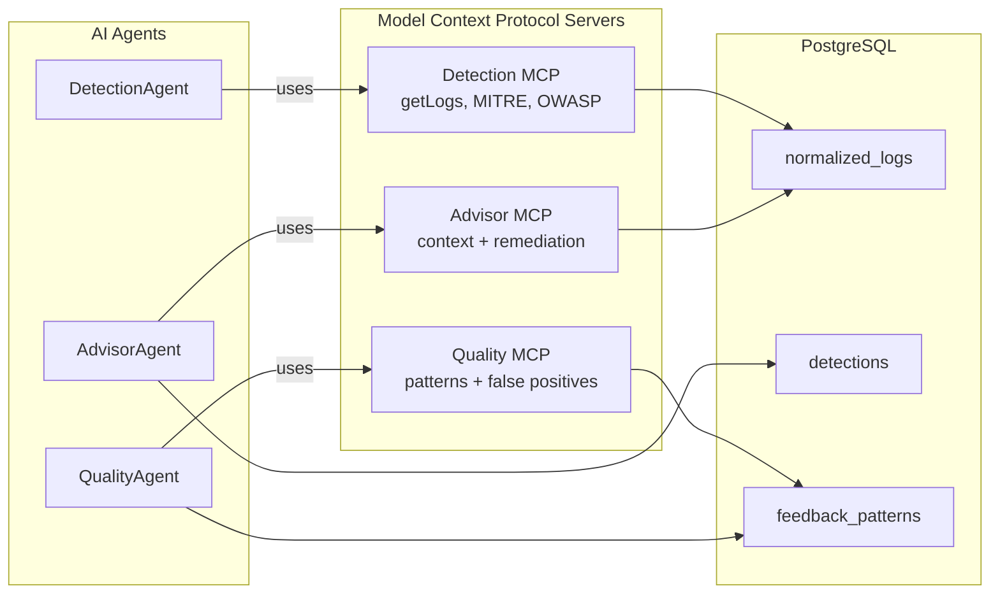

# Appendix A - System Architecture Diagrams

This appendix provides the complete set of architectural diagrams referenced throughout the project. They summarise the modular design, two-tier microservice structure, and end-to-end execution flows. All diagrams are expressed in Mermaid to remain consistent with the architectural documentation maintained in the Log-Transformer and AI-Security repositories.

---

## A.1 High-Level System Architecture

The system is composed of two independent yet integrated services:

- **Log-Transformer (.NET 8)**: Handles ingestion, parsing, and normalisation of heterogeneous logs.
- **AI-Security Backend (Node.js / TypeScript)**: Performs hybrid detection that combines rule-based logic with AI-driven contextual analysis.

Both services share a PostgreSQL database and publish real-time detections to connected dashboards.

**Figure A.1 - High-Level System Architecture**

---

## A.2 Ingestion Pipeline Architecture (Log-Transformer)

This diagram represents the flow from raw log input to normalised storage. It is sourced from LT-3-architecture.md, LT-5-core-components.md, and LT-8-end-to-end-flow.md.

**Figure A.2 - Log-Transformer Ingestion Architecture**

---

## A.3 Detection Pipeline Architecture (AI-Security Backend)

Derived from as-core-components.md and as-architecture.md, this pipeline handles log polling, grouping, rule matching, AI contextual reasoning, and final detection creation.

**Figure A.3 - Detection Pipeline (Rule + AI Hybrid)**

---

## A.4 AI Agent Collaboration Architecture (MCP Integration)

This diagram reflects the MCP-based tool orchestration across DetectionAgent, AdvisorAgent, and QualityAgent, sourced from as-mcp-integration.md and as-ai-agents.md.

**Figure A.4 - AI Agent Collaboration via MCP**

---

## A.5 End-to-End Log-to-Detection Flow

This diagram captures the comprehensive pipeline from ingestion through detection and analyst notification.

**Figure A.5 - End-to-End System Flow**

```mermaid
flowchart LR
    A[Raw Log<br/>Windows/Syslog/Wazuh] --> B[Ingestion API]
    B --> C[Parser Engine]
    C --> D[Normalized Record]
    D --> E[(PostgreSQL)]
    E --> F[LogListener]
    F --> G[DetectionPipeline]
    G --> H[Rule Engine]
    H --> I[AI Agents]
    I --> J[Save Detection<br/>Database]
    J --> K[WebSocket<br/>Broadcast]
    K --> L[Analyst Dashboard]
```

