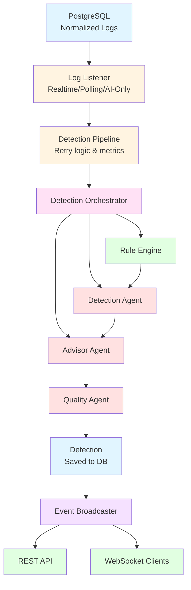

# AI Security Backend Documentation

**AI-Powered Security Intelligence System**

A TypeScript-based backend service that analyzes security logs using a hybrid rule-based + AI agent approach to detect threats and generate actionable remediation plans with MITRE ATT&CK and OWASP references.

## Overview

This backend service ingests normalized security logs from PostgreSQL, evaluates YAML security rules, validates findings with AI agents (powered by Codex SDK), generates remediation plans, and exposes results via REST API + WebSocket for real-time alerts.

## Quick Links

### Getting Started
- [Getting Started Guide](./getting-started.md) - Installation, setup, and first run
- [Configuration Guide](./configuration.md) - Environment variables, config.yaml, and settings

### Core Documentation
- [Architecture Overview](./architecture.md) - System design, components, and data flow
- [Core Components](./core-components.md) - SecurityApp, DetectionOrchestrator, DetectionPipeline, LogListener
- [AI Agents](./ai-agents.md) - BaseAgent, DetectionAgent, AdvisorAgent, QualityAgent
- [Rule System](./rule-system.md) - Rule engine, YAML schemas, and custom rule creation
- [Database](./database.md) - Models, repositories, migrations, and schema

### API & Integration
- [API Reference](./api-reference.md) - REST endpoints, schemas, and usage
- [WebSocket](./websocket.md) - Real-time detection streaming and event broadcasting
- [MCP Integration](./mcp-integration.md) - Model Context Protocol servers and toolss

## Architecture at a Glance



## Key Features

- **Hybrid Detection**: Rule-based + AI agent validation for accurate threat detection
- **Real-time Processing**: LISTEN/NOTIFY or polling modes for log ingestion
- **AI-Powered Analysis**: Codex SDK-powered agents with MCP tool integration
- **Remediation Plans**: Actionable steps with MITRE ATT&CK and OWASP mappings
- **Continuous Learning**: User feedback system improves detection accuracy
- **Flexible Rules**: YAML-based security rules with pattern matching and aggregations
- **Real-time Alerts**: WebSocket broadcasting for instant detection notifications
- **REST API**: Comprehensive API for detections, logs, stats, and configuration

## Technology Stack

- **Runtime**: Node.js 18+ with TypeScript (ES Modules)
- **Framework**: Fastify (REST API + WebSocket)
- **Database**: PostgreSQL with Sequelize ORM
- **AI**: Codex SDK with Model Context Protocol (MCP)
- **Configuration**: dotenv + YAML
- **Testing**: Jest with ES module support
- **Logging**: Winston

## Core Processing Flow

1. **Log Ingestion**: LogListener monitors PostgreSQL for new normalized logs
2. **Pipeline Processing**: DetectionPipeline receives logs and invokes DetectionOrchestrator
3. **Rule Evaluation**: RuleEngine evaluates YAML security rules against log entries
4. **AI Detection**: DetectionAgent validates rule matches and identifies real threats
5. **Remediation Planning**: AdvisorAgent generates actionable remediation plans
6. **Quality Validation**: QualityAgent filters false positives using feedback history
7. **Persistence & Broadcasting**: Valid detections saved to DB and broadcast via WebSocket

## Data Models

- **NormalizedLog**: Security logs from various sources (Wazuh, Windows, IIS) with JSONB fields
- **Detection**: AI-validated threat detections with remediation plans and framework mappings
- **Feedback**: User feedback on detection helpfulness for continuous learning
- **FeedbackPattern**: Aggregated patterns from feedback for quality improvement

## Quick Start

```bash
cd ai-security-backend/packages/core

cp .env.example .env

npm install

npx sequelize-cli db:migrate

npm run dev
```

The service will start:
- **API Server**: http://localhost:3000
- **WebSocket**: ws://localhost:3000/ws/detections
- **MCP Servers**:
  - Detection Agent: http://127.0.0.1:3100/mcp
  - Advisor Agent: http://127.0.0.1:3101/mcp
  - Quality Agent: http://127.0.0.1:3102/mcp

See [Getting Started](./getting-started.md) for detailed instructions.

## Common Commands

```bash
npm run dev             # Run in development mode
npm run build           # Build for production
npm run test            # Run all tests
npm run lint            # Lint code
npm run lint:fix        # Auto-fix linting issues
```

See [Getting Started](./getting-started.md#common-commands) for a complete command reference.

## Project Structure

```
ai-security-backend/
├── docs/                    # This documentation
└── packages/
    ├── core/                # Main backend package
    │   ├── src/
    │   │   ├── agents/      # AI agents (Detection, Advisor, Quality)
    │   │   ├── api/         # REST API (routes, controllers, services, schemas)
    │   │   ├── db/          # Database (models, repositories, migrations)
    │   │   ├── mcp/         # Model Context Protocol servers and tools
    │   │   ├── prompts/     # AI agent prompts and prompt assembly
    │   │   ├── rules/       # Rule engine and YAML security rules
    │   │   ├── streaming/   # Log processing (LogListener, DetectionPipeline)
    │   │   ├── types/       # TypeScript type definitions
    │   │   ├── utils/       # Utilities (logger, config, MITRE, OWASP)
    │   │   ├── websocket/   # WebSocket server and event broadcasting
    │   │   └── index.ts     # Application entry point
    │   ├── tests/           # Unit and integration tests
    │   ├── data/            # Feedback history and agent workspace
    │   └── package.json
    └── codex-sdk/           # Forked Codex SDK dependency
```

---

**Documentation Version**: 1.0.0
**Last Updated**: 2025-01-01
**Backend Version**: 0.1.0
