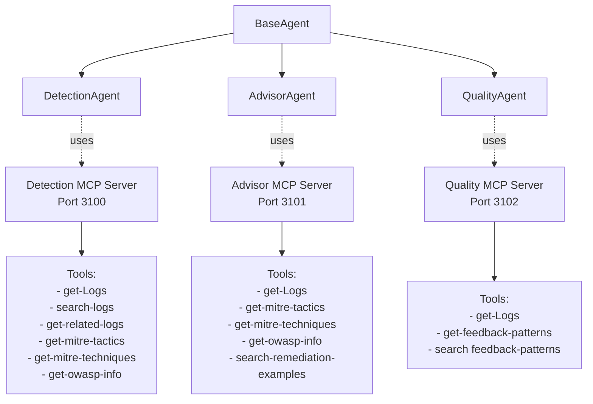
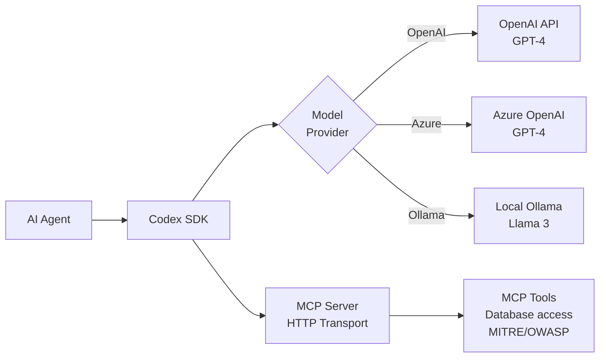
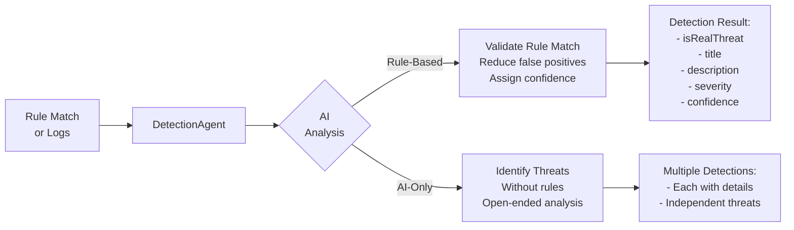
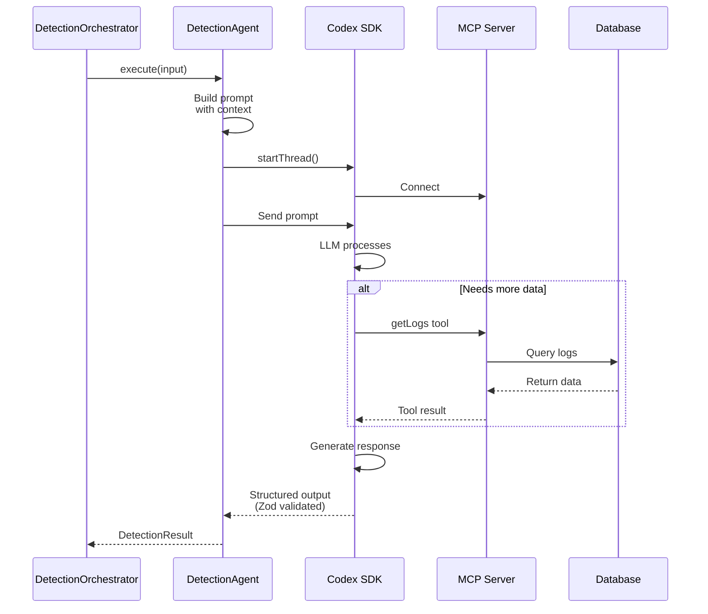
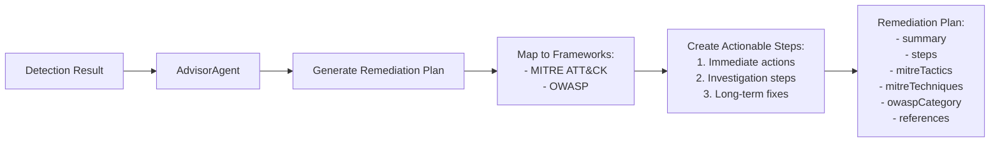
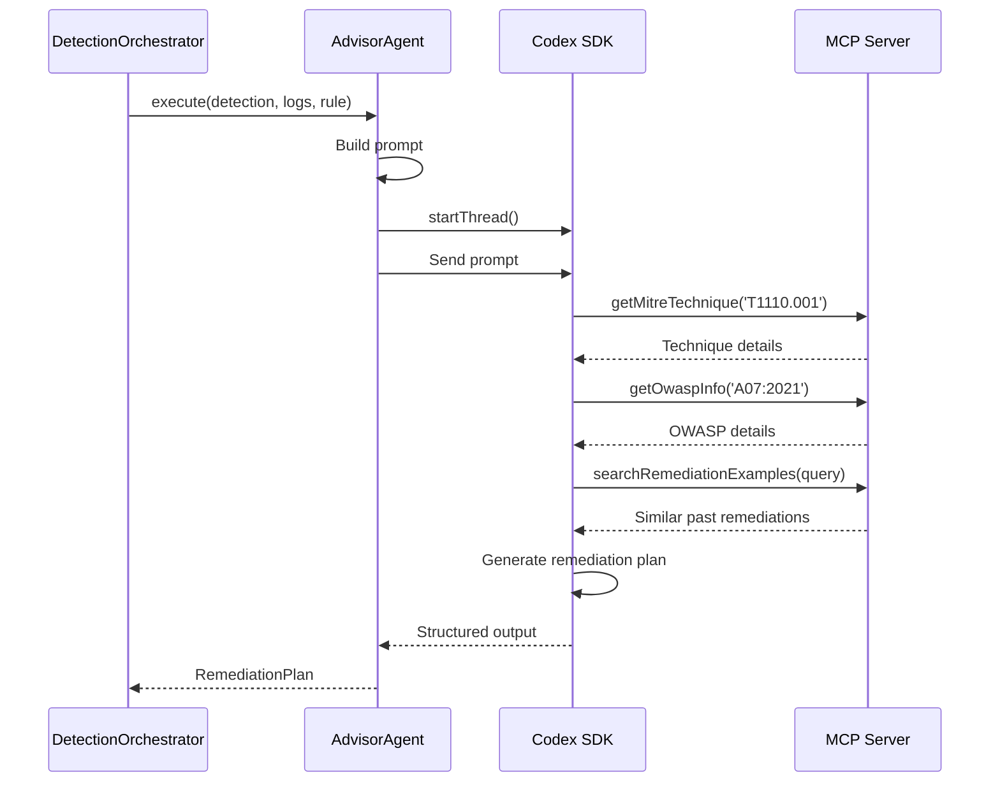
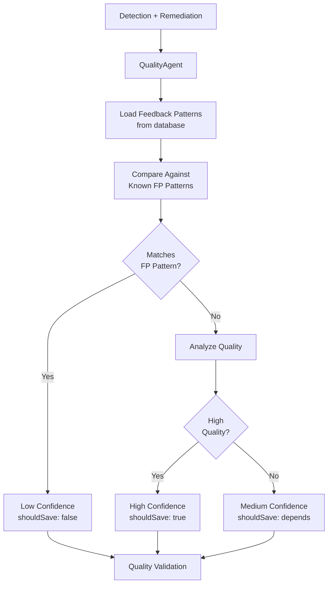
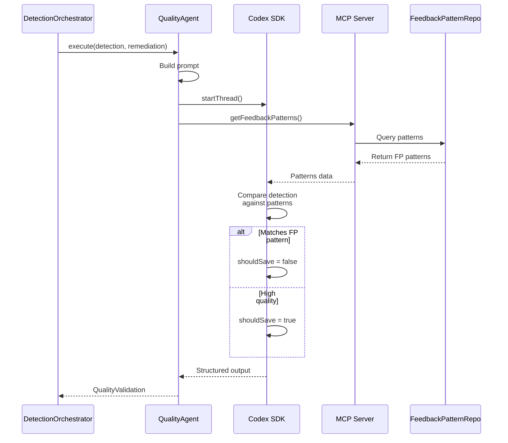
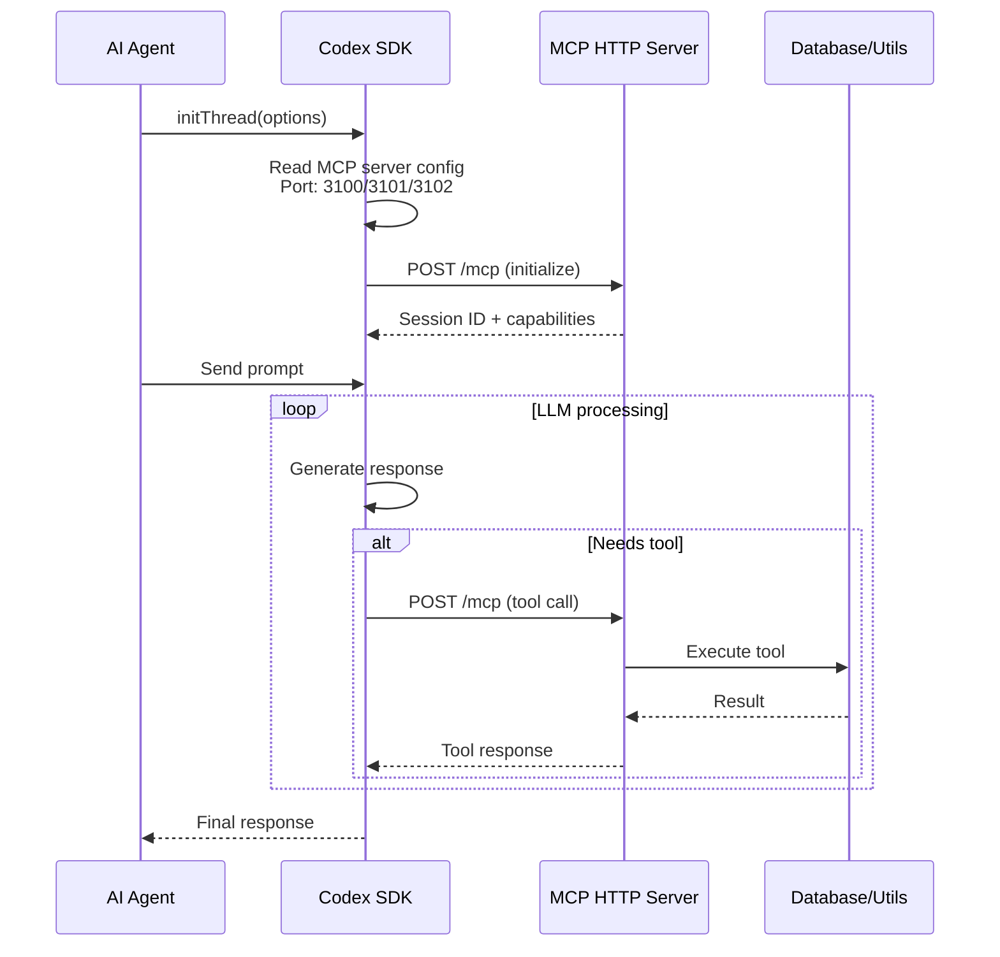

# AI Agents

Comprehensive documentation for AI agents powered by Codex SDK and MCP.

## Table of Contents

- [Overview](#overview)
- [BaseAgent](#baseagent)
- [DetectionAgent](#detectionagent)
- [AdvisorAgent](#advisoragent)
- [QualityAgent](#qualityagent)
- [Prompts System](#prompts-system)
- [MCP Integration](#mcp-integration)

## Overview

All AI agents extend `BaseAgent` and use the Codex SDK for LLM interactions with Model Context Protocol (MCP) tool support.
The system is provider-agnostic and scalable, any LLM provider can be used by swapping the Codex instance in BaseAgent with a compatible API client.



## BaseAgent

**Location**: `packages/core/src/agents/baseAgent.ts`

Abstract base class for all AI agents.

### Responsibilities

- Initialize Codex SDK
- Configure MCP servers
- Manage agent workspaces
- Initialize and resume threads
- Model provider abstraction

### Architecture



### Constructor

```typescript
constructor(config: AgentConfig, agentType: 'detection' | 'advisor' | 'quality')
```

**Parameters**:
- `config`: Agent configuration (name, threadOptions)
- `agentType`: Determines MCP server port and workspace

**Initializes**:
- Codex SDK instance
- Workspace directory for agent
- Logging configuration

### Methods

#### `protected initThread(options?: ThreadOptions): Thread`

Initializes a new Codex thread with MCP server.

**Actions**:
1. Creates CodexConfigBuilder
2. Adds MCP server for agent type
3. Configures model providers
4. Sets workspace directory
5. Creates and returns thread

**MCP Ports**:
- Detection: 3100
- Advisor: 3101
- Quality: 3102

#### `protected resumeThread(threadId: string): Thread`

Resumes an existing thread.

#### `protected getWorkspaceDirectory(): string`

Returns agent-specific workspace path.

**Example**:
```
data/agent-workspace/detection/
data/agent-workspace/advisor/
data/agent-workspace/quality/
```

#### `abstract execute(input: unknown): Promise<unknown>`

Must be implemented by subclasses.

### Configuration

Each agent can configure:
- Model
- Model provider
- Thread options
- Custom prompts

See: `packages/core/src/agents/baseAgent.ts:7-138`

## DetectionAgent

**Location**: `packages/core/src/agents/detection/detectionAgent.ts`

Validates rule matches and identifies real threats using AI analysis.

### Purpose



### Input

**Rule-Based Mode**:
```typescript
{
  logs: NormalizedLog[],
  ruleMatch: {
    rule: SecurityRule,
    log: NormalizedLog,
    matchedConditions: RuleCondition[],
    contextLogs: NormalizedLog[]
  }
}
```

**AI-Only Mode**:
```typescript
{
  logs: NormalizedLog[]
}
```

### Output

```typescript
{
  detections: Array<{
    isRealThreat: boolean,
    title: string,
    description: string,
    severity: 'critical' | 'high' | 'medium' | 'low',
    confidence: number,  // 0-1
    reasoning: string
  }>
}
```

### Execution Flow



### Prompt Structure

**System Prompt**:
```
You are a security analyst AI specializing in threat detection.
Analyze log entries and rule matches to determine if they represent real security threats.

Consider:
- Context from related logs
- Attack patterns and techniques
- False positive indicators
- Severity based on potential impact
```

**User Prompt** (Rule-Based):
```
Rule Match: {rule.name}
Description: {rule.description}

Matched Conditions:
{conditions}

Log Entry:
{log}

Context Logs (last 5 minutes):
{contextLogs}

Analyze if this is a real threat or false positive.
```

**User Prompt** (AI-Only):
```
Analyze the following logs for security threats:

{logs}

Identify any suspicious patterns, attack indicators, or security concerns.
```

### MCP Tools Available

- `getLogs`: Fetch additional logs for context
- `getMitreTactic`: Get MITRE ATT&CK tactic details
- `getMitreTechnique`: Get MITRE ATT&CK technique details
- `getOwaspInfo`: Get OWASP category information

### Example

**Input**:
```typescript
{
  logs: [/* failed login logs */],
  ruleMatch: {
    rule: { ruleId: 'SEC-AUTH-002', name: 'Windows Failed Login Attempts' },
    matchedConditions: [
      { field: 'event_type', operator: 'equals', value: 'failed_login' }
    ]
  }
}
```

**Output**:
```typescript
{
  detections: [{
    isRealThreat: true,
    title: 'Brute Force Attack on Administrator Account',
    description: 'Multiple failed login attempts detected from 192.168.1.100 targeting the administrator account within 2 minutes. Pattern indicates automated brute force attack.',
    severity: 'high',
    confidence: 0.95,
    reasoning: 'Rapid succession of failures, targeting privileged account, from single source IP.'
  }]
}
```

See: `packages/core/src/agents/detection/detectionAgent.ts`

## AdvisorAgent

**Location**: `packages/core/src/agents/advisor/advisorAgent.ts`

Generates actionable remediation plans with MITRE ATT&CK and OWASP mappings.

### Purpose



### Input

```typescript
{
  detection: DetectionResult,
  logs: NormalizedLog[],
  rule?: SecurityRule
}
```

### Output

```typescript
{
  summary: string,
  steps: Array<{
    order: number,
    action: string,
    description: string,
    priority: 'immediate' | 'short-term' | 'long-term'
  }>,
  mitreTactics: string[],      // e.g., ['TA0006']
  mitreTechniques: string[],   // e.g., ['T1110.001']
  owaspCategory?: string,       // e.g., 'A07:2021'
  references: string[]
}
```

### Execution Flow



### Prompt Structure

**System Prompt**:
```
You are a security remediation specialist.
Generate actionable, specific remediation plans for detected security threats.

Use MCP tools to:
- Map threats to MITRE ATT&CK tactics/techniques
- Identify OWASP categories for web attacks
- Find similar past remediation examples

Provide:
1. Clear summary
2. Prioritized actionable steps
3. Framework mappings
4. Relevant references
```

**User Prompt**:
```
Detection: {detection.title}
Description: {detection.description}
Severity: {detection.severity}

Logs:
{logs}

Rule (if applicable):
{rule}

Generate a comprehensive remediation plan.
```

### MCP Tools Available

- `getLogs`: Fetch additional context
- `getMitreTactics`: List all MITRE tactics
- `getMitreTactic`: Get specific tactic details
- `getMitreTechniques`: Search techniques
- `getMitreTechnique`: Get specific technique details
- `getOwaspCategories`: List OWASP categories
- `getOwaspInfo`: Get category details
- `searchRemediationExamples`: Find similar past detections

### Example

**Input**:
```typescript
{
  detection: {
    title: 'Brute Force Attack',
    description: 'Multiple failed logins...',
    severity: 'high'
  },
  logs: [/* logs */],
  rule: { /* rule */ }
}
```

**Output**:
```typescript
{
  summary: 'Immediate action required to block brute force attack on administrator account. Implement account lockout and investigate source.',
  steps: [
    {
      order: 1,
      action: 'Block source IP 192.168.1.100',
      description: 'Immediately block the attacking IP at firewall level to prevent further attempts.',
      priority: 'immediate'
    },
    {
      order: 2,
      action: 'Enable account lockout policy',
      description: 'Set account lockout threshold to 5 failed attempts with 30-minute lockout duration.',
      priority: 'immediate'
    },
    {
      order: 3,
      action: 'Review authentication logs',
      description: 'Audit all failed and successful authentications for the past 24 hours.',
      priority: 'short-term'
    },
    {
      order: 4,
      action: 'Implement MFA',
      description: 'Deploy multi-factor authentication for all administrator accounts.',
      priority: 'long-term'
    }
  ],
  mitreTactics: ['TA0006'],
  mitreTechniques: ['T1110.001'],
  owaspCategory: 'A07:2021',
  references: [
    'https://attack.mitre.org/techniques/T1110/001/',
    'https://owasp.org/Top10/A07_2021-Identification_and_Authentication_Failures/'
  ]
}
```

See: `packages/core/src/agents/advisor/advisorAgent.ts`

## QualityAgent

**Location**: `packages/core/src/agents/quality/qualityAgent.ts`

Filters false positives using feedback history and pattern matching.

### Purpose



### Input

```typescript
{
  detection: DetectionResult,
  remediation: RemediationPlan,
  logs: NormalizedLog[],
  rule?: SecurityRule
}
```

### Output

```typescript
{
  shouldSave: boolean,
  confidence: number,  // 0-1
  reasoning: string,
  matchedPatterns: Array<{
    patternId: string,
    description: string,
    confidence: number
  }>
}
```

### Execution Flow



### Feedback Pattern Matching

Patterns stored from user feedback:

```typescript
{
  patternId: 'fp-auth-001',
  ruleId: 'SEC-AUTH-002',
  description: 'Legitimate admin password reset attempts flagged as brute force',
  indicators: [
    'Single failed attempt followed by success',
    'During business hours',
    'From known admin workstation'
  ],
  confidence: 0.85,
  occurrences: 5
}
```

### Prompt Structure

**System Prompt**:
```
You are a detection quality analyst.
Evaluate detections against known false positive patterns from user feedback.

Use getFeedbackPatterns MCP tool to retrieve historical FP patterns.

Determine:
- If detection matches known FP pattern
- Overall quality and confidence
- Whether to save detection
```

**User Prompt**:
```
Detection: {detection.title}
Description: {detection.description}
Severity: {detection.severity}

Remediation Summary: {remediation.summary}

Rule: {rule?.name}

Logs:
{logs}

Check against feedback patterns and determine quality.
```

### MCP Tools Available

- `getFeedbackPatterns`: Retrieve all FP patterns
- `searchFeedbackPatterns`: Search patterns by keyword
- `getLogs`: Additional context
- `getMitreTechnique`: Validate MITRE mappings

### Example

**Input**:
```typescript
{
  detection: {
    title: 'Brute Force Attack',
    // ...
  },
  remediation: { /* plan */ },
  logs: [/* logs */]
}
```

**Output** (High Confidence):
```typescript
{
  shouldSave: true,
  confidence: 0.92,
  reasoning: 'No matching false positive patterns found. Detection shows clear indicators of automated brute force attack with multiple rapid failed attempts from single source. Remediation plan is comprehensive.',
  matchedPatterns: []
}
```

**Output** (Matched FP Pattern):
```typescript
{
  shouldSave: false,
  confidence: 15,
  reasoning: 'Matches known false positive pattern "fp-auth-001": Legitimate admin password reset. Single failed attempt during business hours from known workstation.',
  matchedPatterns: [{
    patternId: 'fp-auth-001',
    description: 'Admin password reset attempts',
    confidence: 0.85
  }]
}
```

See: `packages/core/src/agents/quality/qualityAgent.ts`

## Prompts System

**Location**: `packages/core/src/prompts/`

Prompts are assembled from:
- **System prompts**: Define agent role and behavior
- **User prompt templates**: Structured input format
- **Defaults**: Fallback prompts if not configured

### Structure

```
prompts/
├── detection.ts         # DetectionAgent prompts
├── remediation.ts       # AdvisorAgent prompts
├── quality.ts           # QualityAgent prompts
├── promptAssembler.ts   # Assembles prompts with context
└── defaults/            # Default prompt templates
    ├── detection-defaults.ts
    ├── remediation-defaults.ts
    └── quality-defaults.ts
```

### Custom Prompts

Configure in `config.yaml`:

```yaml
prompts:
  detection:
    systemPrompt: "Custom detection system prompt..."
    userPromptTemplate: "Analyze: {{detection}}"

  remediation:
    systemPrompt: "Custom remediation system prompt..."

  quality:
    systemPrompt: "Custom quality system prompt..."
```

## MCP Integration

Each agent connects to its dedicated MCP server providing specialized tools.

### Connection Flow



### Tool Categories

**All Agents**:
- Log access (getLogs, searchLogs, getRelatedLogs)
- MITRE ATT&CK (getTactic, getTechnique, getTactics, getTechniques)
- OWASP (getInfo, getCategories)

**Advisor-Specific**:
- searchRemediationExamples

**Quality-Specific**:
- getFeedbackPatterns
- searchFeedbackPatterns

See: [MCP Integration Guide](./mcp-integration.md)

---

For more details:
- [Core Components](./core-components.md)
- [MCP Integration](./mcp-integration.md)
- [Configuration](./configuration.md)
