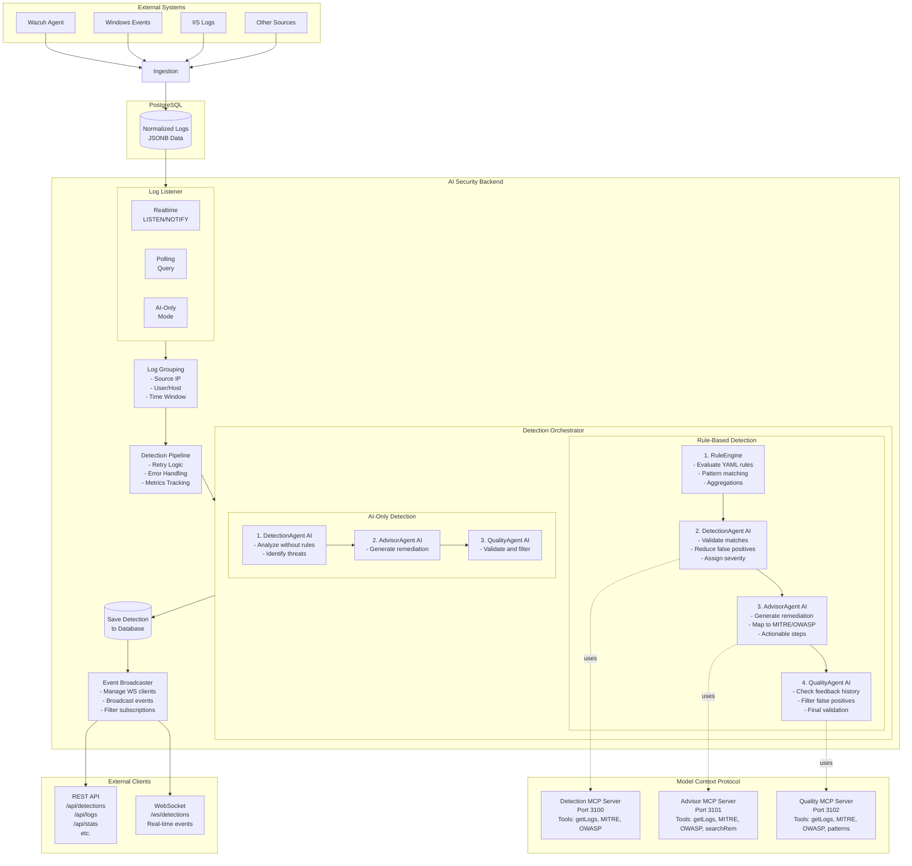
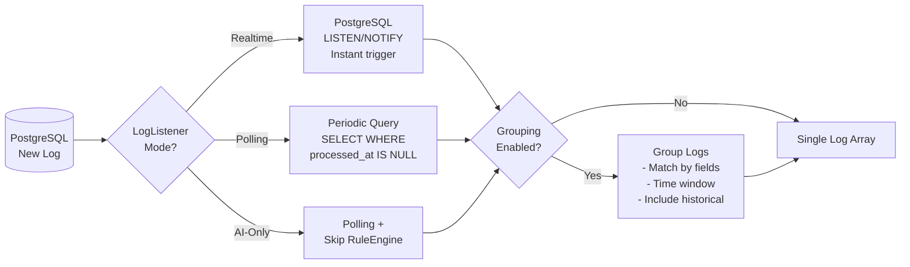
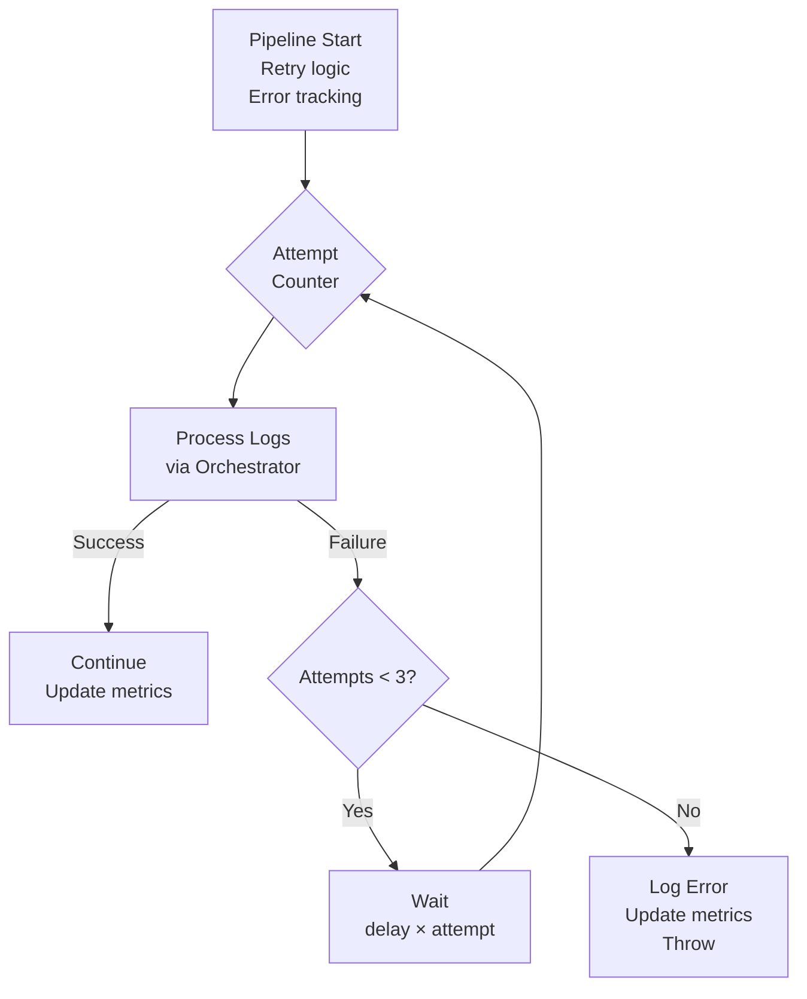
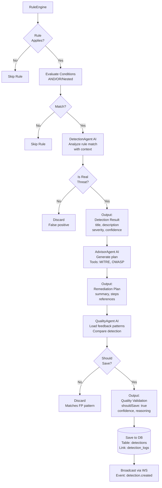
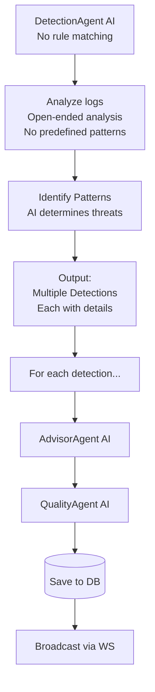
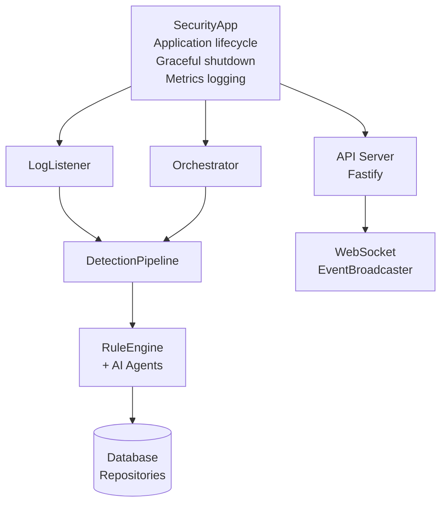
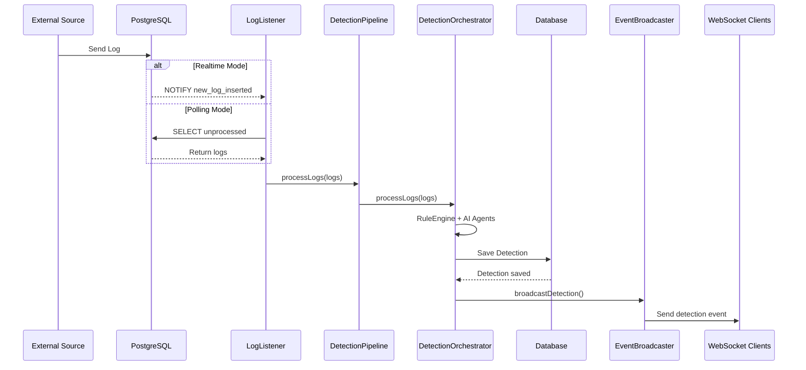
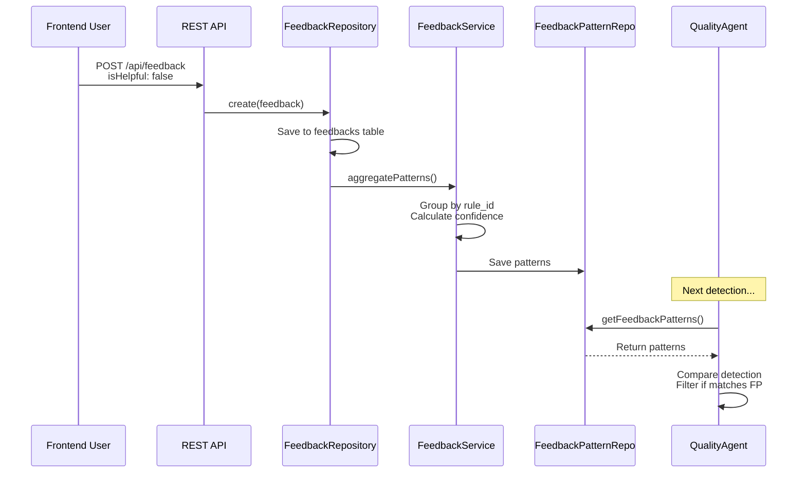
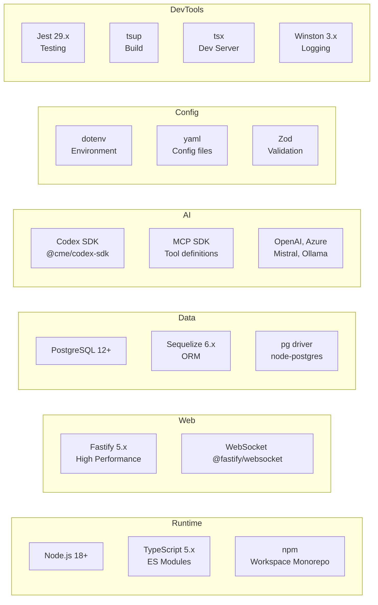
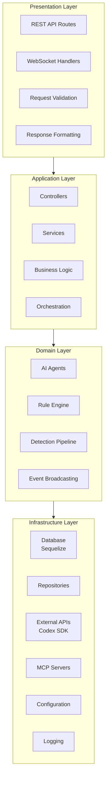

# Architecture Overview

Complete architectural overview of the AI Security Backend system.

## Table of Contents

# Appendix F-1.3 — Architecture

## Core Processing Flow

### 1. Log Ingestion

### 2. Detection Pipeline

### 3. Detection Workflow (Rule-Based)

### 4. Detection Workflow (AI-Only)

## Component Diagram

### Component Relationships

| Component | Depends On | Used By |
|-----------|------------|---------|
| SecurityApp | All components | None (entry point) |
| LogListener | Pipeline, LogRepository | SecurityApp |
| DetectionPipeline | DetectionOrchestrator | LogListener |
| DetectionOrchestrator | RuleEngine, Agents, Repositories | DetectionPipeline |
| RuleEngine | RuleLoader | DetectionOrchestrator |
| AI Agents | Codex SDK, MCP Servers | DetectionOrchestrator |
| MCP Servers | Repositories, Utils | AI Agents (via Codex) |
| API Server | Repositories, Orchestrator, EventBroadcaster | Frontend, External clients |
| EventBroadcaster | WebSocket connections | DetectionOrchestrator, API Server |

## Data Flow

### Log → Detection Flow

### Feedback → Learning Flow

## Technology Stack

### Core Technologies

- **Runtime**: Node.js 18+
- **Language**: TypeScript 5.x (ES Modules)
- **Package Manager**: npm (workspace-based monorepo)
- **API**: Fastify 5.x (high performance, schema validation)
- **WebSocket**: @fastify/websocket (real-time communication)
- **Database**: PostgreSQL 12+ with Sequelize 6.x ORM
- **AI & ML**: Codex SDK with MCP integration (OpenAI, Azure, Ollama)
- **Configuration**: dotenv + YAML
- **Validation**: Zod schemas
- **Logging**: Winston 3.x
- **Testing**: Jest 29.x with ES Modules
- **Build Tools**: tsup (compiler), tsx (dev server)

## Layer Architecture

## Design Decisions

### 1. Hybrid Rule-Based + AI Approach

**Decision**: Combine YAML rules with AI validation

**Rationale**:
- Rules provide fast, deterministic detection
- AI reduces false positives
- AI adapts to context
- Best of both worlds

### 2. Codex SDK + MCP

**Decision**: Use Codex SDK with MCP for AI agents

**Rationale**:
- Tool use capabilities
- Model abstraction
- Workspace isolation
- Structured outputs

### 3. Log Grouping

**Decision**: Group related logs before analysis

**Rationale**:
- Detect attack chains
- Provide context to AI
- Identify patterns (brute force, lateral movement)
- More accurate detections

### 4. Quality Agent

**Decision**: Add quality validation step with feedback

**Rationale**:
- Learn from user feedback
- Reduce false positives over time
- Continuous improvement
- Pattern recognition

### 5. Polling Default Mode

**Decision**: Default to polling instead of realtime

**Rationale**:
- More reliable
- Simpler deployment
- No persistent connection
- Easier debugging

**Alternative**: Realtime available for low-latency needs

### 6. Monorepo Structure

**Decision**: Use npm workspaces for monorepo

**Rationale**:
- Share dependencies
- Unified versioning
- Easier development
- Codex SDK integration

### 7. Fastify over Express

**Decision**: Use Fastify for API server

**Rationale**:
- Higher performance
- Built-in schema validation
- Better TypeScript support
- Modern async/await support

---

For more details:
- [Core Components](./core-components.md)
- [AI Agents](./ai-agents.md)
- [Rule System](./rule-system.md)
- [Database](./database.md)
