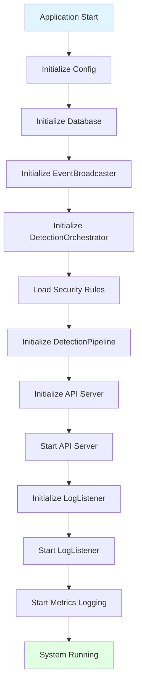
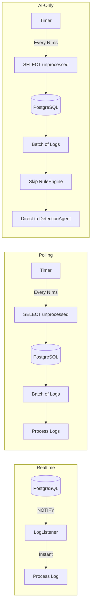
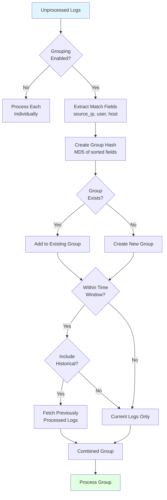
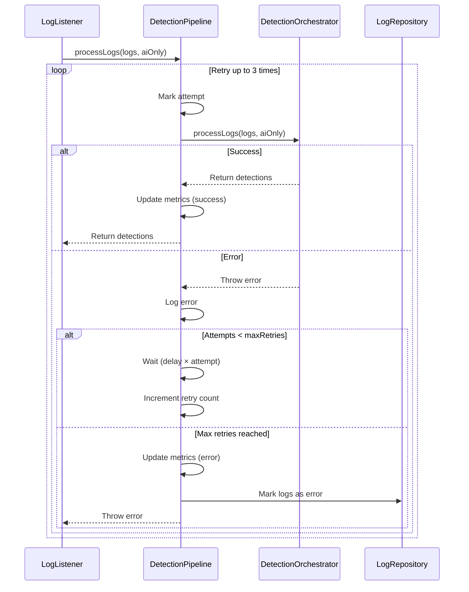
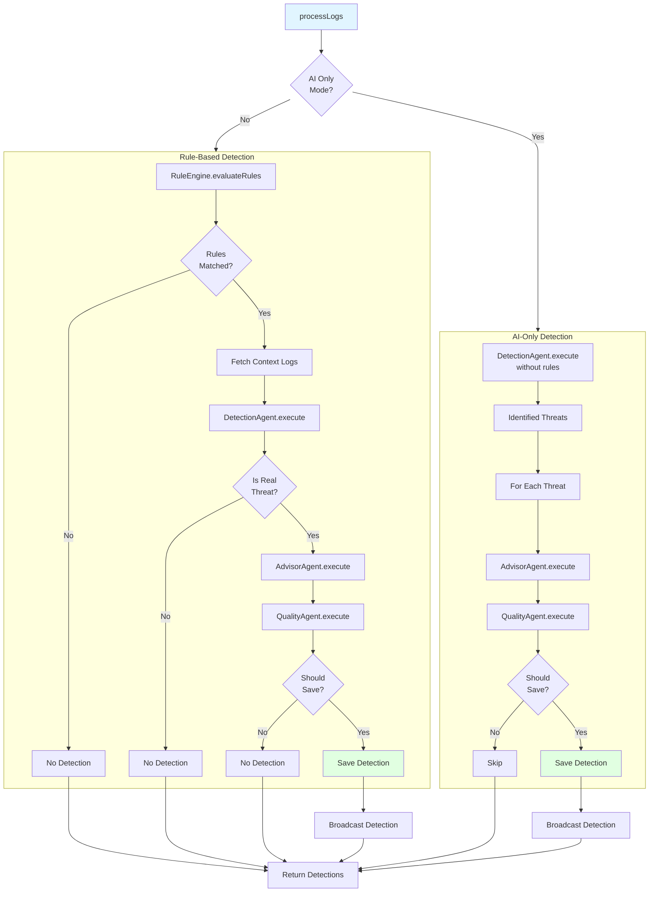
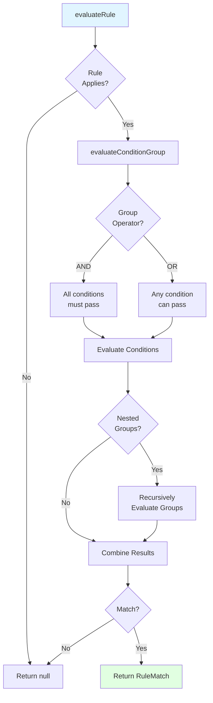
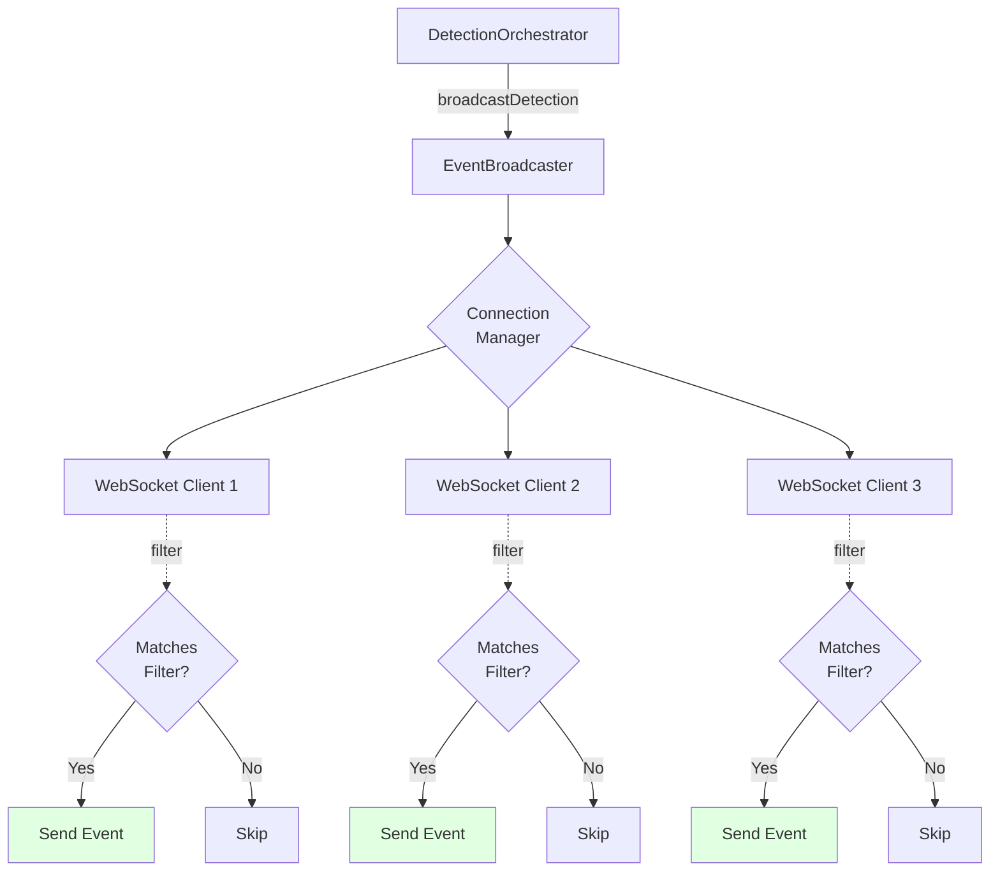
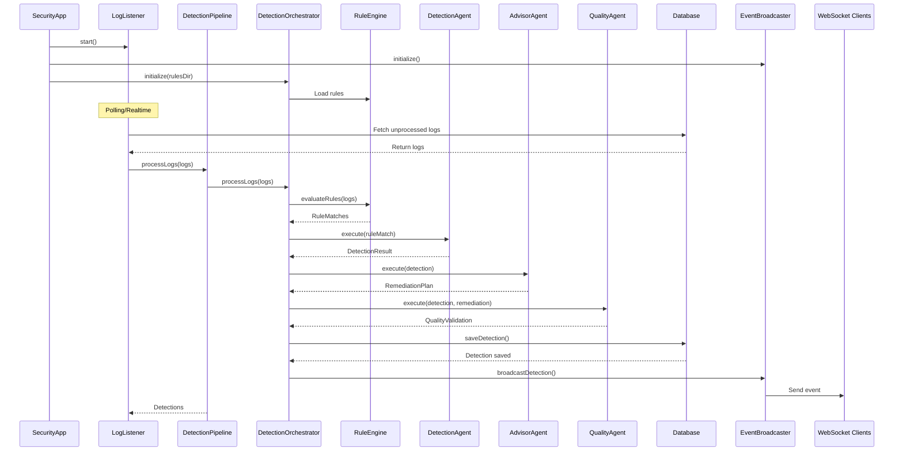

# Appendix F-1.5 — Core Components

Detailed documentation of the core backend components.

## Table of Contents

- [SecurityApp](#securityapp)
- [LogListener](#loglistener)
- [DetectionPipeline](#detectionpipeline)
- [DetectionOrchestrator](#detectionorchestrator)
- [RuleEngine](#ruleengine)
- [EventBroadcaster](#eventbroadcaster)
- [Component Interactions](#component-interactions)

## SecurityApp

**Location**: `packages/core/src/index.ts`

The main application entry point that manages the entire system lifecycle.

### Responsibilities

- Initialize all components in correct order
- Manage graceful shutdown
- Handle process signals (SIGTERM, SIGINT)
- Log system metrics periodically
- Coordinate component dependencies

### Component Structure



### Lifecycle Methods

#### `async start(): Promise<void>`

Initializes and starts all system components.

**Flow**:
1. Load configuration (`initConfig()`)
2. Initialize database connection
3. Create EventBroadcaster
4. Create DetectionOrchestrator
5. Load security rules from YAML files
6. Create DetectionPipeline
7. Create and start API server
8. Create and start LogListener
9. Start metrics logging (every 5 minutes)

**Error Handling**: If any step fails, calls `shutdown()` and exits process.

#### `async shutdown(): Promise<void>`

Gracefully shuts down all components.

**Flow**:
1. Set `isShuttingDown` flag
2. Close API server (Fastify)
3. Stop LogListener
4. Wait for pending tasks (up to 30 seconds)
5. Close all WebSocket connections
6. Close database connection

**Idempotent**: Safe to call multiple times.

#### `async restartLogListener(): Promise<void>`

Restarts LogListener with updated configuration.

**Use Case**: When detection mode or polling interval changes via API.

**Flow**:
1. Stop current LogListener
2. Create new LogListener with current config
3. Attach DetectionPipeline
4. Start new LogListener

### Signal Handling

```typescript
process.on('SIGTERM', async () => {
  await app.shutdown();
  process.exit(0);
});

process.on('SIGINT', async () => {
  await app.shutdown();
  process.exit(0);
});

process.on('unhandledRejection', (reason) => {
  logger.error('Unhandled Rejection', { reason });
  if (config.nodeEnv === 'production') {
    await app.shutdown();
    process.exit(1);
  }
});
```

### Metrics Logging

Every 5 minutes, logs:
- **LogListener Metrics**: logs processed, errors, last processed time
- **DetectionPipeline Metrics**: total processed, detections created, average processing time

### Configuration

Reads from:
- Environment variables
- `config.yaml` (if exists)

See: `packages/core/src/index.ts:28-107`

## LogListener

**Location**: `packages/core/src/streaming/logListener.ts`

Monitors PostgreSQL for new logs and sends them to DetectionPipeline.

### Modes



#### Realtime Mode

- Uses PostgreSQL LISTEN/NOTIFY
- Instant processing when log inserted
- Requires persistent database connection
- Automatically reconnects on connection loss

**Setup Required**: PostgreSQL trigger to send NOTIFY

```sql
CREATE OR REPLACE FUNCTION notify_new_log()
RETURNS TRIGGER AS $$
BEGIN
  PERFORM pg_notify('new_log_inserted', NEW.id::text);
  RETURN NEW;
END;
$$ LANGUAGE plpgsql;

CREATE TRIGGER log_insert_trigger
AFTER INSERT ON normalized_logs
FOR EACH ROW EXECUTE FUNCTION notify_new_log();
```

#### Polling Mode (Default)

- Periodic SELECT query
- Configurable interval via `POLLING_INTERVAL_MS` (default: 5000ms)
- Batch size via `POLLING_BATCH_SIZE` (default: 100 logs)
- No persistent connection needed
- More reliable for production

**Query**:
```sql
SELECT * FROM normalized_logs
WHERE processed_at IS NULL
  AND status != 'processing'
ORDER BY timestamp ASC
LIMIT [batchSize]
```

**Polling Configuration:**
- Interval: `POLLING_INTERVAL_MS` environment variable
- Batch size: `POLLING_BATCH_SIZE` environment variable

**Polling Flow:**
1. Fetch unprocessed logs from database (up to batch size)
2. Pass batch to DetectionPipeline
3. Wait for configured interval
4. Repeat

#### AI-Only Mode

- Same as polling mode
- Skips RuleEngine evaluation
- Directly invokes DetectionAgent
- Useful for exploratory threat hunting

### Log Grouping

Groups related logs for correlated analysis.



**Configuration**:
```typescript
grouping: {
  enabled: true,
  timeWindowMinutes: 5,
  matchFields: [
    'normalized_data.source_ip',
    'normalized_data.host',
    'normalized_data.user'
  ],
  includeProcessedLogs: true
}
```

**Example**:
```
Log 1: { source_ip: '192.168.1.100', user: 'admin', timestamp: '10:00:00' }
Log 2: { source_ip: '192.168.1.100', user: 'admin', timestamp: '10:02:00' }
Log 3: { source_ip: '192.168.1.101', user: 'guest', timestamp: '10:01:00' }

→ Group A: [Log 1, Log 2] (same source_ip + user)
→ Group B: [Log 3] (different source_ip + user)
```

### Methods

#### `async start(): Promise<void>`

Starts the listener in configured mode.

#### `async stop(): Promise<void>`

Stops the listener and cleans up connections.

#### `setPipeline(pipeline: DetectionPipeline): void`

Registers the DetectionPipeline for log processing.

#### `getMetrics(): LogListenerMetrics`

Returns current metrics:
```typescript
{
  logsProcessed: number,
  logsErrored: number,
  lastProcessedAt: Date | null,
  mode: 'realtime' | 'polling' | 'ai-only',
  isRunning: boolean
}
```

### Configuration

See: `packages/core/src/streaming/logListener.ts:29-71`

## DetectionPipeline

**Location**: `packages/core/src/streaming/detectionPipeline.ts`

Processes logs through DetectionOrchestrator with retry logic and error handling.

### Flow



### Retry Strategy

- **Max Retries**: 3 (configurable)
- **Delay**: Exponential backoff
  - Attempt 1: 1 second
  - Attempt 2: 2 seconds
  - Attempt 3: 3 seconds

### Metrics Tracking

```typescript
{
  totalProcessed: number,        // Total logs processed
  detectionsCreated: number,     // Total detections created
  errors: number,                // Failed processing attempts
  retries: number,               // Total retry attempts
  averageProcessingTimeMs: number // Rolling average (last 100)
}
```

### Methods

#### `async processLogs(logs: NormalizedLog[], aiOnly: boolean): Promise<Detection[]>`

Main processing method.

**Parameters**:
- `logs`: Array of logs to process (may be grouped)
- `aiOnly`: If true, skips RuleEngine

**Returns**: Array of created detections

**Error Handling**: Retries on failure, throws after max retries

#### `getMetrics(): PipelineMetrics`

Returns current metrics.

#### `resetMetrics(): void`

Resets all metrics to zero.

### Configuration

```typescript
{
  maxRetries: 3,
  retryDelayMs: 1000
}
```

See: `packages/core/src/streaming/detectionPipeline.ts:19-154`

## DetectionOrchestrator

**Location**: `packages/core/src/agents/detection/detectionOrchestrator.ts`

Coordinates the complete detection workflow: RuleEngine → AI Agents → Database → Broadcasting.

### Workflow



### Methods

#### `async initialize(rulesDirectory: string): Promise<void>`

Loads security rules from YAML files.

**Parameters**:
- `rulesDirectory`: Path to rules directory

**Actions**:
- Uses RuleLoader to parse YAML files
- Validates rule schemas
- Stores in memory

#### `async processLogs(logs: NormalizedLog[], aiOnly: boolean): Promise<Detection[]>`

Main processing method.

**Rule-Based Flow**:
1. Evaluate all rules against all logs
2. For each match:
   - Fetch context logs (5-minute window, up to 20 logs)
   - Execute DetectionAgent with rule context
   - If real threat → Execute AdvisorAgent
   - Execute QualityAgent
   - If should save → Save to DB + Broadcast

**AI-Only Flow**:
1. Execute DetectionAgent without rules
2. For each identified threat:
   - Execute AdvisorAgent
   - Execute QualityAgent
   - If should save → Save to DB + Broadcast

#### `getRuleCount(): number`

Returns number of loaded rules.

#### `getRules(): SecurityRule[]`

Returns all loaded rules.

### State Management

- **Rules**: Loaded once at startup, stored in memory
- **Broadcaster**: Reference to EventBroadcaster for WebSocket events
- **Repositories**: DetectionRepository, LogRepository, FeedbackRepository

See: `packages/core/src/agents/detection/detectionOrchestrator.ts:26-438`

## RuleEngine

**Location**: `packages/core/src/rules/ruleEngine.ts`

Evaluates YAML security rules against normalized logs.

### Rule Evaluation



### Condition Operators

#### Field Matching

- **equals**: Exact match
  ```yaml
  field: event_type
  operator: equals
  value: failed_login
  ```

- **not_equals**: Not equal
  ```yaml
  field: status
  operator: not_equals
  value: success
  ```

- **in**: Value in list
  ```yaml
  field: severity
  operator: in
  values: [high, critical]
  ```

- **not_in**: Value not in list
  ```yaml
  field: event_type
  operator: not_in
  values: [info, debug]
  ```

- **matches**: Regex pattern
  ```yaml
  field: normalized_data.command
  operator: matches
  pattern: '(?i)powershell.*-enc'
  ```

- **not_matches**: Does not match regex
  ```yaml
  field: username
  operator: not_matches
  pattern: '^admin'
  ```

- **contains**: String contains
  ```yaml
  field: message
  operator: contains
  value: 'unauthorized access'
  ```

- **not_contains**: String does not contain
  ```yaml
  field: path
  operator: not_contains
  value: '/admin'
  ```

- **greater_than**: Numeric comparison
  ```yaml
  field: normalized_data.failed_count
  operator: greater_than
  value: 5
  ```

- **less_than**: Numeric comparison
  ```yaml
  field: normalized_data.response_time
  operator: less_than
  value: 100
  ```

#### Aggregation Operators

- **count**: Count occurrences in time window
  ```yaml
  field: normalized_data.source_ip
  operator: count
  threshold: 10
  window: 5m
  ```

- **sum**: Sum values in time window
  ```yaml
  field: normalized_data.bytes_transferred
  operator: sum
  threshold: 1000000
  window: 1h
  ```

- **avg**: Average values in time window
  ```yaml
  field: normalized_data.response_time
  operator: avg
  threshold: 500
  window: 10m
  ```

### Nested Field Access

Access JSONB fields using dot notation:

```yaml
field: normalized_data.source_ip
field: normalized_data.user.name
field: raw_data.EventData.TargetUserName
```

### Methods

#### `evaluateRule(rule: SecurityRule, log: NormalizedLog, options?: EvaluationOptions): RuleMatch | null`

Evaluates a single rule against a log.

**Returns**: RuleMatch if rule matches, null otherwise

#### `evaluateRules(rules: SecurityRule[], log: NormalizedLog, options?: EvaluationOptions): RuleMatch[]`

Evaluates multiple rules against a log.

**Returns**: Array of matches

#### `getLogsInWindow(log: NormalizedLog, windowMs: number, allLogs: NormalizedLog[]): NormalizedLog[]`

Gets logs within time window for aggregation.

See: `packages/core/src/rules/ruleEngine.ts:23-593`

## EventBroadcaster

**Location**: `packages/core/src/websocket/eventBroadcaster.ts`

Manages WebSocket connections and broadcasts detection events.

### Architecture



### Event Types

- **detection.created**: New detection saved
- **detection.updated**: Detection status/notes updated

### Methods

#### `broadcastDetection(detection: Detection): void`

Broadcasts detection to all connected clients.

**Event Format**:
```typescript
{
  type: 'detection.created',
  data: {
    id: 'uuid',
    title: 'Brute Force Attack Detected',
    severity: 'high',
    // ... full detection object
  },
  timestamp: '2025-01-01T10:00:00.000Z'
}
```

#### `async closeAll(): Promise<void>`

Closes all WebSocket connections (during shutdown).

See: `packages/core/src/websocket/eventBroadcaster.ts`

## Component Interactions



---

For more details:
- [Architecture Overview](./architecture.md)
- [AI Agents](./ai-agents.md)
- [Rule System](./rule-system.md)
- [Database](./database.md)
