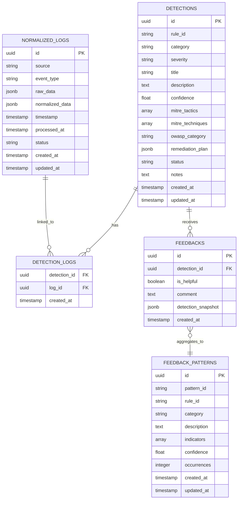

# Database

Complete guide to the PostgreSQL database schema, models, and repositories.

## Table of Contents

- [Overview](#overview)
- [Schema Diagram](#schema-diagram)
- [Models](#models)
- [Repositories](#repositories)
- [Migrations](#migrations)
- [Queries](#queries)

## Overview

Uses PostgreSQL 12+ with Sequelize ORM for data persistence.

**Key Tables**:
- `normalized_logs` - Security log entries
- `detections` - AI-validated threat detections
- `feedbacks` - User feedback on detections
- `feedback_patterns` - Aggregated false positive patterns
- `detection_logs` - Many-to-many junction table

## Schema Diagram



## Models

### NormalizedLog

**Location**: `packages/core/src/db/models/NormalizedLog.ts`

Stores normalized security logs from various sources.

**Fields**:
```typescript
{
  id: UUID,
  source: string,              // 'wazuh', 'windows', 'iis', etc.
  event_type: string,          // 'failed_login', 'file_access', etc.
  raw_data: JSONB,             // Original log data
  normalized_data: JSONB,      // Normalized fields (source_ip, user, etc.)
  timestamp: Date,             // Event timestamp
  processed_at: Date | null,   // When processed by detection pipeline
  status: string,              // 'pending', 'processing', 'processed', 'error'
  created_at: Date,
  updated_at: Date
}
```

**Indexes**:
- `id` (primary key)
- `source`, `event_type`
- `timestamp`
- `processed_at`
- `status`
- GIN index on `normalized_data`

**Associations**:
- `belongsToMany(Detection)` through `detection_logs`

### Detection

**Location**: `packages/core/src/db/models/Detection.ts`

Stores AI-validated threat detections.

**Fields**:
```typescript
{
  id: UUID,
  rule_id: string,             // 'SEC-AUTH-002' or 'AI-ONLY-DETECTION'
  category: string,            // 'AUTHENTICATION_ATTACK', etc.
  severity: enum,              // 'critical', 'high', 'medium', 'low'
  title: string,
  description: text,
  confidence: float,           // 0-100
  mitre_tactics: string[],     // ['TA0006']
  mitre_techniques: string[], // ['T1110.001']
  owasp_category: string | null,
  remediation_plan: JSONB,     // { summary, steps, references }
  status: enum,                // 'active', 'investigating', 'resolved', 'false_positive'
  notes: text | null,
  created_at: Date,
  updated_at: Date
}
```

**Indexes**:
- `id` (primary key)
- `rule_id`
- `severity`
- `status`
- `created_at`

**Associations**:
- `belongsToMany(NormalizedLog)` through `detection_logs`
- `hasMany(Feedback)`

### Feedback

**Location**: `packages/core/src/db/models/Feedback.ts`

Stores user feedback on detections for continuous learning.

**Fields**:
```typescript
{
  id: UUID,
  detection_id: UUID,
  is_helpful: boolean,
  comment: text | null,
  detection_snapshot: JSONB,   // Full detection at time of feedback
  created_at: Date
}
```

**Indexes**:
- `id` (primary key)
- `detection_id`
- `is_helpful`

**Associations**:
- `belongsTo(Detection)`

### FeedbackPattern

**Location**: `packages/core/src/db/models/FeedbackPattern.ts`

Aggregated false positive patterns from user feedback.

**Fields**:
```typescript
{
  id: UUID,
  pattern_id: string,          // 'fp-auth-001'
  rule_id: string,
  category: string,
  description: text,
  indicators: string[],        // Pattern indicators
  confidence: float,           // 0-1
  occurrences: integer,        // How many times seen
  created_at: Date,
  updated_at: Date
}
```

**Indexes**:
- `id` (primary key)
- `pattern_id` (unique)
- `rule_id`

## Repositories

Repositories provide data access layer with business logic.

### LogRepository

**Location**: `packages/core/src/db/repositories/logRepository.ts`

**Methods**:

#### `async findById(id: string): Promise<NormalizedLog | null>`
Find log by ID.

#### `async getUnprocessed(source?: string, limit?: number): Promise<NormalizedLog[]>`
Get unprocessed logs for detection pipeline.

#### `async findRelatedLogs(options): Promise<NormalizedLog[]>`
Find logs related to a reference log (time window, same source/user).

#### `async findMatchingProcessedLogs(options): Promise<NormalizedLog[]>`
Find previously processed logs matching criteria (for log grouping).

#### `async markAsProcessing(logId: string): Promise<void>`
Mark log as currently being processed.

#### `async markAsProcessed(logId: string): Promise<void>`
Mark log as successfully processed.

#### `async markAsError(logId: string): Promise<void>`
Mark log as failed processing.

#### `async markGroupAsProcessing(logIds: string[]): Promise<void>`
Mark multiple logs as processing (for grouped logs).

#### `async markGroupAsProcessed(logIds: string[]): Promise<void>`
Mark multiple logs as processed.

#### `async markGroupAsError(logIds: string[]): Promise<void>`
Mark multiple logs as errored.

### DetectionRepository

**Location**: `packages/core/src/db/repositories/detectionRepository.ts`

**Methods**:

#### `async create(data): Promise<Detection>`
Create new detection.

#### `async createWithLogs(data, logIds: string[]): Promise<Detection>`
Create detection and link to logs in single transaction.

#### `async findById(id: string): Promise<Detection | null>`
Find detection by ID with associated logs.

#### `async findAll(filters?, pagination?): Promise<Detection[]>`
Find all detections with optional filters.

#### `async update(id: string, updates): Promise<Detection>`
Update detection (status, notes, etc.).

#### `async delete(id: string): Promise<void>`
Delete detection.

### FeedbackRepository

**Location**: `packages/core/src/db/repositories/feedbackRepository.ts`

**Methods**:

#### `async create(data): Promise<Feedback>`
Create feedback entry.

#### `async findByDetectionId(detectionId: string): Promise<Feedback[]>`
Get all feedback for a detection.

#### `async findUnhelpful(limit?: number): Promise<Feedback[]>`
Get unhelpful feedback for pattern analysis.

### FeedbackPatternRepository

**Location**: `packages/core/src/db/repositories/feedbackPatternRepository.ts`

**Methods**:

#### `async create(data): Promise<FeedbackPattern>`
Create pattern.

#### `async findAll(): Promise<FeedbackPattern[]>`
Get all patterns.

#### `async findByRuleId(ruleId: string): Promise<FeedbackPattern[]>`
Get patterns for specific rule.

#### `async search(query: string): Promise<FeedbackPattern[]>`
Search patterns by description.

### StatsRepository

**Location**: `packages/core/src/db/repositories/statsRepository.ts`

**Methods**:

#### `async getDetectionStats(timeRange?): Promise<Stats>`
Get detection statistics.

#### `async getSeverityDistribution(): Promise<Distribution>`
Get detection count by severity.

#### `async getTopRules(limit?): Promise<RuleStat[]>`
Get most-triggered rules.

## Migrations

Using Sequelize CLI for schema migrations.

### Create Migration

```bash
cd packages/core
npx sequelize-cli migration:generate --name add-new-field
```

### Migration Template

```javascript
'use strict';

module.exports = {
  up: async (queryInterface, Sequelize) => {
    await queryInterface.addColumn('detections', 'new_field', {
      type: Sequelize.STRING,
      allowNull: true
    });
  },

  down: async (queryInterface, Sequelize) => {
    await queryInterface.removeColumn('detections', 'new_field');
  }
};
```

### Run Migrations

```bash
npx sequelize-cli db:migrate
```

### Rollback

```bash
npx sequelize-cli db:migrate:undo
npx sequelize-cli db:migrate:undo:all
```

## Queries

### Basic Queries

```typescript
import { NormalizedLog } from '../models/NormalizedLog.js';
import { Op } from 'sequelize';

// Find logs by source
const windowsLogs = await NormalizedLog.findAll({
  where: { source: 'windows' },
  limit: 10
});

// Find logs by event type
const failedLogins = await NormalizedLog.findAll({
  where: { event_type: 'failed_login' },
  order: [['timestamp', 'DESC']]
});

// Find recent logs
const recentLogs = await NormalizedLog.findAll({
  where: {
    timestamp: {
      [Op.gte]: new Date(Date.now() - 24 * 60 * 60 * 1000) // Last 24 hours
    }
  }
});
```

### JSONB Field Queries

Since `normalized_data` is JSONB, use Sequelize literal queries:

```typescript
import { Sequelize } from 'sequelize';

// Query JSONB fields
const failedLoginAttempts = await NormalizedLog.findAll({
  where: {
    event_type: 'failed_login',
    [Op.and]: [
      Sequelize.literal("normalized_data->>'result' = 'failure'")
    ]
  }
});

// Query with JSONB operators
const highSeverityLogs = await NormalizedLog.findAll({
  where: Sequelize.literal("normalized_data->>'severity' = 'high'"),
  limit: 50
});

// Check if JSONB field exists
const logsWithSourceIP = await NormalizedLog.findAll({
  where: Sequelize.literal("normalized_data ? 'source_ip'")
});
```

### Complex Queries

```typescript
// Count logs by source
const logCounts = await NormalizedLog.count({
  group: ['source']
});

// Find logs with specific JSONB pattern
const suspiciousLogs = await NormalizedLog.findAll({
  where: Sequelize.literal(
    "normalized_data->>'command' LIKE '%powershell%'"
  )
});
```

---

For more details:
- [Core Components](./core-components.md)
- [API Reference](./api-reference.md)
