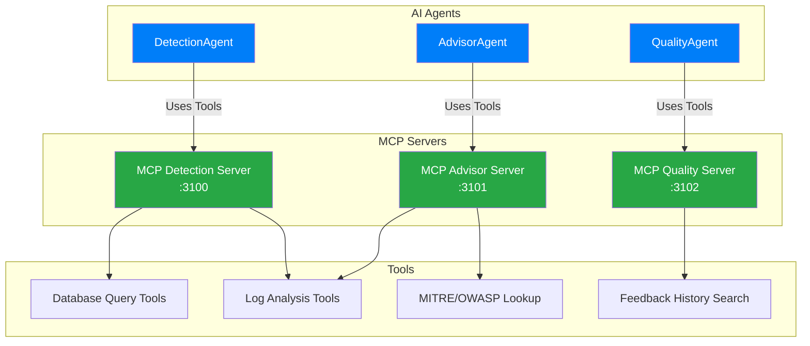
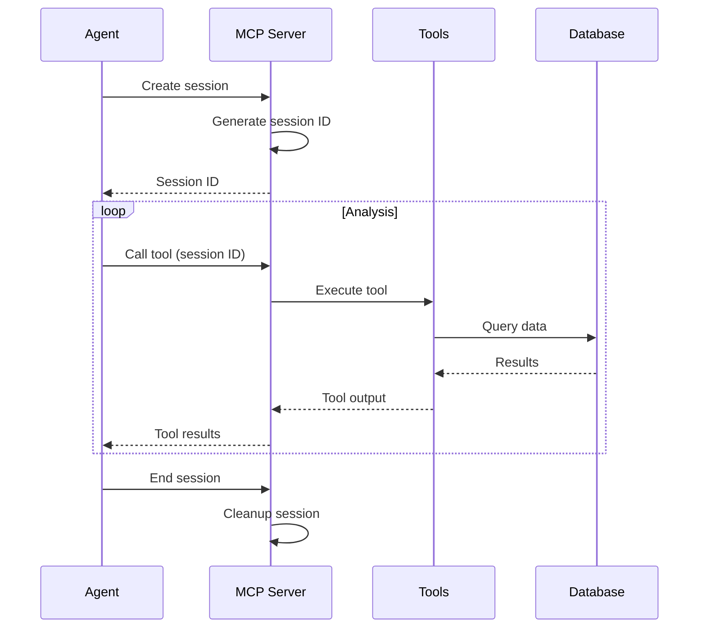

# MCP Integration

Model Context Protocol (MCP) integration for AI agents.

## Table of Contents

- [Overview](#overview)
- [MCP Servers](#mcp-servers)
- [Tools](#tools)
- [Session Management](#session-management)
- [Development](#development)
- [Testing](#testing)

## Overview

The system uses Model Context Protocol (MCP) to provide tools and context to AI agents. MCP servers run on separate ports and expose tools that agents can use during their analysis.



**Key Concepts:**
- MCP servers provide tools to AI agents
- Each agent type has a dedicated MCP server
- Tools enable agents to query database, search logs, lookup frameworks
- Sessions are managed per agent invocation

## MCP Servers

### Detection Server

**Port**: 3100  
**Location**: `packages/core/src/agents/detection/mcp/server.ts`

Provides tools for the DetectionAgent to analyze logs and validate rule matches.

**Available Tools:**
- `query_related_logs`: Find logs related to current detection
- `query_log_patterns`: Search for patterns in historical logs
- `get_log_statistics`: Get statistics about log events

**Starting Server:**
```bash
npm run mcp:http:detection
```

**Health Check:**
```bash
curl http://127.0.0.1:3100/health
```

**Response:**
```json
{
  "status": "ok",
  "agentType": "detection",
  "activeSessions": 0
}
```

### Advisor Server

**Port**: 3101  
**Location**: `packages/core/src/agents/advisor/mcp/server.ts`

Provides tools for the AdvisorAgent to generate remediation plans with framework mappings.

**Available Tools:**
- `query_similar_detections`: Find similar past detections
- `lookup_mitre_technique`: Get MITRE ATT&CK technique details
- `lookup_owasp_category`: Get OWASP category information
- `search_remediation_references`: Find relevant remediation resources

**Starting Server:**
```bash
npm run mcp:http:advisor
```

**Health Check:**
```bash
curl http://127.0.0.1:3101/health
```

### Quality Server

**Port**: 3102  
**Location**: `packages/core/src/agents/quality/mcp/server.ts`

Provides tools for the QualityAgent to check feedback history and filter false positives.

**Available Tools:**
- `search_feedback_history`: Search feedback history.md for patterns
- `query_false_positive_patterns`: Get known false positive patterns
- `get_feedback_for_rule`: Get feedback history for specific rule

**Starting Server:**
```bash
npm run mcp:http:quality
```

**Health Check:**
```bash
curl http://127.0.0.1:3102/health
```

### Server Configuration

**MCP Server Ports:**
```typescript
const MCP_PORTS = {
  detection: 3100,
  advisor: 3101,
  quality: 3102
};
```

**Server Lifecycle:**
All MCP servers start with the main application and shut down gracefully on SIGTERM/SIGINT.

## Tools

### Tool Structure

Each tool follows the MCP tool schema:

```typescript
{
  name: string,
  description: string,
  inputSchema: {
    type: 'object',
    properties: {
      [param: string]: {
        type: string,
        description: string
      }
    },
    required: string[]
  }
}
```

### Detection Tools

#### query_related_logs

Find logs related to a reference log (same source IP, user, time window).

**Input:**
```typescript
{
  logId: string,
  timeWindowMinutes?: number,
  matchFields?: string[]
}
```

**Output:**
```json
{
  "relatedLogs": [
    {
      "id": "uuid",
      "source": "windows",
      "event_type": "failed_login",
      "normalized_data": {...},
      "timestamp": "2025-01-01T10:00:00.000Z"
    }
  ],
  "count": 10
}
```

**Example Usage:**
```typescript
const result = await agent.useTool('query_related_logs', {
  logId: 'log-uuid',
  timeWindowMinutes: 5,
  matchFields: ['normalized_data.source_ip', 'normalized_data.user']
});
```

#### query_log_patterns

Search for patterns in historical logs.

**Input:**
```typescript
{
  source?: string,
  eventType?: string,
  pattern?: object,
  since?: string,
  limit?: number
}
```

**Output:**
```json
{
  "logs": [...],
  "count": 50,
  "patterns": {
    "most_common_source_ips": [...],
    "most_common_users": [...]
  }
}
```

#### get_log_statistics

Get statistics about log events.

**Input:**
```typescript
{
  source?: string,
  eventType?: string,
  timeRange?: string
}
```

**Output:**
```json
{
  "total": 10000,
  "by_event_type": {
    "failed_login": 500,
    "file_access": 300
  },
  "by_source": {
    "windows": 700,
    "wazuh": 100
  },
  "time_range": "24h"
}
```

### Advisor Tools

#### query_similar_detections

Find similar past detections for context.

**Input:**
```typescript
{
  ruleId?: string,
  category?: string,
  severity?: string,
  limit?: number
}
```

**Output:**
```json
{
  "detections": [
    {
      "id": "uuid",
      "title": "Similar attack",
      "remediation_plan": {...},
      "confidence": 95.5
    }
  ],
  "count": 5
}
```

#### lookup_mitre_technique

Get MITRE ATT&CK technique details.

**Input:**
```typescript
{
  techniqueId: string
}
```

**Output:**
```json
{
  "id": "T1110.001",
  "name": "Brute Force: Password Guessing",
  "tactic": "Credential Access",
  "description": "...",
  "detection": "...",
  "mitigation": "...",
  "references": [...]
}
```

**Implementation:**
```typescript
import { getMitreInfo } from '../utils/mitre.js';

const result = getMitreInfo('T1110.001');
```

#### lookup_owasp_category

Get OWASP Top 10 category information.

**Input:**
```typescript
{
  category: string
}
```

**Output:**
```json
{
  "id": "A07:2021",
  "name": "Identification and Authentication Failures",
  "description": "...",
  "prevention": [...],
  "references": [...]
}
```

**Implementation:**
```typescript
import { getOwaspInfo } from '../utils/owasp.js';

const result = getOwaspInfo('A07:2021');
```

#### search_remediation_references

Search for remediation references (placeholder for future integration with knowledge bases).

**Input:**
```typescript
{
  query: string,
  category?: string
}
```

### Quality Tools

#### search_feedback_history

Search feedback database for patterns.

**Input:**
```typescript
{
  query: string,
  ruleId?: string,
  category?: string
}
```

**Output:**
```json
{
  "matches": [
    {
      "pattern": "...",
      "rule_id": "SEC-AUTH-002",
      "occurrences": 5,
      "description": "..."
    }
  ],
  "count": 3
}
```

**Implementation:**
```typescript
import { FeedbackRepository } from '../repositories/FeedbackRepository.js';

const repo = new FeedbackRepository();
const results = await repo.searchPatterns(query);
```

#### query_false_positive_patterns

Get known false positive patterns from database.

**Input:**
```typescript
{
  ruleId?: string,
  category?: string,
  minConfidence?: number
}
```

**Output:**
```json
{
  "patterns": [
    {
      "pattern_id": "fp-auth-001",
      "rule_id": "SEC-AUTH-002",
      "description": "Admin password reset attempts",
      "confidence": 0.85,
      "occurrences": 5
    }
  ],
  "count": 3
}
```

#### get_feedback_for_rule

Get feedback history for a specific rule.

**Input:**
```typescript
{
  ruleId: string,
  isHelpful?: boolean,
  limit?: number
}
```

**Output:**
```json
{
  "feedback": [
    {
      "id": "uuid",
      "detection_id": "uuid",
      "is_helpful": false,
      "comment": "False positive - legitimate admin activity",
      "created_at": "2025-01-01T10:00:00.000Z"
    }
  ],
  "count": 10,
  "helpful_count": 2,
  "unhelpful_count": 8
}
```

## Session Management

### Session Lifecycle



### Session Storage

**Sessions Map:**
```typescript
private sessions: Map<string, Session> = new Map();

interface Session {
  id: string;
  agentType: 'detection' | 'advisor' | 'quality';
  createdAt: Date;
  lastAccessedAt: Date;
  context: any;
}
```

### Session Timeout

Sessions are automatically cleaned up after 30 minutes of inactivity:

```typescript
private cleanupInterval = setInterval(() => {
  const now = Date.now();
  this.sessions.forEach((session, id) => {
    if (now - session.lastAccessedAt.getTime() > 30 * 60 * 1000) {
      this.sessions.delete(id);
      logger.info(`Cleaned up session ${id}`);
    }
  });
}, 5 * 60 * 1000);
```

## Development

### Creating a New Tool

1. **Define Tool Schema:**

```typescript
const myTool = {
  name: 'my_new_tool',
  description: 'description',
  inputSchema: {
    type: 'object',
    properties: {
      param1: {
        type: 'string',
        description: 'First parameter'
      },
      param2: {
        type: 'number',
        description: 'Second parameter'
      }
    },
    required: ['param1']
  }
};
```

2. **Implement Tool Handler:**

```typescript
async function handleMyTool(params: any): Promise<any> {
  const { param1, param2 } = params;
  
  const result = await someOperation(param1, param2);
  
  return {
    success: true,
    data: result
  };
}
```

3. **Register Tool:**

```typescript
server.setRequestHandler(CallToolRequestSchema, async (request) => {
  const { name, arguments: args } = request.params;
  
  switch (name) {
    case 'my_new_tool':
      return {
        content: [{
          type: 'text',
          text: JSON.stringify(await handleMyTool(args))
        }]
      };
      
    default:
      throw new Error(`Unknown tool: ${name}`);
  }
});
```

4. **Add to Tools List:**

```typescript
server.setRequestHandler(ListToolsRequestSchema, async () => {
  return {
    tools: [
      myTool,
      ...existingTools
    ]
  };
});
```

### Testing Tools

Use the MCP inspector to test tools:

```bash
npm run mcp:inspect:detection
npm run mcp:inspect:advisor
npm run mcp:inspect:quality
```

Or use curl:

```bash
curl -X POST http://127.0.0.1:3100/mcp \
  -H "Content-Type: application/json" \
  -d '{
    "jsonrpc": "2.0",
    "id": 1,
    "method": "tools/call",
    "params": {
      "name": "query_related_logs",
      "arguments": {
        "logId": "log-uuid",
        "timeWindowMinutes": 5
      }
    }
  }'
```

### Debugging

Enable debug logging for MCP servers:

```env
LOG_LEVEL=debug
```

MCP servers log:
- Session creation/cleanup
- Tool invocations
- Errors and warnings

---

For more details:
- [AI Agents](./ai-agents.md)
- [Core Components](./core-components.md)
