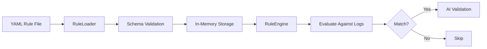
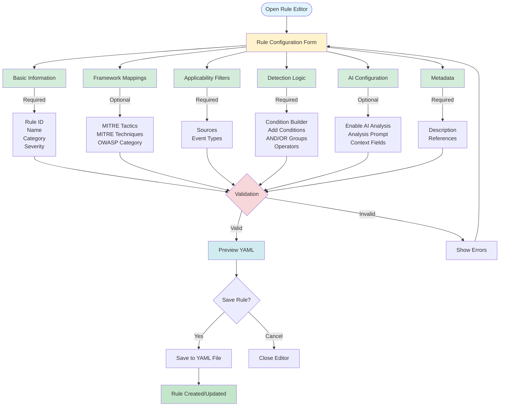

# Rule System

Complete guide to the YAML-based security rule engine.

## Table of Contents

- [Overview](#overview)
- [Rule Editor Interface](#rule-editor-interface)
- [Rule Structure](#rule-structure)
- [Rule Schema](#rule-schema)
- [Condition Operators](#condition-operators)
- [Creating Custom Rules](#creating-custom-rules)
- [Rule Examples](#rule-examples)
- [Best Practices](#best-practices)

## Overview

Security rules are defined in YAML files and evaluated by the RuleEngine against normalized logs. Rules combine pattern matching with AI validation for accurate threat detection.



**Location**: `packages/core/src/rules/rules/*.yaml`

## Rule Editor Interface

The Rule Editor Modal provides a user-friendly interface for creating and editing security rules without manually writing YAML.



**Rule Editor Features:**

The Rule Editor Modal simplifies rule creation by breaking down the complex YAML structure into organized sections:

- **Basic Information** - Essential rule identifiers and classification (Rule ID, Name, Category, Severity)
- **Framework Mappings** - Link to MITRE ATT&CK tactics/techniques and OWASP categories
- **Applicability Filters** - Define which log sources and event types to monitor
- **Detection Logic** - Visual condition builder with AND/OR logic groups and multiple operators
- **AI Configuration** - Enable AI validation with custom prompts and context fields
- **Metadata** - Rule description and security resource references

The editor validates inputs in real-time and provides a YAML preview before saving.

## Rule Structure

### Complete Example

```yaml
ruleId: SEC-AUTH-002
name: Windows Failed Login Attempts
category: AUTHENTICATION_ATTACK
severity: high

# Framework mappings
mitre:
  tactics: [TA0006]           # Credential Access
  techniques: [T1110.001]     # Brute Force: Password Guessing
owasp: A07:2021              # Identification and Authentication Failures

# Applicability filters
appliesTo:
  sources: [windows_security, windows, all]
  eventTypes: [failed_login, credential_validation]

# Detection conditions
conditions:
  operator: AND
  conditions:
    - field: event_type
      operator: equals
      value: failed_login

    - field: normalized_data.result
      operator: equals
      value: failure

# AI analysis configuration
aiAnalysis:
  enabled: true
  prompt: |
    Analyze the following Windows failed login attempt. Determine if this is:
    1. A brute force attack (multiple failed attempts from same source)
    2. A password spray attack (attempts across multiple users)
    3. Legitimate user issues (e.g., forgotten password)
    4. Automated attack from external source
  contextFields:
    - source_ip
    - user
    - domain
    - timestamp

# Metadata
description: |
  Detects Windows failed login attempts that may indicate
  brute force attacks or credential stuffing.

references:
  - https://attack.mitre.org/techniques/T1110/001/
  - https://owasp.org/Top10/A07_2021-Identification_and_Authentication_Failures/
```

## Rule Schema

### Required Fields

| Field | Type | Description |
|-------|------|-------------|
| `ruleId` | string | Unique ID (format: `PREFIX-CATEGORY-###`) |
| `name` | string | Human-readable name |
| `category` | string | Category (e.g., `AUTHENTICATION_ATTACK`) |
| `severity` | enum | `critical`, `high`, `medium`, `low` |
| `mitre` | object | MITRE ATT&CK mappings |
| `appliesTo` | object | Source and event type filters |
| `conditions` | object | Detection conditions |
| `aiAnalysis` | object | AI configuration |
| `description` | string | Rule description |

### MITRE Mapping

```yaml
mitre:
  tactics: [TA0006, TA0001]          # Array of tactic IDs
  techniques: [T1110.001, T1078]     # Array of technique IDs
```

Common Tactics:
- `TA0001` - Initial Access
- `TA0002` - Execution
- `TA0003` - Persistence
- `TA0004` - Privilege Escalation
- `TA0005` - Defense Evasion
- `TA0006` - Credential Access
- `TA0007` - Discovery
- `TA0008` - Lateral Movement
- `TA0009` - Collection
- `TA0010` - Exfiltration
- `TA0011` - Command and Control

### OWASP Mapping

```yaml
owasp: A07:2021  # OWASP Top 10 2021 category
```

Common Categories:
- `A01:2021` - Broken Access Control
- `A02:2021` - Cryptographic Failures
- `A03:2021` - Injection
- `A04:2021` - Insecure Design
- `A05:2021` - Security Misconfiguration
- `A06:2021` - Vulnerable and Outdated Components
- `A07:2021` - Identification and Authentication Failures
- `A08:2021` - Software and Data Integrity Failures
- `A09:2021` - Security Logging and Monitoring Failures
- `A10:2021` - Server-Side Request Forgery (SSRF)

### Applies To

```yaml
appliesTo:
  sources: [windows, wazuh, all]
  eventTypes: [failed_login, file_access, all]
```

- `sources`: Log sources this rule applies to
- `eventTypes`: Event types to evaluate
- Use `all` as wildcard

### AI Analysis

```yaml
aiAnalysis:
  enabled: true
  prompt: "Detailed analysis instructions..."
  contextFields:
    - field1
    - field2
```

- `enabled`: Whether to use AI validation
- `prompt`: Instructions for DetectionAgent
- `contextFields`: Fields to include in AI context

## Condition Operators

### Simple Conditions

#### equals
```yaml
- field: event_type
  operator: equals
  value: failed_login
```

#### not_equals
```yaml
- field: status
  operator: not_equals
  value: success
```

#### in
```yaml
- field: severity
  operator: in
  values: [high, critical]
```

#### not_in
```yaml
- field: event_type
  operator: not_in
  values: [info, debug]
```

#### matches (Regex)
```yaml
- field: normalized_data.command
  operator: matches
  pattern: '(?i)powershell.*-enc'
```

**Regex Flags**: Inline flags supported
- `(?i)` - Case insensitive
- `(?m)` - Multiline
- `(?s)` - Dot matches newline

#### contains
```yaml
- field: message
  operator: contains
  value: 'unauthorized access'
```

#### greater_than / less_than
```yaml
- field: normalized_data.failed_count
  operator: greater_than
  value: 5
```

### Aggregation Operators

#### count
Count occurrences in time window:

```yaml
- field: normalized_data.source_ip
  operator: count
  threshold: 10
  window: 5m
```

Counts logs where `source_ip` matches the current log's value within last 5 minutes.

#### sum
Sum numeric values:

```yaml
- field: normalized_data.bytes_transferred
  operator: sum
  threshold: 1000000
  window: 1h
```

#### avg
Average numeric values:

```yaml
- field: normalized_data.response_time
  operator: avg
  threshold: 500
  window: 10m
```

**Time Windows**:
- `s` - seconds (e.g., `30s`)
- `m` - minutes (e.g., `5m`)
- `h` - hours (e.g., `1h`)
- `d` - days (e.g., `1d`)

### Nested Conditions

```yaml
conditions:
  operator: AND
  conditions:
    - field: event_type
      operator: equals
      value: login

  groups:
    - operator: OR
      conditions:
        - field: result
          operator: equals
          value: failure

        - field: normalized_data.attempts
          operator: greater_than
          value: 3
```

Logic:
- `AND`: All conditions must match
- `OR`: Any condition can match
- Unlimited nesting supported

## Creating Custom Rules

### Step 1: Create YAML File

```bash
cd packages/core/src/rules/rules/
touch my-custom-rule.yaml
```

### Step 2: Define Rule

```yaml
ruleId: SEC-CUSTOM-001
name: My Custom Detection
category: CUSTOM_CATEGORY
severity: medium

mitre:
  tactics: [TA0001]
  techniques: [T1190]

appliesTo:
  sources: [all]
  eventTypes: [all]

conditions:
  operator: AND
  conditions:
    - field: my_field
      operator: equals
      value: suspicious_value

aiAnalysis:
  enabled: true
  prompt: "Analyze this event..."
  contextFields: [field1, field2]

description: "Detects custom pattern..."
references: []
```

### Step 3: Validate

Restart the backend to load new rules:

```bash
npm run dev
```

Check logs for:
```
Loaded X security rules
```

### Step 4: Test

Insert a test log matching your rule and verify detection.

## Rule Examples

### Brute Force Detection

```yaml
ruleId: SEC-AUTH-001
name: Brute Force Attack Detection
category: AUTHENTICATION_ATTACK
severity: high

mitre:
  tactics: [TA0006]
  techniques: [T1110]

appliesTo:
  sources: [all]
  eventTypes: [failed_login]

conditions:
  operator: AND
  conditions:
    - field: event_type
      operator: equals
      value: failed_login

    - field: normalized_data.source_ip
      operator: count
      threshold: 10
      window: 5m

aiAnalysis:
  enabled: true
  prompt: "Analyze for brute force patterns..."
  contextFields: [source_ip, user, timestamp]

description: "Detects 10+ failed logins from same IP in 5 minutes"
references: []
```

### SQL Injection Detection

```yaml
ruleId: SEC-WEB-001
name: SQL Injection Attempt
category: WEB_ATTACK
severity: critical

mitre:
  tactics: [TA0001]
  techniques: [T1190]
owasp: A03:2021

appliesTo:
  sources: [iis, apache, nginx, all]
  eventTypes: [http_request]

conditions:
  operator: OR
  conditions:
    - field: normalized_data.query_string
      operator: matches
      pattern: '(?i)(union.*select|or.*1=1|drop.*table)'

    - field: normalized_data.post_data
      operator: matches
      pattern: '(?i)(exec.*xp_|\'.*or.*\'=\')'

aiAnalysis:
  enabled: true
  prompt: "Analyze for SQL injection attack..."
  contextFields: [url, query_string, user_agent]

description: "Detects SQL injection patterns in web requests"
references:
  - https://owasp.org/www-community/attacks/SQL_Injection
```

### Privilege Escalation

```yaml
ruleId: SEC-PRIV-001
name: Suspicious Privilege Escalation
category: PRIVILEGE_ESCALATION
severity: high

mitre:
  tactics: [TA0004]
  techniques: [T1068, T1548]

appliesTo:
  sources: [windows, linux, all]
  eventTypes: [process_creation, privilege_change]

conditions:
  operator: AND
  conditions:
    - field: event_type
      operator: in
      values: [process_creation, privilege_change]

    - field: normalized_data.elevated
      operator: equals
      value: true

    - field: normalized_data.parent_process
      operator: not_in
      values: [explorer.exe, services.exe]

aiAnalysis:
  enabled: true
  prompt: "Analyze for privilege escalation attempt..."
  contextFields: [user, process, parent_process, command_line]

description: "Detects suspicious privilege escalation attempts"
references: []
```

## Best Practices

### 1. Use Specific Conditions

**Good**:
```yaml
conditions:
  operator: AND
  conditions:
    - field: event_type
      operator: equals
      value: failed_login
    - field: normalized_data.source_ip
      operator: count
      threshold: 10
      window: 5m
```

**Bad**:
```yaml
conditions:
  operator: OR
  conditions:
    - field: event_type
      operator: equals
      value: login
```

### 2. Set Appropriate Severity

- `critical`: Immediate threat, active exploitation
- `high`: Serious threat, likely attack
- `medium`: Suspicious activity, potential threat
- `low`: Anomaly, requires investigation

### 3. Include AI Analysis

Always enable AI validation to reduce false positives:

```yaml
aiAnalysis:
  enabled: true
  prompt: "Detailed analysis instructions..."
  contextFields: [relevant, fields]
```

### 4. Map to Frameworks

Include MITRE ATT&CK and OWASP mappings for analyst context:

```yaml
mitre:
  tactics: [TA0006]
  techniques: [T1110.001]
owasp: A07:2021
```

### 5. Use Aggregations for Patterns

Detect attack patterns over time:

```yaml
- field: normalized_data.source_ip
  operator: count
  threshold: 5
  window: 1m
```

### 6. Test Thoroughly

- Test with real log samples
- Verify no false positives
- Ensure AI validation works correctly

### 7. Document Well

- Clear description
- Relevant references
- Update as needed

---

For more details:
- [Core Components](./core-components.md)
- [AI Agents](./ai-agents.md)
- [Configuration](./configuration.md)
