# AI Log Anomaly Detection System - Architecture Diagrams

This document provides comprehensive architecture diagrams for the AI Log Anomaly Detection System, illustrating the two-tier microservices architecture, component interactions, data flows, and deployment patterns.

## Overview

The AI Log Anomaly Detection System employs a strategic two-tier microservices architecture that separates log ingestion concerns from threat detection responsibilities, enabling independent scaling and technology optimization for each operational domain.

---

## 1. Complete Two-Tier Microservices Architecture

### 1.1 Main System Architecture


### 1.2 Architecture Benefits

**🔄 Tier Separation Benefits:**
- **Independent Scaling**: Each tier scales based on specific workload characteristics
- **Technology Optimization**: .NET for high-performance ingestion, Node.js for flexible AI integration
- **Fault Isolation**: Issues in one tier don't cascade to the other
- **Development Velocity**: Teams can work independently on each tier

**💾 Shared Database Advantages:**
- **ACID Guarantees**: Ensures data consistency across tiers
- **Simplified Audit Trail**: Complete detection lifecycle in single database
- **Query Efficiency**: No cross-service API calls for data access
- **High Availability**: PostgreSQL streaming replication support

---

## 2. High-Availability Deployment Architecture

### 2.1 Production Deployment Pattern

```mermaid
graph TB
    subgraph Internet["🌐 Internet"]
        subgraph InternetSub[" "]
        USERS[👥 Security Analysts<br/>SOC Team<br/>Administrators]
        LOGSRC[📊 Log Sources<br/>Enterprise Infrastructure<br/>Security Tools]
        end
    end
    
    subgraph AZ1["🏢 Availability Zone 1 (Primary)"]
        subgraph LB1["⚖️ Load Balancer Layer"]
            LB_Main[🔀 Load Balancer<br/>NGINX/HAProxy<br/>SSL Termination<br/>Health Checks]
        end
        
        subgraph AppTier1["🔧 Application Tier - Zone 1"]
            LT1[📡 Log-Transformer<br/>Container 1<br/>Port 5001<br/>4 CPU / 8GB RAM]
            LT2[📡 Log-Transformer<br/>Container 2<br/>Port 5001<br/>4 CPU / 8GB RAM]
            AS1[🤖 AI-Security<br/>Container 1<br/>Port 3000<br/>4 CPU / 8GB RAM]
            AS2[🤖 AI-Security<br/>Container 2<br/>Port 3000<br/>4 CPU / 8GB RAM]
            FE1[🖥️ Frontend<br/>NGINX Static<br/>Port 80]
        end
        
        subgraph DBTier1["💾 Database Tier - Zone 1"]
            PG_Primary[🐘 PostgreSQL Primary<br/>Port 5432<br/>Read/Write<br/>16 CPU / 32GB RAM<br/>SSD Storage]
        end
        
        subgraph Monitor1["📊 Monitoring - Zone 1"]
            PROM1[📈 Prometheus<br/>Metrics Collection]
            GRAF1[📊 Grafana<br/>Dashboards]
        end
    end
    
    subgraph AZ2["🏢 Availability Zone 2 (Standby)"]
        subgraph AppTier2["🔧 Application Tier - Zone 2"]
            LT3[📡 Log-Transformer<br/>Container 3<br/>Port 5001<br/>Standby]
            AS3[🤖 AI-Security<br/>Container 3<br/>Port 3000<br/>Standby]
        end
        
        subgraph DBTier2["💾 Database Tier - Zone 2"]
            PG_Replica[🐘 PostgreSQL Replica<br/>Port 5432<br/>Read Only<br/>Hot Standby<br/>Streaming Replication]
        end
    end
    
    subgraph Storage["💽 Shared Storage"]
        subgraph StorageSub[" "]
        BLOB[📁 Blob Storage<br/>Log File Archive<br/>Encrypted at Rest]
        BACKUP[💾 Backup Storage<br/>Automated Backups<br/>Point-in-time Recovery]
        end
    end
    
    %% User Traffic Flow
    USERS --> LB_Main
    LOGSRC --> LB_Main
    
    %% Load Balancer Distribution
    LB_Main --> LT1
    LB_Main --> LT2
    LB_Main --> AS1
    LB_Main --> AS2
    LB_Main --> FE1
    
    %% Database Connections
    LT1 --> PG_Primary
    LT2 --> PG_Primary
    AS1 --> PG_Primary
    AS2 --> PG_Primary
    
    %% Replication
    PG_Primary -.-> PG_Replica
    
    %% Standby Connections
    LT3 -.-> PG_Replica
    AS3 -.-> PG_Replica
    
    %% Storage Connections
    PG_Primary --> BACKUP
    LT1 --> BLOB
    LT2 --> BLOB
    
    %% Monitoring
    PROM1 --> LT1
    PROM1 --> LT2
    PROM1 --> AS1
    PROM1 --> AS2
    PROM1 --> PG_Primary
    GRAF1 --> PROM1
    
    %% Styling
    classDef primary fill:#e8f5e8,stroke:#2e7d32,stroke-width:3px
    classDef standby fill:#fff3e0,stroke:#ef6c00,stroke-width:2px,stroke-dasharray: 5 5
    classDef database fill:#e3f2fd,stroke:#1976d2,stroke-width:3px
    classDef storage fill:#fce4ec,stroke:#c2185b,stroke-width:2px
    classDef monitoring fill:#f3e5f5,stroke:#7b1fa2,stroke-width:2px
    
    class AZ1,LT1,LT2,AS1,AS2,FE1,PG_Primary primary
    class AZ2,LT3,AS3,PG_Replica standby
    class DBTier1,DBTier2,PG_Primary,PG_Replica database
    class Storage,BLOB,BACKUP storage
    class Monitor1,PROM1,GRAF1 monitoring
```



### 2.2 Deployment Specifications

**🔧 Container Specifications:**
- **Log-Transformer**: 4 CPU cores, 8GB RAM, .NET 8.0 runtime
- **AI-Security**: 4 CPU cores, 8GB RAM, Node.js 18+ runtime
- **PostgreSQL**: 16 CPU cores, 32GB RAM, NVMe SSD storage

**⚖️ Load Balancing Strategy:**
- Round-robin distribution for Log-Transformer containers
- Session affinity for AI-Security containers (WebSocket support)
- Health check endpoints: `/health` (HTTP 200 response)

**💾 Data Persistence:**
- PostgreSQL streaming replication (async)
- Automated backup every 6 hours with 30-day retention
- Point-in-time recovery capability

---

## 3. Component Interaction Sequence

### 3.1 End-to-End Detection Flow

```mermaid
sequenceDiagram
    participant LS as 📊 Log Source
    participant LB as ⚖️ Load Balancer
    participant LT as 📡 Log-Transformer
    participant DB as 💾 PostgreSQL
    participant AS as 🤖 AI-Security
    participant DA as 🔍 DetectionAgent
    participant AA as 💡 AdvisorAgent
    participant QA as ✅ QualityAgent
    participant WS as 🔄 WebSocket
    participant UI as 🖥️ Frontend
    
    Note over LS,UI: Complete Detection Lifecycle (~3.8 seconds)
    
    LS->>LB: 📤 Upload log file (EVTX/JSON/Syslog)
    LB->>LT: 🔀 Route to available container
    
    LT->>LT: 🔌 Parse via plugin system
    LT->>LT: ⚙️ Normalize to standard schema
    LT->>DB: 💾 Batch write (500-1000 records)
    DB-->>LT: ✅ Insert confirmation
    
    DB->>AS: 📢 NOTIFY new_log_inserted
    AS->>AS: 📋 Evaluate against YAML rules
    
    alt Rule Match Found
        AS->>DA: 🔍 Validate threat context
        DA->>DB: 🔍 Query related logs (MCP)
        DB-->>DA: 📊 Historical context
        DA->>DA: 🧠 LLM analysis (GPT-4/Claude)
        
        alt Real Threat Detected
            DA-->>AS: ✅ Threat confirmed (94% confidence)
            AS->>AA: 💡 Generate remediation plan
            AA->>AA: 📚 Query MITRE ATT&CK (MCP)
            AA->>AA: 🔒 Query OWASP categories (MCP)
            AA-->>AS: 📋 Remediation plan ready
            
            AS->>QA: ✅ Check false positive patterns
            QA->>DB: 🔍 Query feedback history
            DB-->>QA: 📊 Pattern data
            
            alt Not False Positive
                QA-->>AS: ✅ Final validation passed
                AS->>DB: 💾 Persist detection
                AS->>WS: 📡 Broadcast alert
                WS->>UI: 🚨 Real-time notification
                UI->>UI: 🔔 Display alert to analyst
            else False Positive Match
                QA-->>AS: ❌ Filtered as false positive
                Note over QA,AS: Alert suppressed, analyst workload reduced
            end
        else Benign Activity
            DA-->>AS: ❌ Not a threat
            Note over DA,AS: No alert generated
        end
    else No Rule Match
        AS->>AS: ➡️ Continue monitoring
    end
    
    Note over LS,UI: Detection complete: Sub-5 second latency achieved
```



---

## 4. Technology Stack Overview

### 4.1 Tier 1: Log-Transformer (.NET 8.0)

**🔧 Core Technologies:**
- **Framework**: ASP.NET Core 8.0
- **ORM**: Entity Framework Core 8.0
- **Database**: PostgreSQL 16 with Npgsql driver
- **Parsing**: Custom plugin architecture (ILogIngestParser)
- **Serialization**: System.Text.Json
- **Background Processing**: Hosted Services
- **Containerization**: Docker with Alpine Linux base

**📊 Performance Characteristics:**
- **Throughput**: 8,000+ log entries/minute sustained
- **Latency**: <200ms per batch processing
- **Memory Usage**: ~500MB baseline
- **CPU Utilization**: ~40% under normal load

### 4.2 Tier 2: AI-Security Backend (Node.js 18+)

**🤖 Core Technologies:**
- **Runtime**: Node.js 18+ with TypeScript
- **Framework**: Fastify web framework
- **ORM**: Sequelize with PostgreSQL
- **AI Integration**: Codex SDK (multi-LLM support)
- **MCP**: Model Context Protocol servers
- **WebSockets**: Native WebSocket API
- **Process Management**: PM2 cluster mode

**🧠 AI Integration:**
- **LLM Providers**: GPT-4, Claude 3.5 Sonnet, Llama 3.1
- **MCP Servers**: 3 specialized servers (ports 3100-3102)
- **Tool Catalogs**: 15+ security-specific tools
- **Session Management**: Thread isolation per agent

### 4.3 Database Layer (PostgreSQL 16)

**💾 Schema Design:**
- **Tables**: 5 core tables with JSONB support
- **Indexes**: B-tree + GIN composite indexing
- **Partitioning**: Date-based table partitioning
- **Replication**: Streaming replication for HA
- **Backup Strategy**: Automated backups with PITR

---

## 5. Security Architecture

### 5.1 Security Layers

```mermaid
graph TB
    subgraph Security["🔒 Security Architecture Layers"]
        subgraph SecuritySub[" "]
        
        subgraph Network["🌐 Network Security"]
            FW[🔥 Firewall<br/>Port Restrictions<br/>IP Whitelisting]
            VPN[🔐 VPN Access<br/>Admin Interfaces<br/>Database Connections]
            TLS[🔒 TLS 1.3<br/>End-to-end Encryption<br/>Certificate Management]
        end
        
        subgraph App["🛡️ Application Security"]
            AUTH[🔑 Authentication<br/>JWT Tokens<br/>API Keys<br/>Role-based Access]
            RBAC[👤 Authorization<br/>RBAC Policies<br/>Resource Permissions<br/>Admin/Analyst Roles]
            VALID[✅ Input Validation<br/>Schema Validation<br/>Sanitization<br/>Rate Limiting]
        end
        
        subgraph Data["💾 Data Security"]
            ENCRYPT[🔐 Encryption<br/>Database: AES-256<br/>Storage: At-rest encryption<br/>Backups: Encrypted]
            AUDIT[📋 Audit Logging<br/>All API calls<br/>MCP tool invocations<br/>Admin actions]
            GDPR[📜 GDPR Compliance<br/>Data anonymization<br/>Retention policies<br/>Right to deletion]
        end
        
        subgraph AI["🤖 AI Security"]
            MCP_SEC[🔒 MCP Security<br/>Session isolation<br/>Tool access control<br/>Invocation logging]
            PROMPT[🛡️ Prompt Security<br/>Injection prevention<br/>Output sanitization<br/>Context isolation]
            LIMITS[⚡ Resource Limits<br/>Token usage caps<br/>Rate limiting<br/>Timeout controls]
        end
        
        end
    end
    
    %% Security Flow
    Network --> App
    App --> Data
    Data --> AI
    
    %% Styling
    classDef security fill:#ffebee,stroke:#d32f2f,stroke-width:2px
    class Network,App,Data,AI,FW,VPN,TLS,AUTH,RBAC,VALID,ENCRYPT,AUDIT,GDPR,MCP_SEC,PROMPT,LIMITS security
```



### 5.2 Security Compliance

**🔒 Security Standards:**
- **ISO 27001**: Information security management
- **GDPR**: Data protection and privacy
- **SOC 2 Type II**: Security controls and procedures
- **NIST Cybersecurity Framework**: Risk management

**🛡️ Security Controls:**
- **Access Control**: Multi-factor authentication, RBAC
- **Data Protection**: AES-256 encryption, secure key management
- **Network Security**: TLS 1.3, firewall policies, VPN access
- **Audit & Monitoring**: Complete audit trails, SIEM integration

---

## 6. Deployment Guide

### 6.1 Prerequisites

**🖥️ Infrastructure Requirements:**
```bash
# Minimum Production Specifications
- CPU: 16 cores (8 per tier)
- RAM: 32GB (16GB per tier) 
- Storage: 1TB NVMe SSD
- Network: 1Gbps bandwidth
- OS: Ubuntu 22.04 LTS or RHEL 9
```

**🐳 Container Platform:**
```bash
# Required Software
- Docker Engine 24.0+
- Docker Compose 2.20+
- PostgreSQL 16
- NGINX 1.24+ (Load Balancer)
```

### 6.2 Quick Deployment

```bash
# Clone repositories
git clone https://github.com/your-org/log-transformer.git
git clone https://github.com/your-org/ai-security.git

# Start infrastructure
docker-compose -f infrastructure.yml up -d

# Deploy Log-Transformer tier
cd log-transformer
docker-compose up -d

# Deploy AI-Security tier  
cd ../ai-security
docker-compose up -d

# Verify deployment
curl http://localhost:5001/health  # Log-Transformer
curl http://localhost:3000/health  # AI-Security
```

### 6.3 Scaling Instructions

**📈 Horizontal Scaling:**
```bash
# Scale Log-Transformer containers
docker-compose up -d --scale log-transformer=4

# Scale AI-Security containers
docker-compose up -d --scale ai-security=3

# Add database read replicas
docker-compose -f postgres-replica.yml up -d
```

**⚖️ Load Balancer Configuration:**
```nginx
# NGINX upstream configuration
upstream log_transformer {
    server log-transformer-1:5001;
    server log-transformer-2:5001;
    server log-transformer-3:5001;
}

upstream ai_security {
    server ai-security-1:3000;
    server ai-security-2:3000;
}
```

---

## 7. Monitoring and Observability

### 7.1 Metrics Collection

**📊 Key Performance Indicators:**
- **Throughput**: Logs processed per minute
- **Latency**: Detection processing time
- **Accuracy**: True/false positive rates  
- **Resource Usage**: CPU, memory, disk utilization
- **Error Rates**: API errors, processing failures

**🔍 Monitoring Stack:**
- **Metrics**: Prometheus + Grafana dashboards
- **Logs**: Centralized logging with ELK stack
- **Tracing**: Distributed tracing with Jaeger
- **Alerting**: PagerDuty integration for critical issues

### 7.2 Health Checks

```bash
# Health check endpoints
GET /health                    # Application health
GET /metrics                   # Prometheus metrics  
GET /ready                     # Readiness probe
GET /live                      # Liveness probe
```

---

## 8. Disaster Recovery

### 8.1 Backup Strategy

**💾 Data Backup:**
- **Database**: Automated backups every 6 hours
- **Configuration**: Version-controlled infrastructure as code
- **Logs**: Archived to object storage with 90-day retention
- **Recovery**: Point-in-time recovery within 15 minutes

### 8.2 Failover Procedures

**🔄 Automatic Failover:**
1. **Database Failover**: Automatic promotion of read replica
2. **Application Failover**: Container restart and traffic redirection  
3. **Cross-Zone Failover**: Traffic routing to standby availability zone
4. **Recovery Time Objective (RTO)**: < 5 minutes
5. **Recovery Point Objective (RPO)**: < 1 minute

---

This architecture documentation provides a comprehensive view of the AI Log Anomaly Detection System's two-tier microservices design, enabling effective deployment, scaling, and maintenance in enterprise environments.