# AI Security Dashboard - User Interface Documentation

## Overview

The AI Security Dashboard serves as the primary interface for security analysts and SOC teams to monitor, analyze, and respond to security threats detected by the hybrid AI-powered log anomaly detection system. Built with modern web technologies, the dashboard provides real-time threat visualization, interactive detection management, and comprehensive analytics capabilities.

## Technology Stack

- **Frontend Framework**: React 18 with TypeScript
- **UI Library**: Material-UI (MUI) v5
- **State Management**: Redux Toolkit with RTK Query
- **Real-time Communication**: WebSocket API
- **Data Visualization**: Chart.js and Recharts
- **Styling**: Emotion CSS-in-JS with theme support
- **Build Tool**: Vite for fast development and optimized builds

---

## Dashboard Architecture

### Component Hierarchy

```
AI Security Dashboard
├── Authentication Layer
│   ├── Login/Logout
│   ├── Role-based Access Control (RBAC)
│   └── Session Management
├── Navigation & Layout
│   ├── Top Navigation Bar
│   ├── Sidebar Menu
│   └── Breadcrumb Navigation
├── Core Dashboard Views
│   ├── Detection Overview (Home)
│   ├── Real-time Detection Feed
│   ├── Detection Details & Management
│   ├── Analytics & Reports
│   └── System Administration
└── Shared Components
    ├── Data Tables with Filtering
    ├── Interactive Charts
    ├── Real-time Notifications
    └── Modal Dialogs
```

---

## 1. Authentication & Access Control

### 1.1 User Roles

The dashboard supports role-based access with three primary user types:

**🔍 Security Analyst**
- View and manage detections
- Provide feedback on detection quality
- Access historical detection data
- Generate basic reports

**👤 SOC Manager** 
- All analyst capabilities
- Access advanced analytics
- Configure detection rules
- Manage user accounts (limited)

**⚙️ System Administrator**
- Full system access
- Configure AI agents and MCP settings
- Manage system users and permissions
- Access system logs and diagnostics

### 1.2 Authentication Flow


---

## 2. Main Dashboard Views

### 2.1 Detection Overview (Home Dashboard)

The main dashboard provides a high-level overview of system status and recent threat activity.

#### Key Metrics Cards

```
┌─────────────────────┬─────────────────────┬─────────────────────┐
│   🚨 Active Alerts   │  📊 24h Detection   │   ✅ System Health   │
│        127          │       1,248         │      Online         │
│   ↑ 15% from last   │   ↓ 8% from avg    │   All services up   │
└─────────────────────┴─────────────────────┴─────────────────────┘

┌─────────────────────┬─────────────────────┬─────────────────────┐
│  ⚡ Avg Response    │   🎯 Detection      │  👥 Active Analysts │
│     3.2 seconds     │    Accuracy 94%     │         8          │
│   ✅ Within SLA     │   ↑ 2% improved    │   Peak: 12 (3pm)   │
└─────────────────────┴─────────────────────┴─────────────────────┘
```

#### Real-time Activity Feed

- **Live Detection Stream**: Recent detections with severity indicators
- **System Events**: AI agent status, rule updates, system notifications  
- **Analyst Activity**: Recent feedback, case assignments, resolution status

#### Detection Trend Charts

```mermaid
graph LR
    subgraph Charts["📊 Dashboard Charts"]
        subgraph ChartsSub[" "]
        TC[📈 Detection Timeline<br/>• 24h/7d/30d views<br/>• Severity breakdown<br/>• Peak activity periods]
        SC[🥧 Severity Distribution<br/>• Critical: 8%<br/>• High: 23%<br/>• Medium: 45%<br/>• Low: 24%]
        AC[📊 Agent Performance<br/>• DetectionAgent: 94% accuracy<br/>• AdvisorAgent: 98% MITRE mapping<br/>• QualityAgent: 89% FP filtering]
        TC[🌍 Geographic Activity<br/>• Source IP locations<br/>• Attack origin tracking<br/>• Regional threat patterns]
        end
    end
```



### 2.2 Real-time Detection Feed

#### Live Detection Table

The main detection interface displays active and recent threats in a sortable, filterable data table.

**Table Columns:**
```
┌────────────┬──────────────┬─────────────┬───────────────┬─────────────┬─────────────┐
│ Timestamp  │  Severity    │   Source    │  Threat Type  │   Status    │   Actions   │
├────────────┼──────────────┼─────────────┼───────────────┼─────────────┼─────────────┤
│ 11:47:23   │ 🔴 Critical  │ 10.0.1.45   │ Brute Force   │ New         │ View|Assign │
│ 11:46:15   │ 🟠 High      │ 192.168.1.8 │ Privilege Esc │ In Progress │ View|Update │
│ 11:45:02   │ 🟡 Medium    │ 172.16.0.12 │ SQL Injection │ Resolved    │ View|Archive│
│ 11:44:33   │ 🟢 Low       │ 10.0.0.25   │ File Access   │ False Pos   │ View|Learn  │
└────────────┴──────────────┴─────────────┴───────────────┴─────────────┴─────────────┘
```

#### Advanced Filtering Options

**Filter Panel:**
- **Time Range**: Last hour, 24h, 7 days, custom range
- **Severity Levels**: Multi-select checkboxes
- **Source Systems**: Log-Transformer, Wazuh, FluentBit, etc.
- **Threat Categories**: MITRE ATT&CK tactic mappings
- **Status**: New, In Progress, Resolved, False Positive
- **Assigned Analyst**: Dropdown with SOC team members
- **IP Address Ranges**: CIDR notation support
- **Text Search**: Free-text search across all fields

#### Real-time Updates

**WebSocket Integration:**
```javascript
// Real-time detection updates
const ws = new WebSocket('ws://localhost:3000/ws/detections');

ws.onmessage = (event) => {
  const detection = JSON.parse(event.data);
  
  switch(detection.type) {
    case 'detection.created':
      // Add new row to table with highlight animation
      addDetectionToFeed(detection.data);
      showNotification(`New ${detection.severity} alert`);
      break;
      
    case 'detection.updated':
      // Update existing row status
      updateDetectionStatus(detection.data);
      break;
      
    case 'agent.status':
      // Update system status indicators
      updateAgentStatus(detection.data);
      break;
  }
};
```

### 2.3 Detection Details View

#### Detailed Detection Analysis

When a detection is selected, analysts see comprehensive threat analysis:

**Detection Summary Card:**
```
┌─────────────────────────────────────────────────────────────────┐
│ 🚨 CRITICAL: Brute Force Attack Detected                        │
├─────────────────────────────────────────────────────────────────┤
│ ID: det_01HJXK7M9P8QN2R3S4T5V6W7X8Y9                           │
│ Detected: 2025-11-11 11:47:23 UTC                              │
│ Source IP: 203.45.67.89 (External)                             │
│ Target: server-web-01.company.com                               │
│ Confidence: 96% (High)                                          │
│ MITRE Tactic: TA0006 (Credential Access)                       │
│ MITRE Technique: T1110.001 (Password Spraying)                 │
└─────────────────────────────────────────────────────────────────┘
```

**AI Agent Analysis:**
```
┌─────────────────────────────────────────────────────────────────┐
│ 🤖 DetectionAgent Analysis                                       │
├─────────────────────────────────────────────────────────────────┤
│ Analysis: Multiple failed authentication attempts from single    │
│ source IP (203.45.67.89) across 15 different user accounts     │
│ within 5-minute window. Pattern indicates automated brute       │
│ force attack rather than legitimate user lockout.              │
│                                                                 │
│ Evidence:                                                       │
│ • 47 failed login attempts in 5 minutes                       │
│ • 15 unique usernames targeted                                 │
│ • External IP with no prior organization access               │
│ • Consistent timing intervals (2-3 seconds)                   │
│                                                                │
│ Risk Factors:                                                  │
│ • High-privilege accounts targeted (admin, service accounts)   │
│ • No geographic correlation with legitimate users             │
│ • IP appears on threat intelligence blacklists               │
└─────────────────────────────────────────────────────────────────┘
```

**Generated Remediation Plan:**
```
┌─────────────────────────────────────────────────────────────────┐
│ 💡 AdvisorAgent Remediation Plan                                │
├─────────────────────────────────────────────────────────────────┤
│ IMMEDIATE ACTIONS:                                              │
│ 1. Block source IP 203.45.67.89 at firewall/WAF              │
│ 2. Reset passwords for targeted accounts                       │
│ 3. Enable account lockout policies (if not active)            │
│ 4. Monitor for lateral movement from compromised accounts      │
│                                                                │
│ INVESTIGATION STEPS:                                           │
│ 1. Check for successful logins from this IP                   │
│ 2. Review logs 24h before attack for reconnaissance           │
│ 3. Validate account integrity for targeted users              │
│ 4. Search for similar patterns from related IP ranges         │
│                                                                │
│ LONG-term IMPROVEMENTS:                                        │
│ 1. Implement MFA for high-privilege accounts                  │
│ 2. Deploy IP reputation filtering                             │
│ 3. Set up automated blocking for brute force patterns         │
│ 4. Regular security awareness training                        │
│                                                                │
│ REFERENCES:                                                    │
│ • MITRE ATT&CK T1110.001: Password Spraying                  │
│ • OWASP A07:2021 Identification and Authentication Failures  │
│ • NIST 800-63B: Authentication Guidelines                    │
└─────────────────────────────────────────────────────────────────┘
```

#### Related Log Entries

**Contextual Log Analysis:**
- Shows original log entries that triggered the detection
- Related logs from same source IP or target system  
- Timeline view of attack progression
- Raw log data with syntax highlighting

#### Investigation Tools

**Analyst Investigation Panel:**
```
┌─────────────────┬─────────────────┬─────────────────┬─────────────────┐
│   🔍 Pivot      │  📊 Correlate   │  📋 Export      │  👥 Assign      │
│                 │                 │                 │                 │
│ • Same Source   │ • Time Window   │ • PDF Report    │ • Analyst: ____ │
│ • Same Target   │ • IP Neighbors  │ • CSV Data      │ • Priority: High│
│ • Same Pattern  │ • User Activity │ • JSON Evidence │ • SLA: 4 hours │
│ • MITRE Links   │ • Host Logs     │ • STIX Format   │ • Notify: ✓    │
└─────────────────┴─────────────────┴─────────────────┴─────────────────┘
```

### 2.4 Analytics & Reporting

#### Executive Dashboard

**High-Level Metrics:**
```mermaid
graph TB
    subgraph Analytics["📊 Analytics Dashboard"]
        subgraph AnalyticsSub[" "]
        
        subgraph Metrics["Key Metrics"]
            MTTR[⏱️ Mean Time to Response<br/>Target: <30 min<br/>Current: 23 min<br/>↓ 12% this month]
            
            MTTD[🔍 Mean Time to Detection<br/>Target: <5 min<br/>Current: 3.8 min<br/>↑ 5% accuracy]
            
            FPR[✅ False Positive Rate<br/>Target: <10%<br/>Current: 6.2%<br/>↓ 34% vs rule-only]
        end
        
        subgraph Trends["Trend Analysis"]
            THREAT[🚨 Threat Trends<br/>• Brute Force: +15%<br/>• Malware: -8%<br/>• Insider: +3%<br/>• Phishing: -12%]
            
            VOLUME[📈 Detection Volume<br/>• Daily Avg: 1,248<br/>• Peak: 2,150 (Tue 3pm)<br/>• Low: 890 (Sun 2am)<br/>• Growth: +8% month]
        end
        
        subgraph Performance["AI Performance"]
            AGENTS[🤖 Agent Metrics<br/>• Detection: 94% accuracy<br/>• Advisor: 98% relevance<br/>• Quality: 89% precision<br/>• Response: 3.2s avg]
        end
        
        end
    end
```

#### Detailed Reports

**Report Types:**
1. **Daily SOC Summary**: Detection counts, response times, top threats
2. **Weekly Trend Analysis**: Pattern changes, emerging threats, performance
3. **Monthly Executive Brief**: High-level metrics, ROI analysis, recommendations
4. **Incident Response Report**: Detailed analysis of major security incidents
5. **AI Performance Report**: Agent effectiveness, accuracy trends, optimization
6. **Compliance Report**: Regulatory requirement coverage, audit trails

---

## 3. User Interaction Workflows

### 3.1 Detection Triage Workflow

```mermaid
flowchart TD
    A[🚨 New Detection Alert] --> B{Severity Level?}
    
    B -->|Critical/High| C[🔴 Immediate Response]
    B -->|Medium| D[🟡 Standard Queue]
    B -->|Low| E[🟢 Batch Review]
    
    C --> F[📋 Assign to Senior Analyst]
    D --> G[📋 Assign to Available Analyst] 
    E --> H[📋 Add to Daily Review Queue]
    
    F --> I[🔍 Investigation Phase]
    G --> I
    H --> I
    
    I --> J{Real Threat?}
    
    J -->|Yes| K[🚨 Incident Response]
    J -->|No| L[❌ Mark False Positive]
    J -->|Uncertain| M[🤔 Escalate to Senior]
    
    K --> N[📝 Document Response]
    L --> O[💡 Provide Feedback to AI]
    M --> P[👥 Team Review]
    
    N --> Q[✅ Close Detection]
    O --> R[📚 Update Quality Patterns]
    P --> J
    
    R --> Q
```



### 3.2 Feedback Collection

**Feedback Interface:**
```
┌─────────────────────────────────────────────────────────────────┐
│ 💭 Detection Feedback                                            │
├─────────────────────────────────────────────────────────────────┤
│ Was this detection helpful?                                     │
│ ○ Very Helpful    ○ Helpful    ○ Not Helpful    ○ False Positive│
│                                                                 │
│ Comments (optional):                                            │
│ ┌─────────────────────────────────────────────────────────────┐ │
│ │ This appears to be legitimate admin activity during         │ │
│ │ scheduled maintenance window. Consider excluding            │ │
│ │ maintenance IPs from brute force rules.                    │ │
│ └─────────────────────────────────────────────────────────────┘ │
│                                                                 │
│ Suggested Improvements:                                         │
│ ☑ Exclude maintenance windows                                  │
│ ☑ Add IP whitelist for admin activities                       │
│ ☐ Adjust confidence threshold                                  │
│ ☐ Modify rule conditions                                       │
│                                                                 │
│ [Submit Feedback]  [Cancel]                                    │
└─────────────────────────────────────────────────────────────────┘
```

### 3.3 Bulk Operations

**Multi-Detection Management:**
- Bulk status updates (Mark as resolved, false positive)
- Bulk assignment to analysts
- Bulk export for external analysis
- Bulk archive operations

---

## 4. Real-time Features

### 4.1 Live Notifications

**Notification System:**
```javascript
// Browser notification for critical alerts
if (detection.severity === 'critical') {
  new Notification('Critical Security Alert', {
    body: `${detection.threat_type} detected from ${detection.source_ip}`,
    icon: '/assets/critical-alert-icon.png',
    tag: detection.id,
    requireInteraction: true
  });
  
  // Desktop sound alert (optional)
  playNotificationSound('critical');
}

// In-app toast notifications
showToast({
  type: detection.severity,
  title: 'New Detection',
  message: `${detection.threat_type} from ${detection.source}`,
  duration: 5000,
  actions: [
    { label: 'View', onClick: () => navigateToDetection(detection.id) },
    { label: 'Assign to Me', onClick: () => assignDetection(detection.id) }
  ]
});
```

### 4.2 Auto-refresh & Live Updates

**Real-time Data Synchronization:**
- Detection table auto-updates via WebSocket
- Charts refresh every 30 seconds
- System status updates in real-time
- Analyst activity indicators (who's viewing what)

### 4.3 Collaborative Features

**Multi-User Awareness:**
- Show which detections are being viewed by other analysts
- Real-time comments and notes on detections
- Assignment notifications
- Handoff procedures for shift changes

---

## 5. Responsive Design & Accessibility

### 5.1 Multi-Device Support

**Responsive Breakpoints:**
- **Desktop**: 1920px+ (Full feature set)
- **Laptop**: 1366px-1919px (Optimized layout)
- **Tablet**: 768px-1365px (Simplified interface)
- **Mobile**: <768px (Essential features only)

### 5.2 Accessibility Features

**WCAG 2.1 Compliance:**
- Keyboard navigation for all functions
- High contrast mode for visual impairments  
- Screen reader compatibility
- Color-blind friendly severity indicators
- Scalable text and UI elements

---

## 6. Configuration & Customization

### 6.1 User Preferences

**Customizable Settings:**
```json
{
  "user_preferences": {
    "theme": "dark|light|auto",
    "notifications": {
      "browser_notifications": true,
      "sound_alerts": true,
      "email_digest": "daily",
      "severity_filter": ["critical", "high"]
    },
    "dashboard": {
      "default_view": "detection_feed",
      "refresh_interval": 30,
      "items_per_page": 25,
      "chart_timeframe": "24h"
    },
    "filters": {
      "auto_hide_false_positives": true,
      "show_resolved": false,
      "default_severity": "all",
      "default_timeframe": "last_24h"
    }
  }
}
```

### 6.2 Dashboard Customization

**Widget Configuration:**
- Drag-and-drop dashboard layout
- Resizable chart widgets
- Custom metric displays
- Personalized quick filters

---

## 7. Integration Points

### 7.1 API Integration

**Frontend API Consumption:**
```typescript
// Detection API client
class DetectionAPI {
  async getDetections(filters: DetectionFilters): Promise<Detection[]> {
    return fetch('/api/detections', {
      method: 'POST',
      headers: { 'Authorization': `Bearer ${token}` },
      body: JSON.stringify(filters)
    }).then(res => res.json());
  }
  
  async updateDetectionStatus(id: string, status: DetectionStatus): Promise<void> {
    return fetch(`/api/detections/${id}/status`, {
      method: 'PUT',
      body: JSON.stringify({ status })
    });
  }
  
  async provideFeedback(id: string, feedback: Feedback): Promise<void> {
    return fetch(`/api/feedbacks`, {
      method: 'POST',
      body: JSON.stringify({ detection_id: id, ...feedback })
    });
  }
}
```

### 7.2 External Tool Integration

**SIEM Integration:**
- Export detections to Splunk, QRadar, Sentinel
- STIX/TAXII threat intelligence sharing
- Webhook notifications to external systems

---

## 8. Performance Optimization

### 8.1 Data Loading Strategies

**Efficient Data Management:**
- Virtual scrolling for large detection lists
- Pagination with infinite scroll
- Lazy loading of chart data
- Caching strategies for frequently accessed data

### 8.2 WebSocket Optimization

**Connection Management:**
```javascript
class WebSocketManager {
  constructor() {
    this.reconnectAttempts = 0;
    this.maxReconnectAttempts = 5;
    this.reconnectDelay = 1000;
  }
  
  connect() {
    this.ws = new WebSocket(WS_URL);
    
    this.ws.onopen = () => {
      this.reconnectAttempts = 0;
      console.log('WebSocket connected');
    };
    
    this.ws.onclose = () => {
      if (this.reconnectAttempts < this.maxReconnectAttempts) {
        setTimeout(() => this.reconnect(), this.reconnectDelay);
      }
    };
    
    this.ws.onerror = (error) => {
      console.error('WebSocket error:', error);
    };
  }
  
  reconnect() {
    this.reconnectAttempts++;
    this.reconnectDelay *= 2; // Exponential backoff
    this.connect();
  }
}
```

---

## 9. Security Considerations

### 9.1 Frontend Security

**Client-Side Security Measures:**
- JWT token secure storage (httpOnly cookies)
- XSS prevention through CSP headers
- Input sanitization for all user inputs
- CSRF protection on state-changing operations
- Secure WebSocket connections (WSS)

### 9.2 Data Protection

**Sensitive Data Handling:**
- No sensitive data in localStorage/sessionStorage
- Automatic token refresh
- Session timeout after inactivity
- Secure logout with token invalidation

---

## 10. Deployment & Distribution

### 10.1 Build Configuration

**Production Build:**
```json
{
  "scripts": {
    "build": "vite build --mode production",
    "build:staging": "vite build --mode staging", 
    "preview": "vite preview",
    "analyze": "vite-bundle-analyzer"
  },
  "dependencies": {
    "react": "^18.2.0",
    "@mui/material": "^5.14.0",
    "@reduxjs/toolkit": "^1.9.0",
    "chart.js": "^4.4.0",
    "react-router-dom": "^6.15.0"
  }
}
```

### 10.2 Hosting Options

**Deployment Strategies:**
1. **Static Hosting**: Serve built files via NGINX
2. **CDN Distribution**: CloudFlare, AWS CloudFront
3. **Container Deployment**: Docker with NGINX base image
4. **Integrated Hosting**: Serve from Node.js backend

---

## 11. Future Enhancements

### 11.1 Planned Features

**Roadmap Items:**
1. **Dark Mode**: Full dark theme implementation
2. **Mobile App**: React Native companion app
3. **Advanced Analytics**: Machine learning insights
4. **Custom Dashboards**: User-defined widget layouts
5. **Integration Hub**: Plugin system for external tools
6. **Collaborative Incident Response**: Real-time team coordination
7. **Threat Intelligence Feeds**: External threat data integration
8. **Automated Playbooks**: Guided incident response workflows

### 11.2 Advanced Visualization

**Enhanced Charts & Graphs:**
- 3D network topology visualization
- Geographic threat mapping
- Interactive attack timeline
- Relationship graphs for connected threats
- Heat maps for system activity

---

This UI Dashboard documentation provides comprehensive coverage of the security analyst interface, ensuring users understand all available features, workflows, and customization options for effective threat detection and response operations.