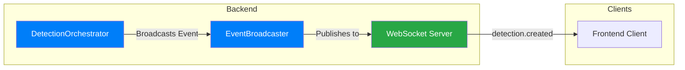
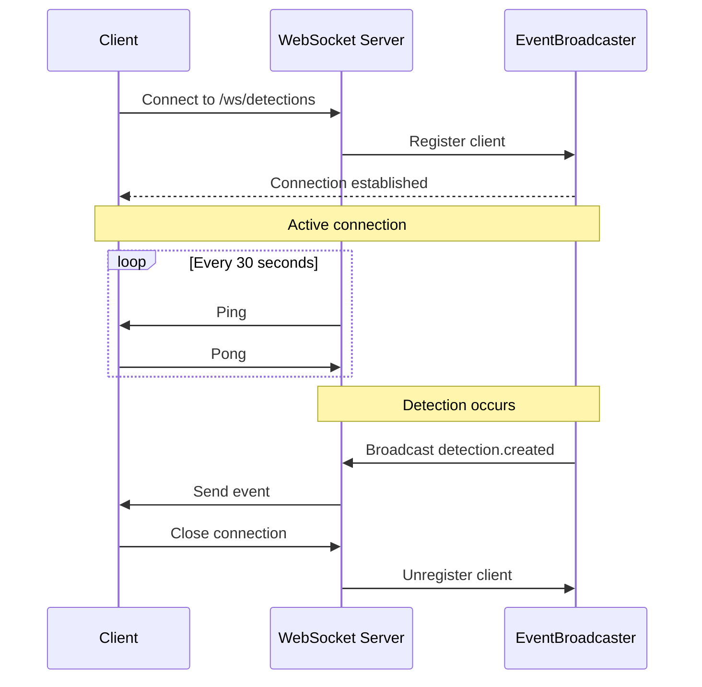
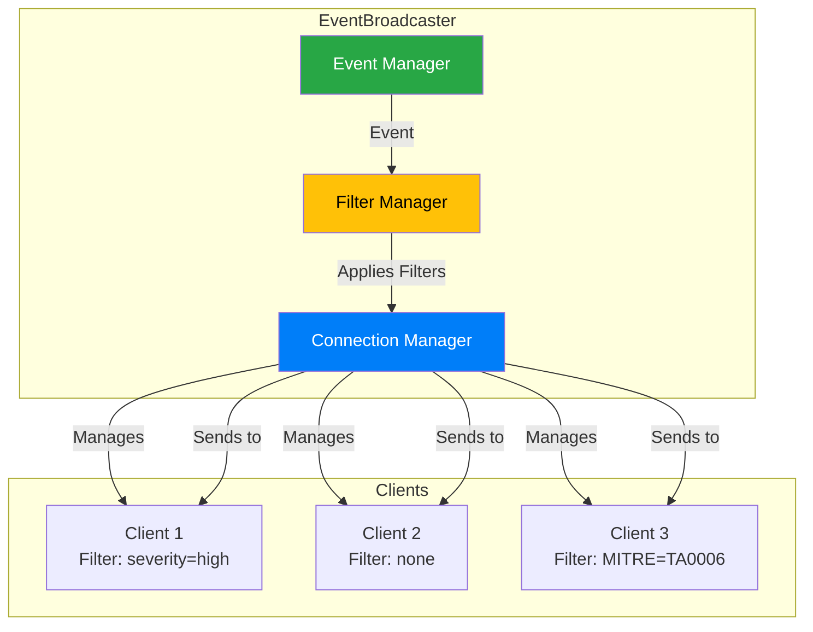

# Appendix F-1.14 — WebSocket

Real-time detection streaming via WebSocket connections.

## Table of Contents

- [Overview](#overview)
- [Connection](#connection)
- [Events](#events)
- [EventBroadcaster](#eventbroadcaster)
- [Client Implementation](#client-implementation)
- [Error Handling](#error-handling)
- [Best Practices](#best-practices)

## Overview

The WebSocket server provides real-time streaming of security detections to connected clients. It enables immediate notification of threats without polling the REST API.



**Key Features:**
- Real-time detection streaming
- Event filtering by severity, status, MITRE tactics
- Connection management with heartbeat
- Error handling and reconnection
- Multiple concurrent clients supported

**Location**: `packages/core/src/websocket/`

## Connection

### Endpoint

```
ws://localhost:3000/ws/detections
```

### Establishing Connection

**JavaScript/TypeScript:**
```javascript
const ws = new WebSocket('ws://localhost:3000/ws/detections');

ws.onopen = () => {
  console.log('Connected to detection stream');
};

ws.onerror = (error) => {
  console.error('WebSocket error:', error);
};

ws.onclose = (event) => {
  console.log('Disconnected:', event.code, event.reason);
};

ws.onmessage = (event) => {
  const message = JSON.parse(event.data);
  console.log('Received:', message);
};
```

**Node.js (ws library):**
```javascript
import WebSocket from 'ws';

const ws = new WebSocket('ws://localhost:3000/ws/detections');

ws.on('open', () => {
  console.log('Connected');
});

ws.on('message', (data) => {
  const message = JSON.parse(data.toString());
  console.log('Received:', message);
});

ws.on('error', (error) => {
  console.error('Error:', error);
});

ws.on('close', (code, reason) => {
  console.log('Closed:', code, reason.toString());
});
```

### Connection Lifecycle



## Events

### Event Structure

All events follow this format:

```typescript
{
  type: string,
  data: object,
  timestamp: string (ISO 8601)
}
```

### detection.created

Sent when a new detection is created and approved by QualityAgent.

**Event:**
```json
{
  "type": "detection.created",
  "data": {
    "id": "550e8400-e29b-41d4-a716-446655440000",
    "rule_id": "SEC-AUTH-002",
    "title": "Brute Force Attack Detected",
    "category": "AUTHENTICATION_ATTACK",
    "severity": "high",
    "confidence": 0.95,
    "status": "active",
    "mitre_tactics": ["TA0006"],
    "mitre_techniques": ["T1110.001"],
    "owasp_category": "A07:2021",
    "created_at": "2025-01-01T10:00:00.000Z"
  },
  "timestamp": "2025-01-01T10:00:00.123Z"
}
```

**Fields:**
- `id`: Detection UUID
- `rule_id`: Triggered rule ID
- `title`: Detection title
- `category`: Threat category
- `severity`: critical | high | medium | low
- `confidence`: 0-100 confidence score
- `status`: Detection status
- `mitre_tactics`: Array of MITRE ATT&CK tactics
- `mitre_techniques`: Array of MITRE ATT&CK techniques
- `owasp_category`: OWASP Top 10 category (if applicable)
- `created_at`: Detection creation timestamp

### detection.updated

Sent when an existing detection is updated (status change, notes added).

**Event:**
```json
{
  "type": "detection.updated",
  "data": {
    "id": "550e8400-e29b-41d4-a716-446655440000",
    "status": "investigating",
    "notes": "Assigned to security team",
    "updated_at": "2025-01-01T11:00:00.000Z"
  },
  "timestamp": "2025-01-01T11:00:00.456Z"
}
```

### Error Events

**Event:**
```json
{
  "type": "error",
  "data": {
    "message": "Internal server error"
  },
  "timestamp": "2025-01-01T10:00:00.789Z"
}
```

## Client Filtering

Clients can filter events they receive by sending a filter message after connecting:

**Filter Message:**
```json
{
  "action": "filter",
  "filters": {
    "severity": ["high", "critical"],
    "status": ["active"],
    "mitre_tactics": ["TA0006"]
  }
}
```

**Example:**
```javascript
const ws = new WebSocket('ws://localhost:3000/ws/detections');

ws.onopen = () => {
  // Subscribe only to high/critical severity detections
  ws.send(JSON.stringify({
    action: 'filter',
    filters: {
      severity: ['high', 'critical']
    }
  }));
};
```

**Available Filters:**
- `severity`: Array of severity levels (`critical`, `high`, `medium`, `low`)
- `status`: Array of statuses (`active`, `investigating`, `resolved`, `false_positive`)
- `mitre_tactics`: Array of MITRE ATT&CK tactic IDs

## EventBroadcaster

### Overview

**Location**: `packages/core/src/websocket/eventBroadcaster.ts`

EventBroadcaster manages WebSocket connections and handles event broadcasting to all connected clients.



### API Reference

#### Constructor

```typescript
constructor(wss: WebSocket.Server)
```

Creates EventBroadcaster instance and attaches to WebSocket server.

**Parameters:**
- `wss`: WebSocket.Server instance

#### broadcast

```typescript
broadcast(event: DetectionEvent): void
```

Broadcasts event to all connected clients (with filtering).

**Parameters:**
- `event`: Event object with type, data, timestamp

**Example:**
```typescript
eventBroadcaster.broadcast({
  type: 'detection.created',
  data: {
    id: 'uuid',
    title: 'Brute Force Attack',
    severity: 'high',
    ...
  },
  timestamp: new Date().toISOString()
});
```

#### broadcastToClient

```typescript
broadcastToClient(clientId: string, event: DetectionEvent): void
```

Broadcasts event to specific client.

**Parameters:**
- `clientId`: Client UUID
- `event`: Event object

#### getConnectedClients

```typescript
getConnectedClients(): number
```

Returns count of connected clients.

**Returns:** Number of active connections

#### close

```typescript
close(): void
```

Closes all connections gracefully.

### Implementation Details

**Connection Tracking:**
```typescript
private clients: Map<string, WebSocket> = new Map();
```

Each connection is assigned a UUID and tracked in a Map.

**Heartbeat:**
```typescript
private heartbeatInterval = setInterval(() => {
  this.clients.forEach((ws) => {
    if (ws.isAlive === false) {
      ws.terminate();
      return;
    }
    ws.isAlive = false;
    ws.ping();
  });
}, 30000);
```

Pings clients every 30 seconds to detect dead connections.

**Event Filtering:**
```typescript
private shouldSendToClient(client: WebSocket, event: DetectionEvent): boolean {
  if (!client.filters) return true;
  
  const { severity, status, mitre_tactics } = client.filters;
  
  if (severity && !severity.includes(event.data.severity)) {
    return false;
  }
  
  if (status && !status.includes(event.data.status)) {
    return false;
  }
  
  if (mitre_tactics) {
    const hasMatchingTactic = event.data.mitre_tactics?.some(
      tactic => mitre_tactics.includes(tactic)
    );
    if (!hasMatchingTactic) return false;
  }
  
  return true;
}
```

---

For more details:
- [API Reference](./api-reference.md)
- [Core Components](./core-components.md)
